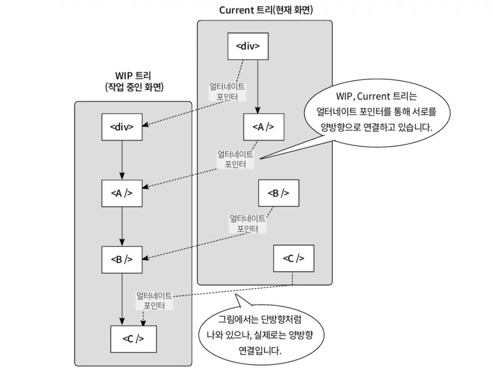
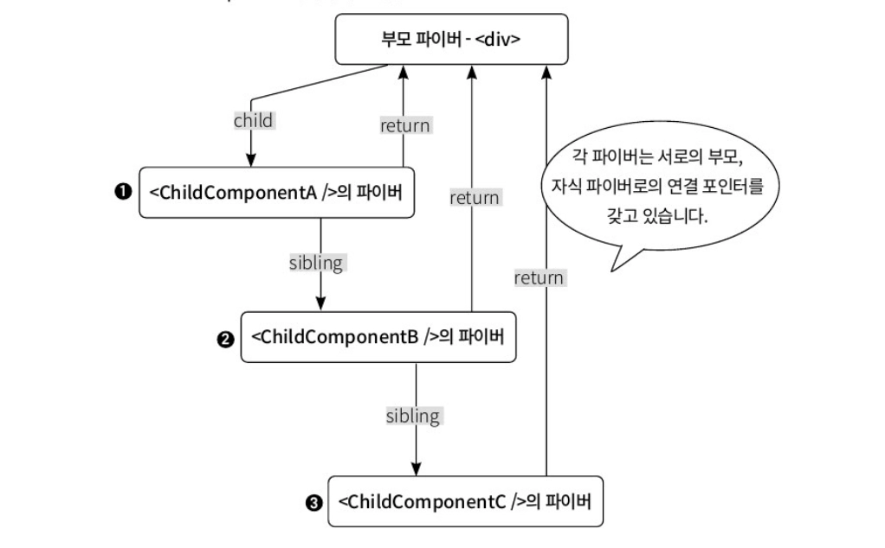

### Overview

모던 리액트에서는 개발자가 렌더링에 우선순위를 부여하여 유저에게 더 유려한 인터랙션을 제공함

→ 이를 가능하게 하는 것, 파이버 아키텍처

이 파이버 아키텍처를 통해 긴 렌더링 작업이 사용자 인터랙션을 막는 현상을 방지하는지, 각 작업 단위에 어떤 과정을 거쳐 우선순위를 부여하는지 살펴볼 것임

</br>
</br>

### 리액트 파이버를 돌아봐야 하는 이유

리액트는 렌더링 작업을 파이버라는 작은 단위로 쪼갠 뒤, 정해진 시간(약 5ms) 동안 작업을 수행하다가 시간이 다 되면 브라우저에 제어권을 넘겨줌

이때, 브라우저는 입력 처리나 애니메이션 같은 더 시급한 일을 처리함

여유가 생기면 리액트는 멈췄던 지점부터 렌더링 작업을 이어감

→ 긴 렌더링 작업이 더는 사용자 경험을 해치지 않게 됨

</br>
</br>

### 리액트 스택 재조정자 알아보기

DOM을 직접 조작하던 시대에는, 상태가 변경될 때마다 UI를 일관성 있게 업데이트하는 일이 번거로웠고, 오류 발생 확률도 높았음

리액트는 이 문제를 해결하기 위해 선언적 UI, 컴포넌트 기반 아키텍처, 효율적인 업데이트, 단방향 데이터 흐름을 핵심 철학으로 삼음

→ 스택 재조정자는 이러한 목표를 달성하기 위한 핵심적인 구현체

</br>
</br>

#### 스택 재조정자 동작 원리 & 한계

리액트 15이하 버전에서는 스택 구조로 되어 있는 재조정자를 사용했음

스택 재조정자는 컴포넌트 트리를 재귀적으로 순회하며, 이 모든 과정을 하나의 동기적인 작업으로 처리함

→ 렌더링 작업이 한 번 시작되면 호출 스택이 비워질 때까지 멈출 수 없었음

이러한 방식은 복잡하고 깊은 컴포넌트 트리에서는 메인 스레드를 장시간 점유하여 유저 인터랙션에 즉각적으로 반응하지 못하는 문제를 낳음

</br>
</br>

### 파이버 아키텍처 알아보기

스택 재조정자의 한계를 극복하기 위해 렌더링 메커니즘을 처음부터 다시 설계한 파이버 아키텍처를 공개함

리액트 16버전부터 기본 재조정자로 채택되었으며, 모던 리액트의 모든 동시성 기능의 기반이 됨

파이버 아키텍처는 내부 구현이 매우 복잡하지만, 그 덕분에 개발자는 렌더링 작업의 우선순위를 제어하여 훨씬 부드럽고 유저 친화적인 인터페이스를 만들 수 있게 되었음

</br>
</br>

#### 파이버 노드 해부하기

파이버는 리액트 용어가 아닌 CS에서 실행 가능한 가장 작은 작업 단위를 의미하는 일반적인 용어임

리액트에서는 이 개념을 차용해, 컴포넌트에 대한 정보를 담고있는 자바스크립트 객체이자, 처리해야 할 하나의 작업 단위로 정의함

→ 파이버는 객체이기에 한번 실행되면 제어할 수 없는 콜 스택과는 달리 자유롭게 다룰 수 있음

</br>

다음은 리액트 파이버 노드의 핵심 속성을 간소화한 예시임

```jsx
class FiberNode {
	constructor(tag, pendingProps, key) {
	  // 기본 식별 정보
		this.tag = tag;
		this.key = key;
		this.elementType = null;
		this.type = null;
		this.stateNode = null;
		
		// 트리 탐색을 위한 포인터
		this.return = null;
		this.child = null;
		this.sibling = null;
		
		// 작업 처리에 필요한 데이터
		this.pendingProps = pendingProps;
		this.memoizedProps = null;
		this.updateQueue = null;
		this.memoizedState = null;
		
		// 부수 효과 관련 정보
		this.flags = 0;
		this.subtreeFlags = 0;
		this.deletions = null;
		
		// 더블 버퍼링을 위한 포인터
		this.alternate = null;
	}
}
```

</br>

더블 버퍼링은 기존 UI와 새로운 UI를 나타내기 위해 렌더링에 필요한 객체를 바꿔끼는 기법을 말함



더블 버퍼링에 사용되는 트리 종류는 다음과 같음

- **current 트리**
    - 현재 화면에 보이는 UI에 해당하는 파이버 트리
- **WIP 트리**
    - 상태 변경 발생시, 리액트는 current 트리를 복제하여 WIP 트리를 만듦

작업이 완료되면, 리액트는 WIP 트리를 current 트리로 바꿔치기 하여 화면에 한 번에 보여줌

위 코드의 `this.alternate = null;` 는 두 트리의 파이버 노드들을 서로 연결해주는 역할을 함

</br>
</br>

#### 파이버 우선순위와 Lanes 모델

파이버 아키텍처는 스택 아키텍처의 문제를 해결하기 위해 다차선 항로 시스템을 도입함

이를 Lanes 모델이라고 함

리액트는 모든 업데이트에 긴급도에 따라 각기 다른 우선순위인 Lanes을 할당함

- **우선순위가 높은 작업**
    - 즉각적인 피드백이 중요한 작업
    - 텍스트 입력, 버튼 클릭 후 즉각적인 UI 변화 등의 유저 입력에 대한 반응
    - 프레임 업데이트 등
- **우선순위가 낮은 작업**
    - 화면 밖에 있는 콘텐츠의 렌더링
    - 백그라운드 데이터 동기화 혹은 프리패칭

이처럼 개발자는 동시성 기능을 통해 리액트에게 우선순위가 낮은 업데이트를 지정해줄 수 있음

</br>

Lanes은 추상적인 개념이 아니라, 파이버 객체의 lanes 속성의 저장되는 비트마스크임

```jsx
type Lanes = number;

// 각 우선순위를 2의 거듭제곱으로 표현
const NoLanes: Lanes = 0b0000;
const SyncLane: Lanes = 0b0001;
const DefaultLane: Lanes = 0b0100;
const TransitionLane: Lanes = 0b1000;

function mergeLanes(a: Lanes, b: Lanes): Lanes {
  return a | b;
}

function includesSomeLane(lanes: Lanes, lane: Lanes): boolean {
  return (lanes & lane) !== 0;
}

let fiber = {
  lanes: NoLanes,
};

// 일반 상태 업데이트 발생
fiber.lanes = mergeLanes(fiber.lanes, DefaultLane);

// transition 업데이트 발생
fiber.lanes = mergeLanes(fiber.lanes, TransitionLane);

console.log(fiber.lanes.toString(2));
// 1100

console.log(includesSomeLane(fiber.lanes, DefaultLane));
// true

console.log(includesSomeLane(fiber.lanes, SyncLane));
// false
```

리액트는 각 우선순위 수준을 2의 거듭제곱으로 표현하여, 비트 단위 연산을 통해 여러 레인을 병합하거나 우선위를 비교하는 작업을 매우 효율적으로 수행함

</br>

리액트는 상태 업데이트가 발생하면, 다음과 같은 내부 로직을 통해 해당 작업의 우선순위를 결정함

```jsx
function requestUpdateLane(fiber) {
	const currentExecutionContext = getExecutionContext();
	
	// 개발자가 의도적으로 우선순위를 낮춘 경우 (트랜지션)
	if (isTransitionLane(fiber.mode)) {
		return TransitionLane;
	}
	
	// 유저 입력에 의한 업데이트인 경우
	if (currentExecutionContext & DiscreteEventContext) {
		return InputDiscreateLane;
	}
	if (currentExecutionContext & ConcurrentEventContext) {
	  // 클릭, 
		return InputContinuousLane;
	}
	
	// 렌더링 도중 발생한 동기적 업데이트인 경우
	if ((currentExecutionContext & (RenderContext | CommitContext)) !== NoContext) {
	  // 가장 급한 동기 작업
		return SyncLane;
	}
	
	// 그 외
	return DefaultLane;
}
```

이렇게 각 파이버에 할당된 Lanes 정보는 리액트 스케줄러에게 전달됨

</br>
</br>

#### 파이버 트리 구조

파이버 트리의 가장 중요한 설계 목표는 재귀없이도 전체 컴포넌트 트리를 순회는 것임

이를 위해 파이버는 링크드 리스트와 유사한 포인터 구조를 가짐

```jsx
function ParentComponent() {
	return (
		<div>
			<ChildComponentA />
			<ChildComponentB />
			<ChildComponentC />
		</div>
	);
}
```

리액트는 이 구조를 다음과 같은 포인터를 가진 파이버 노드들로 변환함

- **child**
    - 부모에서 첫 번째 자식으로 이동할 때 사용
- **sibling**
    - 현재 노드에서 다음 형제 노드로 이동할 때 사용
- **return**
    - 모든 자식과 형제 순회가 끝났을 때, 부모로 돌아가기 위해 사용

</br>

이 포인터들을 따라가는 작업 순서는 다음과 같음



- div 파이버 → child 포인터를 따라 ChildComponentA로 이동
- ChildComponentA의 자식이 없음 → sibling 포인터를 따라 ChildComponentB로 이동
- ChildComponentB의 자식이 없음 → sibling 포인터를 따라 ChildComponentC로 이동
- ChildComponentC는 더 이상 형제가 없음 → return 포인터를 따라 부모인 div로 이동

</br>
</br>

#### 파이버 아키텍처와 동시성 기능 원리

파이버 아키텍처는 하나의 while 반복문을 사용하여 렌더링을 처리함

상태 업데이트가 발생했을 때 멈출 수 있는 작업 루프가 어떻게 시작되는지에 대한 의사코드는 다음과 같음

```jsx
// 다음으로 처리할 파이버 작업 단위
let nextUnitOfWork = null;
// 현재 작업 중인 전체 파이버 트리의 루트
let workInProgressRoot = null;
// 현재 작업 루프가 멈춰야 하는 시간
let deadline = 0;
// 브라우저에 제어권을 양보하기 위한 시간
~~~~const frameYieldMs = 5;

function scheduleUpdate(rootFiber) {
	if (workInProgressRoot = null) {
		workInProgressRoot = rootFiber;
		nextUnitOfWork = rootFiberl
		
		deadline = getCurrentTime() + frameYieldMs;
		scheduleCallback(workLoop);
	}
}
```

</br>

업데이트가 발생하면 리액트는 다음과 같이 준비함

- **nextUnitOfWork**
    - 작업 루프는 이 변수가 null이 될 때까지 계속됨
- **deadline**
    - 작업이 허용된 시간을 추적하는 타이머
- **첫 작업 단위 설정**
    - `nextUnitOfWork` 에 트리의 최상단인 `rootFiber` 를 할당하여 작업의 시작점을 알려줌
- **작업 루프 예약**
    - `sheduleCallback()` 을 통해 브라우저가 여유 있을 때 `workLoop()` 함수를 실행하도록 예약함

</br>

다음은 파이버 아키텍처의 핵심으로 `workLoop()` 와, 그 안에서 실제 작업을 처리하는 `performUnitOfWork()` 에 대한 의사코드임

```jsx
function workLoop() {
	while (nextUnitOfWork !== null && deadline > getCurrentTime()) {
		nextUnitOfWork = performUnitOfWork(nextUnitOfWork);
	}
	
	if (nextUnitOfWork === null) {
		commitRoot(workInProgressRoot);
	} else {
		scheduleCallback(workLoop);
	}
}

function performUnitOfWork(fiber) {
	beginWork(fiber);
	
	if (fiber.child) {
		return fiber.child;
	}
	
	if (fiber.sibling) {
		return fiber.slibing;
	}
	
	let parent = fiber.return;
	
	while (parent) {
		if (parent.sibling) {
			return parent.sibling;
		}
		parent = parent.return;
	}
		
	return null;
}
```

</br>