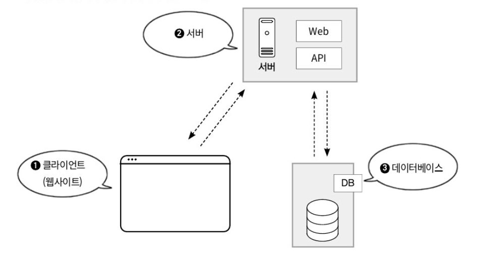
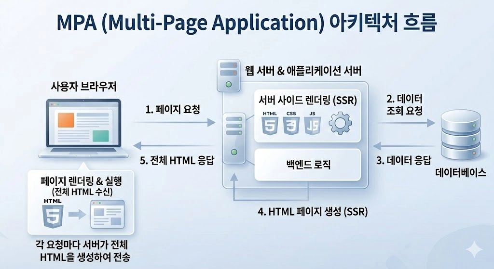
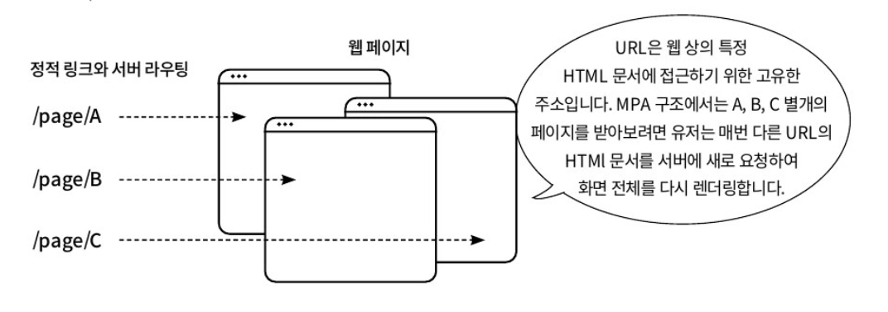
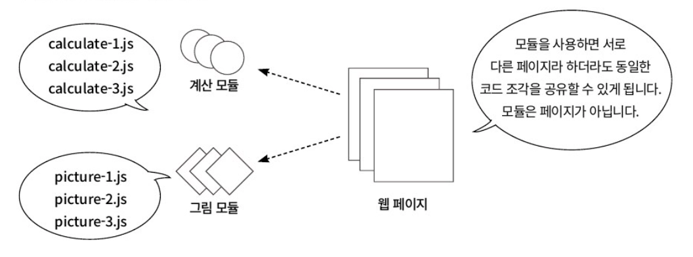
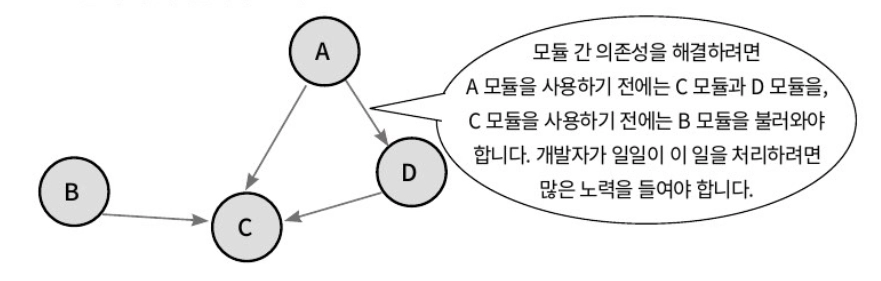
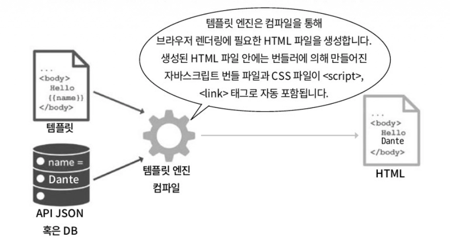
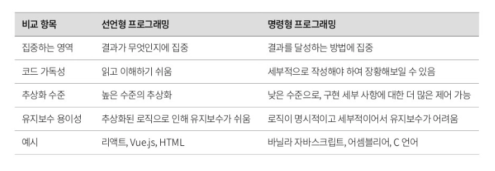

### 프론트엔드의 구성 요소와 발전 과정을 돌아봐야 하는 이유

프론트엔드 개발의 역사를 공부하는 것은 현재 우리가 사용하는 기술들의 근본적인 ‘왜’를 이해하고, 미래 기술 변화를 예측할 수 있는 통찰력을 기르는 중요한 과정입니다.

제이쿼리 - jQuery, 앵귤러 - Angular, 리액트 - React, 뷰제이에스 - Vue.js

다음과 같은 라이브러리와 프레임 워크는 저마다 특정 시대의 문제를 해결하기 위해 탄생했습니다.

</br>

예를 들어 브라우저마다 다른 DOM API를 추상화하고 복잡한 DOM 조작을 단순화하기 위해 jQuery가 등장했습니다.

이 후 웹 애플리케이션의 규모가 커지면서 상태 관리의 어려움이 대두되고 이를 해결하기 위해 React와 같은 컴포넌트 기반의 아키텍처가 주목받기 시작했습니다.

이처럼 기술의 발전 과정을 따라가다 보면 각 기술의 핵심 철학과 존재 이유를 깊이 있게 파악할 수 있습니다.

</br>

현대 프론트엔드 생태계는 수많은 프레임워크와 라이브러리로 가득 차 있습니다.

각 기술이 어떤 역사적 맥락에서 어떤 문제를 해결하기 위해 등장했는지, 어떤 장단점을 가지고 있는지 이해한다면, 단순히 유행을 좇는 것이 아니라 기술적인 장단점을 명확히 인지하고 합리적인 의사결정을 내릴 수 있습니다.

결론적으로 프론트엔드 기술의 변천사와 각 구성 요소를 명확히 알고 있는 것은 과거를 돌아보는 행위를 넘어, 현재를 이해하고 미래를 준비하는 가장 효과적인 방법입니다.

</br>
</br>

### 웹 개발과 프론트엔드가 차지하는 위상과 구성 요소

웹 개발은 어느 쪽에 중점을 두냐에 따라 크게 **서버 사이드(server-side**) 개발과 **클라이언트 사이드(client-side)** 개발로 나뉩니다.

</br>

**서버 사이드 개발**

서버 사이드 개발은 일반적으로 백엔드(Backend) 개발이라고 부릅니다.

다양한 프로그래밍 언어와 런타임 환경을 기반으로 데이터베이스에서 또는 외부 API로 데이터를 조회, 가공, 변환하며, 클라이언트 또는 다른 서버로부터 전달된 요청을 처리하는 코드를 작성하는 것을 포함합니다.

</br>

**클라이언트 사이드 개발**

클라이언트 사이드 개발은 일반적으로 프론트엔드(Frontend) 개발이라고 부릅니다.

클라이언트란 웹 환경에서는 브라우저에서 동작하는 웹 애플리케이션을, 모바일 환경에서는 모바일 애플리케이션을 의미합니다.

프론트엔드는 유저 상호작용과 인터페이스를 책임집니다.

</br>

웹 초기에 프론트엔드는 미리 구성된 정적인 화면을 만드는 작업에 불과했습니다.

웹 서비스를 구성하는 데는 클라이언트 이외에도 다음과 같은 구성 요소들이 필요합니다.



간소화된 웹 애플리케이션 아키텍처의 구성 요소들

클라이언트가 브라우저를 통해 서버에 요청을 보내면, 서버는 REST, GraphQL 같은 API 앤드포인트를 통해 요청을 받고, 자체 데이터베이스나 외부 서비스 등에서 데이터를 가져와 가공한 뒤 클라이언트에 반환합니다.

서버는 개발자에 따라 아파치나 Nginx와 같이 정적 파일 제공 및 프록시 서버 역할을 하는 서버를 웹 서버로, 아파치 톰캣이나 제이보스 애플리케이션 로직 및 서버 사이드 렌더링, API 제공 역할을 하는 서버를 웹 애플리케이션 서버로 구분해 부르기도 합니다.

클라이언트는 서버로부터 받은 응답을 화면에 렌더링하거나 추가 요청을 통해 동적 데이터를 업데이트합니다.

데이터 흐름은 클라이언트의 요청(Request) → 서버의 처리 → 데이터베이스 연동 → 응답(Response)으로 이루어집니다.

</br>
</br>

### 초창기 웹 프론트엔드

오늘날 프론트엔드 코드는 기본적으로 HTML, 자바스크립트, CSS 코드로 구성됩니다.

초창기 웹 프론트엔드는 정적인 HTML 문서로 구성되었으며, 유저가 웹사이트를 방문하면 서버에서 완성된 페이지를 전달하는 방식이었습니다.

</br>

**1990년대 초반**

1990년대 초반에는 CSS도 없었기 때문에 모든 디자인 요소가 HTML 태그 안에 직접 포함되었고, 인터랙티브한 기능은 거의 없었습니다.

</br>

**1995년**

이후 1995년에 자바스크립트가 등장하면서 웹 페이지에서 간단한 유저 입력 처리나 동적인 효과를 줄 수 있게 되었지만, 여전히 대부분의 로직은 서버에서 처리되었고, 웹페이지를 새로고침해야만 변경 사항이 반영되는 구조였습니다.

</br>

**2000년대 초반**

2000년대 초반에는 브라우저 구현이 안정화되며 CSS가 널리 사용되면서 웹페이지의 디자인과 레이아웃을 더 정교하게 구성할 수 있게 되었고, 자바스크립트와 함께 DOM을 조작하는 방식이 발전했습니다.

자바스크립트에서 DOM(Document Object Model, 문서 객체 모델)은 HTML 문서를 트리 구조로 표현하여 자바스크립트로 요소를 동적을 조작하는 인터페이스입니다.

</br>

DOM을 사용하면 HTML 요소를 동적을 조작할 수 있는 다음과 같은 장점이 있습니다.

- **실시간 콘텐츠 변경**
    - 페이지를 새로고침하지 않고도 텍스트, 스타일, 속성 등을 변경 가능합니다.
- **유저 상호작용 처리**
    - 클릭, 입력, 스크롤 등의 이벤트를 감지하고 반응 가능합니다.
- **구조적 데이터 접근**
    - HTML을 트리 구조로 다뤄 특정 요소를 쉽게 찾고 수정 가능합니다.
- **애니메이션 및 효과 적용**
    - CSS와 함께 사용하여 동적인 화면 연출이 가능합니다.
- **비동기 데이터 업데이트**
    - Ajax, Fetch API 등과 함께 서버 데이터를 동적으로 표시 가능합니다.

</br>
</br>

### 모듈의 탄생과 한계

초창기 웹페이지는 단일 페이지가 아닌, 여러 페이지로 이루어져 초기 웹 애플리케이션에서는 유저에게 새로운 UI를 보여주고 싶을 때마다 매번 새로운 페이지를 다시 웹 서버에 요청해야 했습니다.

이런 방식을 MPA - multi page application, 멀티 페이지 애플리케이션이라고 합니다.

</br>



각 페이지는 고유한 URL을 가지며, 서버에서 완전히 렌더링되어 클라이언트로 전송됩니다.

MPA의 각 페이지는 고유한 URL을 가진 완전한 HTML 문서이기에 크롤러가 특정 URL을 방문하면, 해당 페이지의 모든 텍스트, 이미지, 그리고 중요한 메타 태그가 포함된 완성된 HTML을 즉시 얻을 수 있습니다.

MPA은 검색엔진 최적화 SEO에 유리, 구현이 비교적 단순하다는 장점이 있지만, 페이지를 이동할 때마다 화면 전체를 새로고침해야 하므로 유저 경험이 저하될 수 있다는 명확한 단점을 가집니다.

또한 서버와의 상호작용이 제한적이어서 실시간 업데이트가 어려웠습니다.

</br>

앞서 소개한 Ajax가 2005년 등장한 이후에는 한 페이지의 일부 영역에 한해서 API 서버와 통신해 콘텐츠를 업데이트할 수 있게 되어 상황이 많아 나아졌지만 일부 영역이 아닌 완전히 새로운 페이지를 보여주려면 여전히 서버에 매번 다른 페이지를 요청해야 했습니다.



MPA의 단점을 극복하고자 프론트엔드 개발자들은 여러 페이지에 공통으로 사용할 코드 조각을 만들어 서로 공유하기로 했습니다.

코드를 나누어 조각 단위로 작성하면 필요한 곳에서 자유롭게 해당 코드 조각을 가져다 재사용할 수 있기 때문입니다.

자바스크립트 생태계에서는 재사용 가능한 JS 파일을 모듈이라고 합니다.

</br>



이제 공통 모듈을 만들어 더 적은 코드로 많은 기능을 만들 수 있게 되었습니다.

</br>

하지만 모듈이 많아지면서 서로 간의 영향을 미치는 의존성이 생기는 문제가 생깁니다.

그리고 프로젝트 크기가 점차 커짐에 따라 한 페이지에 설치해야 할 모듈 개수 또한 기하급수적으로 늘어나게 되었습니다.



공통 기능을 모듈로 쪼개면 코드 재사용성은 높아지지만 라이브러리 A → 모듈 C → 모듈 B 처럼 복잡한 의존성 관계가 성립될 수 있습니다.

</br>
</br>

### 번들러의 탄생

모듈의 의존성 문제는 번들러라는 도구로 해결하게 됩니다.

번들러는 모듈 의존성을 해석하고, 브라우저가 실행할 수 있는 형태로 정리, 배포 최적화까지 해주는 빌드 시스템입니다.

초기에는 그런트와 걸프가 브라우저리파이 플러그인으로 `CommonJS` 모듈을 하나의 `bundle.js` 스크립트로 묶어주었고 2014년 웹팩이 로더와 플러그인 개념을 가져왔습니다.

</br>

프론트엔드 개발 환경에서 사용되는 대표적인 번들러 및 번들어와 함께 쓰이는 도구들은 다음과 같습니다.

- **그런트 - Grunt**
    - 자바스크립트 작업 자동화를 위해 사용되는 태스크 러너로 모듈 번들러는 아니지만 브라우저리파이, 웹팩과 같은 번들러와 결합하여 개발 환경을 구축하는 데 많이 사용되었습니다.
    - 그런트의 핵심은 빌드 시 반복적인 작업을 간소화하는 데 도움을 줍니다.
        - JS 압축
        - CSS 전처리
        - 이미지 최적화
        - 테스트 실행
        - 파일 감시 등..
- **웹팩 - Webpack**
    - 자바스크립틍로 작성된 모듈 번들러로 여러 파일과 모듈을 하나의 번들로 묶어 빌드 및 최적화를 도와주며 비트 이전에는 롤업과 함께 가장 많이 사용되었습니다.
    - 애플리케이션 전체를 모듈 그래프로 보고 처리하는 방식을 사용합니다.
        - JS 파일은 Babel 로더로 변환
        - CSS 파일은 css-loader, style-loader로 처리
        - 이미지 파일은 asset module로 처리
        - 빌드 결과는 플러그인으로 압축, 분리, 분석
- **롤업 - Rollup**
    - 자바스크립트 라이브러리를 작성하는 데 특화된 모듈 번들러로 특히 ES 모듈을 지원하는데 강점이 있습니다.
- **ESBuild**
    - Go 언어로 작성되어 매우 빠르고 강력한 성능을 보여주는 번들러로 최소화된 설정을 사용해 번들링하는 것을 추구하며 최신 자바스크립트, 타입스크립트 문법을 지원합니다.
- **비트 - Vite**
    - 빠른 개발 환경을 제공하는 프론트엔드 빌드 도구로 모듈화된 최신 브라우저 기능과 초고속 HMR(Hot Module Replacement)을 지원합니다.
    - dev 서버는 ESBuild 기반 ESM 네이티브 로딩, 빌드는 롤업을 사용합니다.

</br>

번들러는 개발 단계에 모듈 그래프를 분석해 의존성 순서 걱정 없이 `import`/`require` 구문을 사용할 수 있게 도와주어 빠르게 개발 환경을 구성할 수 있게 도움을 주었습니다.

또한 배포 단계에 필요 없는 코드를 제거하여 번들의 크기를 줄이는 트리 쉐이킹 기능을 지원하고 코드 스프플리팅으로  초기 로딩 시간을 최소화하는 데 도움을 주었습니다.

번들러의 도입으로 프론트엔드 개발자는 각 페이지에 여러 스크립트 태그를 삽입해야 했던 불편을 해소할 수 있었습니다.

</br>
</br>

### 패키지 매니저의 도입

초창기 웹 개발에서 외부 라이브러리를 사용하려면 각 라이브러리 웹사이트를 방문해 JS 파일을 내려받고, 프로젝트의 특정 폴더에 저장해야 했습니다.

이렇게 각 개발자가 만든 라이브러리를 더 쉽게 사용할 수 있도록 등장한 것이 NPM(Node Package Manager)입니다.

NPM은 자바스크립트 생태계의 표준 패키지 매니저로 `npm install` 과 같은 커맨드라인 인터페이스 한 줄로 수천 개의 하위 의존성을 트리 형태로 내려받아 `node_modules` 폴더에 배치합니다.

이 덕분에 개발자들은 외부 라이브러리를 프로젝트 내부에 따로 저장하지 않고, 필요한 라이브러리들이 선언된 청사진인 `package.json` 과 `package-lock.json` 만 있으면, 동일한 개발 환경을 쉽게 복원할 수 있습니다.

</br>
</br>

### 템플릿 엔진의 도입

웹 개발이 점점 복잡해지면서, 한편으로는 반복되는 HTML 코드와 동적인 콘텐츠를 효율적으로 관리할 필요가 생겼고, 이를 해결하기 위해 HTML 템플릿 엔진이 등장했습니다.

템플릿 엔진은 페이지 하나를 여러 템플릿으로 구성할 수 있게 도와주는 도구입니다.

템플릿 엔진은 서버에서 데이터를 받아 동적으로 HTML을 생성하는 방식이 주를 이루었고 이들은 변수를 삽입하거나 조건문, 반복문 등을 사용할 수 있도록 하여 HTML 코드의 재사용성을 높이고 유지보수를 용이하게 했습니다.

</br>

템플릿은 정적인 HTML 구조 안에 동적인 데이터가 들어갈 위치를 미리 정의해 놓은 구조를 말합니다.

```tsx
<div>
  <h1>은현</h1>
</div>
```

다음 HTML 코드에서 데이터가 바뀌면 코드도 바뀝니다.

</br>

하지만 템플릿을 사용하면 다음과 같습니다.

```tsx
<div>
  <h1>{{name}}</h1>
</div>
```

기존 HTML처럼 코드를 바꾸지않고 `{{name}}` 과 같은 템플릿 변수를 사용하여 유지보수성을 높일 수 있습니다.

</br>

대표적인 템플릿 엔진으로는 다음이 존재합니다.

- **퍼그**
    - 들여쓰기를 주 문법으로 사용하는 템플릿 엔진으로 코드 내부에서 자바스크립트를 직접 실행할 수 있습니다.
    - 템플릿 상속을 자체적으로 제공합니다.
- **핸들바**
    - HTML 기반 템플릿 엔진으로 중괄호를 사용하는 텍스트 보간법을 사용하며 HTML 문법을 그대로 사용합니다.
    - 템플릿 상속 대신 Partial, Helper라는 용어로 사용합니다.
- **EJS**
    - 템플릿 내부에서 자바스크립트를 작성할 수 있으며 HTML 문법을 그대로 사용합니다.
    - 템플리 상속을 제공하지 않습니다.

</br>

태스크 러너 그런트와 템플릿 엔진을 같이 사용하면 개발 환경에서는 개별 JS, CSS 파일을 작성해 작업을 진행할 때 필요한 반복적인 빌드 작업을 자동화할 수 있습니다.

번들러 웹팩을 사용하면 여러 개의 JS, CSS, 템플릿 파일의 의존성을 분석하고 하나의 최적화된 번들 파일로 변환할 수 있습니다.

또한 EJS, 핸들바, 퍼그 같은 템플릿 엔진을 처리하여 최종 HTML을 생성하는 기능도 포함될 수 있습니다.



이제 위 이미지처럼 웹 프론트엔드 프로젝트에서 흔히 만날 수 있는 체계적 구조를 갖추게 됩니다.

- **src**
    - 소스 코드가 위치하며, 자바스크립트, 타입스크립트, CSS, 템플릿 파일이 포함됩니다.
- **public**
    - 정적 파일이 포함됩니다.
- **dist**
    - 번들링된 최종 결과물이 배포될 준비 상태로 저장됩니다.
- **node_modules**
    - npm 패키지가 설치되는 곳입니다.

현재는 자바스크립트 프레임워크와 스타일링을 위한 CSS 전처리기가 활용되고, ES6+ 모듈 시스템과 CommonJS를 통한 코드 관리 및 모듈화가 일반화되었습니다.

컴포넌트 기반 개발이 확산되면서 프로젝트의 모듈화와 유지보수성이 크게 향상되었습니다.

</br>
</br>

### 명령형, 선언형 프로그래밍

프론트엔드 개발자들은 단순 개발 환경 구성뿐만 아니라 화면을 그리는 전문 영역 안에서 더운 많고 복잡한 일을 하는 방법을 연구했습니다.

그 결과 화면에 그려진 DOM 하나하나를 일일이 집어 변경하는 방식이 아닌, 코드 조각으로 미리 선언해놓은 모습 그대로 화면에 표시하는 기술을 만들게 되었습니다.

과거의 방식을 명령형 방식의 프론트엔드 개발로, 새로운 방식을 선언형 방식의 프론트엔드 개발로 구분해볼 수 있습니다.

</br>
</br>

### 명령형 방식의 프론트엔드 개발

제이쿼리 명령형 예제를 통해 알아봅시다.

```tsx
$(document).ready(function () {
  $('#addItem').click(function () { 
    $('#itemList').append('<li>New Item</li>');
  });
});
```

다음 코드는 템플릿 엔진으로 생성된 화면에서, 백엔드로부터 불러운 데이터를 `itemList` 아이디를 가진 DOM 요소에 직접 추가하고 있습니다.

이렇게 명시적으로 특정 DOM을 잡아 이벤트 핸들러를 바인딩(연결)하거나 화면을 업데이트하는 방식을 명령형 프로그래밍이라고 합니다.

</br>

명령형 프로그래밍은 다음과 같은 특징을 가집니다.

- 개발자가 UI 동기화 책임 주체를 가집니다.
- 애플리케이션이 커질수록 DOM 조작 코드 관리가 어려워집니다.
- UI 상태와 데이터 상태가 명확히 분리되지 않습니다.
- 특정 동작이 코드에 직접적으로 구현되어 있어 재사용이나 확장이 어렵습니다.
- 로직이 흩어져 있어 코드를 이해하고 유지보수하기 힘들어집니다.

이런 복잡성과 유지보수의 어려움으로 인해 대규모 애플리케이션에서는 명령형보다 선언형 프로그래밍이 더 효율적일 수 있습니다.

</br>
</br>

### 선언형 방식의 프론트엔드 개발

리액트를 사용한 코드를 통해 알아봅시다.

```tsx
import React, { useState } from 'react';

function ItemList() {
	const [items, setItems] = useState(['Item 1']);
	
	function addItem() {
		setItems([...items, 'New Item']);
	}
	
	return (
		<div>
			<ul>
				{items.map((item, index) => (
					<li key={index}>{item}</li>
				))}
			</ul>
			<button onClick={addItem}>Add Item</button>
		</div>
	);
}
```

기존 방식에서는 특정 버튼을 클릭하고, 특정 DOM 요소를 찾아 글자를 변경해야 했지만, 이 코드에서는 그런 과정이 명시적으로 드러나지 않습니다.

단지 `ItemList()` 함수 안에서 `li` 태그와 `items` 상태 변수를 사용해 리스트 형식으로 화면을 구성하고, 버튼을 클릭하면 리스트에 새로운 아이템을 추가하도록 선언했을 뿐입니다.

개발자는 상태를 설계하고 선언하는 것에 책임을 가지며, 리액트는 UI 동기화 책임의 주체가 됩니다.

</br>

어떻게 동작해야 하는지가 아니라 무엇을 할지를 코드로 선언하는 방식을 선언형 프로그래밍이라고 합니다.

선언형 프로그래밍을 사용하면 코드가 간결하고 읽기 쉬워지며, 상태가 변경될 때 리액트가 알아서 UI를 갱신하기 때문에 개발자가 직접 DOM을 조작할 필요가 없습니다.

따라서 유지보수가 쉬워지고, 컴포넌트 기반 구조로 인해  재사용성이 높아집니다.

또한 상태와 UI가 항상 일치하므로 예상치 못한 버그 발생 가능성이 줄어듭니다.

복잡한 업데이트 로직은 리액트가 처리해주므로, 개발자는 핵심 로직에 집중할 수 있으며, 그 결과 테스트와 디버깅도 쉬어져 개발 생산성이 높아집니다.

</br>

**선언형 프로그래밍과 명령형 프로그래밍**



</br>
