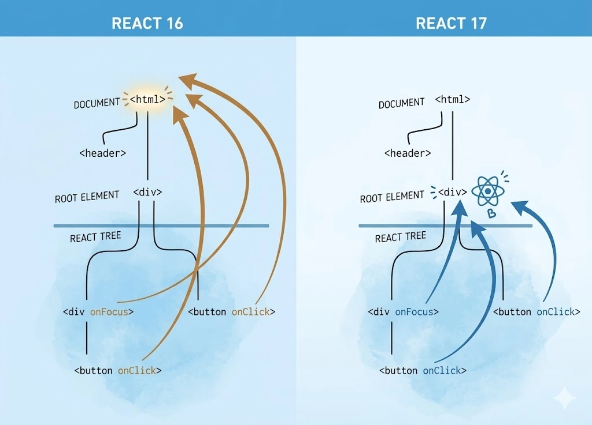

### JSX 핵심 문법과 자바스크립트 변환을 돌아봐야 하는 이유

JSX가 `React.createElement()` 혹은 최신 자동 런타임의 `jsx()` 함수 호출로 변환되는 과정을 알면, 렌더링마다 불필요한 함수나 객체가 재성성되는 코드를 즉시 식별할 수 있음

이는 불필요한 최적화와 필수 최적화를 구분하는 날카로운 시각을 제공함

</br>
</br>

### JSX 변환하기

실제로 JSX 코드를 브라우저가 이해할 수 있는 자바스크립트 코드로 변환하는 다양한 도구들을 살펴볼 것임

그중에서도 가장 오랫동안, 널리 사용되온 Babel을 시작으로 여러 도구를 활용해 JSX 코드가 어떻게 변환되는지 알아볼 것임

</br>
</br>

### 자동 런타임이란

클래식 런타임을 사용하는 17 이전 버전에서는 JSX를 사용하려면 파일 상단에 `import React from ‘react’;` 구문을 반드시 포함해야 했음

→ 트랜스파일러가 JSX 구문을 `React.createElement()` 함수 호출로 변환했기 때문

```jsx
import React from 'react';

// 변환 전 JSX
const element = <h1 className="greeting">Hello, world</h1>;

// 클래식 런타임으로 변환 후
const element = React.createElement('h1', {className: 'greeting'}, 'Hello, world');
```

위 코드처럼 `React.createElement(…)` 코드가 정상적으로 실행되려면, 리액트 객체가 해당 파일의 스코프 내에 존재해야 했음

</br>

리액트 17버전은 자동 런타임을 도입하여 개발자는 React를 import 할 필요가 없게 됨

자동 런타임 환경에서 트랜스파일러는 `React.createElement()` 대신 리액트 패키지에 내장된 별도의 함수를 자동으로 임포트하여 사용함

이는 다음과 같은 이점을 제공함

- **코드 간소화**
    - 불필요한 import 구문이 사라짐
- **번들 크기 감소**
    - 모든 파일에 React 전체를 포함하지 않아도 되므로 최종 번들 크기가 최적화될 수 있음
- **개선된 개발 경험**
    - import 구문을 사용하지 않아 에러를 마주할 일이 거의 사라짐

</br>

어떤 모듈, 함수를 쓸지는 빌드 환경에 따라 달라짐

- **프로덕션 환경**
    - `react/jsx-runtime` 에서 `jsx()` 와 `jsxs()` 함수를 가져와 사용
- **개발 환경**
    - `react/jsx-dev-runtime` 에서 `jsxDEV()` 를 가져와 사용하며, 여기에는 개발에 유용한 추가 검증 및 경고 기능이 포함

</br>
</br>

### 바벨로 JSX 변환해보기

최신 자바스크립트 문법이나 JSX를 현재 실행 환경이 이해할 수 있는 자바스크립트 코드로 변환해 주는 트랜스파일러임

리액트에서 JSX를 사용할때 `React.createElement()` 호출이나 `react/jsx-runtime` 의 `jsx()` , `jsxs()` 호출로 바꿔주는 과정을 바벨이 해줌

</br>

바벨 설정은 보통 프로젝트 루트의 `.babelrc` 같은 JSON 형식 파일에 작성함

```jsx
{
  "presets": ["@babel/preset-env", "@babel/preset-react"]
}
```

- `@babel/preset-env`
    - 최신 JS 문법을 브라우저 환경에 맞는 코드로 변환
- `‎@babel/preset-react`
    - JSX 문법을 일반 자바스크립트로 변환
    - 리액트 17 이전에는 ‎`React.createElement()` 기반,
    - 리액트 17 이후 자동 런타임 설정 `runtime: "automatic"` 을 사용하면 `‎react/jsx-runtime` 기반으로 변환

</br>
</br>

### Babel 설정과 자동 런타임

리액트 17에서 도입된 자동 런타임을 사용하려면, `@babel/perset-react` 에 `runtime: “automatic”` 옵션을 추가해야함

```jsx
{
  "presets": [
    "@babel/preset-env",
    [
      "@babel/preset-react",
      {
        "runtime": "automatic"
      }
    ]
  ]
}
```

</br>
</br>

### JSX 코드와 Babel 변환 전, 후 비교

변환 전 예제 코드는 다음과 같음

```jsx
const element = <h1 className="welcome">Hello, JSX!</h1>;

const nestedElement = (
  <div className="container">
    <h2 className="title">중첩된 JSX 예제</h2>
    <p className="content">JSX는 중첩 구조를 쉽게 표현할 수 있습니다.</p>
    <button onClick={() => alert("클릭해보세요!")}>클릭해보세요!</button>
  </div>
);

const MyButton = ({ color, children }) => (
  <button
    style={{ backgroundColor: color, color: "white", padding: "10px" }}
  >
    {children}
  </button>
);

const customComponentExample = (
  <MyButton color="blue">Click Me</MyButton>
);

const showMessage = true;
const conditionalExample = (
  <div>
    {showMessage ? (
      <p>메시지가 표시됩니다.</p>
    ) : (
      <p>메시지가 숨겨집니다.</p>
    )}
  </div>
);
```

예제 코드를 바벨로 트랜스파일하면, 설정에 따라 결과가 두 가지 방향으로 나뉨

</br>
</br>

먼저 classic 런타임, `React.createElement()` 기반 변환 과정이 있음

자동 런타임을 쓰지 않는 설정에서는 JSX가 다음처럼 `React.createElement()` 호출로 변환됨

```jsx
"use strict";

var _react = _interopRequireDefault(require("react"));

function _interopRequireDefault(obj) {
  return obj && obj.__esModule ? obj : { default: obj };
}

// simple JSX 예제
var element = /*#__PURE__*/ _react["default"].createElement(
  "h1",
  { className: "welcome" },
  "Hello, JSX!"
);

// nested JSX 예제
var nestedElement = /*#__PURE__*/ _react["default"].createElement(
  "div",
  { className: "container" },
  /*#__PURE__*/ _react["default"].createElement(
    "h2",
    { className: "title" },
    "중첩된 JSX 예제"
  ),
  /*#__PURE__*/ _react["default"].createElement(
    "p",
    { className: "content" },
    "JSX는 중첩 구조를 쉽게 표현할 수 있습니다."
  ),
  /*#__PURE__*/ _react["default"].createElement(
    "button",
    {
      onClick: function onClick() {
        return alert("클릭해보세요!");
      }
    },
    "클릭해보세요!"
  )
);

// 커스텀 컴포넌트 예제
var MyButton = function MyButton(_ref) {
  var color = _ref.color,
    children = _ref.children;

  return /*#__PURE__*/ _react["default"].createElement(
    "button",
    {
      style: {
        backgroundColor: color,
        color: "white",
        padding: "10px"
      }
    },
    children
  );
};

var customComponentExample = /*#__PURE__*/ _react["default"].createElement(
  MyButton,
  { color: "blue" },
  "Click Me"
);

// 조건부 렌더링 예제
var showMessage = true;
var conditionalExample = /*#__PURE__*/ _react["default"].createElement(
  "div",
  null,
  showMessage
    ? /*#__PURE__*/ _react["default"].createElement(
        "p",
        null,
        "메시지가 표시됩니다."
      )
    : /*#__PURE__*/ _react["default"].createElement(
        "p",
        null,
        "메시지가 숨겨집니다."
      )
);
```

classic 런타임에서는 이런 변환이 이루어지기 때문에 파일마다 `import React from “react”` 가 필요함

또, 빌드 결과에 `require(”react”)` + `_interopRequireDefault` 같은 보일러플레이트가 존재함

</br>


자동 런타임을 적용하면, 동일한 JSX가 `React.createElement()` 가 아니라 `react/jsx-runtime` 의 `jsx()` , `jsxs()` 호출로 변환됨

```jsx
"use strict";

var _jsxRuntime = require("react/jsx-runtime");

// 단순 JSX 예제: jsx
var element = (0, _jsxRuntime.jsx)("h1", {
  className: "welcome",
  children: "Hello, New JSX Transform!"
});

// 중첩 JSX 예제: jsxs
var nestedElement = (0, _jsxRuntime.jsxs)("div", {
  className: "container",
  children: [
    (0, _jsxRuntime.jsx)("h2", {
      className: "title",
      children: "중첩된 JSX 예제"
    }),
    (0, _jsxRuntime.jsx)("p", {
      className: "content",
      children:
        "JSX를 사용하면 중첩된 구조도 쉽게 표현할 수 있습니다."
    }),
    (0, _jsxRuntime.jsx)("button", {
      onClick: () => console.log("클릭됨!"),
      children: "클릭해보세요!"
    })
  ]
});
```

더 이상 `require(”react”)` 나 `React.createElement` 를 사용하지 않음

대신 `require(”react/jsx-runtime”)` 를 통해 `jsx` , `jsxs` 함수를 가져와 사용함

</br>

개발 환경에서는 같은 JSX가 `react/jsx-dev-runtime` 에서 `jsxDEV()` 를 `import` 해서 사용하는 형태로 변환됨

이 버전은 디버깅용 메타데이터를 추가로 담아서, 개발 중 경고, 에러 메시지를 더 풍부하게 제공함

</br>
</br>

### SWC로 JSX 변환해보기

SWC는 러스트로 구현된 컴파일러로, 단일 스레드 기준으로도 바벨보다 20배 이상 빠른 성능을 보여줌

Next.js, Parcel, Deno와 같이 SSR 프레임워크부터 자바스크립트 런타임까지 많은 분야에서 활용되고 있음

</br>

SWC 설정은 보통 프로젝트 루트에 두는 `.swcrc` 파일에 JSON 형식으로 작성함

기본적인 구조는 다음과 같음

```jsx
{
  "jsc": {
    "parser": {
      "syntax": "ecmascript",
      "jsx": true
    },
    "target": "es2015"
  },
  "module": {
    "type": "commonjs"
  }
}
```

</br>

리액트용 JSX 변환을 위해서는 `transform.react` 블록을 추가로 사용함

```jsx
{
  "jsc": {
    "parser": {
      "syntax": "ecmascript",
      "jsx": true
    },
    "target": "es2015"
  },
  "module": {
    "type": "commonjs"
  },
  "transform": {
    "react": {
      "runtime": "automatic",
      "importSource": "react",
      "pragma": "React.createElement",
      "pragmaFrag": "React.Fragment"
    }
  }
}
```

SWC에서도 `classic` , `automatic` 런타임 개념은 바벨과 동일함

</br>
</br>


### ESBuild로 JSX 변환해보기

Go 언어로 작성된 초고속 번들러로 비트와 같은 최신 프론트엔드 빌드 도구들은 내부적으로 ESBuild를 사용하여 타입스크립트와 JSX 코드를 빠르게 변환함

바벨이나 SWC와 달리 ESBuild는 별도의 설정 없이도 기본적으로 JSX를 인식함

파일 확장자가 `.jsx` , `.tsx` 인 경우 ESBuild는 JSX 구문을 파싱하여 표준 자바스크립트로 변환하는데 기본 동작은 JSX를 `React.createElement()` 호출로 변환함

</br>
</br>


### React.createElement와 리액트 엘리먼트 그리고 가상 DOM

`React.createElement()` 와 `jsx()` 는 리액트 엘리먼트라고 불리는 자바스크립트 불변 객체를 반환함

이 객체는 리액트가 실제 DOM을 만들기 전에 가지고 있는 청사진으로 Virtual DOM이라고 불리는 구조의 한 조각임

→ Virtual DOM을 표현하기 위한 객체 트리를 구성

리액트는 이 불변 객체를 메모리 상에서 비교하고 필요한 부분만 실제 DOM에 반영함으로써 성능을 최적화함

</br>

다음과 같은 코드가 있을때

```jsx
const classicElement = React.createElement(
	'div',
	{ className: 'container', id: 'root' },
	React.createElement('h1', null, '제목'),
	React.createElement('p', null, '내용')
);
```

</br>

리액트 엘리먼트 객체로 나타내면 다음과 같음

```jsx
{
  $$typeof: Symbol(react.element),
  type: 'div',
  key: null,
  ref: null,
  props: {
    className: 'container',
    id: 'root',
    children: [ [Object], [Object] ] // 여기서 Object는 h1, p
  },
  _owner: null,
  _store: {}
}
```

</br>
</br>

### JSX의 핵심 문법 돌아보기

JSX를 효과적으로 활용하기 위해서는 핵심 문법과 패턴들을 알아야함

템플릿 리터럴과의 비교부터 스타일링, 이벤트 처리, 조건부 렌더링까지 반드시 알아야 할 JSX의 핵심 사용법을 알아볼 것임

</br>
</br>

### 템플릿 리터럴과 태그드 템플릿 돌아보기

템플릿 리터럴은 ES6에서 도입된 기능으로, 백틱을 사용해 문자열을 다루는 문법임

백틱을 사용해서 문자열을 만들고, 그 안에서 변수나 표현식을 자연스럽게 끼워 넣을 수 있음

```jsx
const color = 'golden';
const rabbit = 'rabbit';
const cat = 'cat';

// 기존 방식
const goldenRabbit = color + rabbit;
console.log(goldenRabbit);

// 템플릿 리터럴 사용
const goldenCat = `${color}${cat}`;
console.log(goldenCat);
```

</br>

같은 내용을 훨씬 읽기 좋은 형태로 쓸 수 있고 문자열 안에서 계산도 바로 할 수 있음

```jsx
const count = 5;
const message = `${color}${rabbit}이 ${count}마리 있습니다.`;
console.log(message); // goldenrabbit이 5마리 있습니다.

const price = 1000;
const tax = 0.1;
const totalPrice = `총 가격: ${price * (1 + tax)}원`;
console.log(totalPrice); // 총 가격: 1100원
```

</br>

또, 공백이나 개행을 표기하는 데 `\` 기호룰 추가로 사용할 필요가 없음

```jsx
const multiLineText = `
첫 번째 줄
두 번째 줄
세 번째 줄
`;
console.log(multiLineText);
```

</br>
</br>

### Tagged Template 기본 동작

템플릿 리터럴에 태그 함수를 적용하여 문자열과 동적 값을 분리하고, 커스터마이즈된 처리 로직을 구현할 수 있는 문법임

```jsx
// 기본 형태
function fn(strings, ...values) {
  console.log('strings:', strings);
  console.log('values:', values);
  return '함수 실행 결과';
}

// 태그드 템플릿으로 호출
const color2 = 'Golden';

const result = fn`${color2} Rabbit`;
console.log(result); // '함수 실행 결과'
```

</br>

내부적으로는 다음과 같이 호출된 것과 비슷하게 동작함

```jsx
fn(['', ' Rabbit'], color2);
```

- `‎strings`
    - 템플릿 리터럴을 순수 문자열 조각으로 나눈 배열 `['', ' Rabbit']`
- `‎values`
    - `${...}` 안에 들어간 표현식들의 평가 결과 `[color2]`

</br>

동적으로 스타일을 적용할 때 styled-component, emotion과 같은 CSS-in-js 방식을 사용할 수 있음

이러한 방식은 태그드 템플릿을 사용함

```jsx
// styled-component
import styled from 'styled-components';

const StyledDiv = styled.div`
  color: black;
  background-color: #555;
`;

function GrayBox() {
  return <StyledDiv>Golden Rabbit</StyledDiv>;
}
```

- `‎styled.div\…```
    - 태그 함수
        - `styled.div`
    - 템플릿 내용
        - CSS 문자열

</br>

라이브러리 내부에서는 템플릿 문자열과 ‎`${...}` 값들을 받아서 하나의 CSS로 컴파일하고 고유한 클래스 이름을 생성한 다음 그 클래스가 적용된 React 컴포넌트를 반환함

이런 패턴 덕분에 JSX 안에서 자바스크립트 문법으로 스타일을 포함해 UI를 구성할 수 있음

</br>
</br>

### JSX VS 템플릿 리터럴

JSX를 사용하면 바벨, SWC, esbuild 처럼 트랜스파일러가 필요하지만 템플릿 리터럴를 사용하면 추가 문법 없이 순수 JS로 UI를 만들 수 있음

다음은 htm 라이브러리를 사용하여 태그드 템플릿을 JSX 대신 사용하는 예시임

```jsx
import { html } from 'htm/react;

// 기본 컨테이너 컴포넌트
const GoldenRabbitBox = ({children}) => {
	return html`<div className="golden-rabbit-box">${children}</div>`;
};

// 부모 컴포넌트의 속성으로 정의된 하위 컴포넌트
GoldenRabbitBox.Comment = ({children}) => {
	return html`<div className="comment">${children}</div>`;
};

// props로 value와 children을 받는 독립 컴포넌트
const GoldenRabbitAnswer = ({ value, children }) => {
	return html`<div className="answer" data-value=${value}>${children}</div>`;
};

// 복잡한 컴포넌트 사용 예시
const ComplexExample = ({ user }) => {
  const shouldShowGoldenRabbit = (user) => {
    return user && user.role === 'admin';
  };

  return html`
    <${GoldenRabbitBox}>
      ${
        shouldShowGoldenRabbit(user)
          ? html`<${GoldenRabbitAnswer} value=${false}>No Golden Rabbit</${GoldenRabbitAnswer}>`
          : html`
              <${GoldenRabbitBox.Comment}>
                GoldenRabbit
              </${GoldenRabbitBox.Comment}>
            `
      }
    </${GoldenRabbitBox}>
 `;
```

이때 $ 표기를 사용해 커스텀 컴포넌트임을 변수임을 명시적으로 알려줘야 함

예시를 보면 태그 내부에 또 다른 커스텀 컴포넌트와 로직을 표현하기 위해 추가로 작성해줘야 하는 문법이 생김

→ JSX는 이런 반복되는 패턴들을 더 간결하고 일관된 문법으로 추상화해줌

</br>
</br>

### 합성 이벤트

모던 브라우저에서는 W3C(Word Wide Web Consortium) 표준으로 정의된 이벤트 모델을 사용하지만, 과거에는 브라우저마다 이벤트를 다루는 인터페이스가 달랐음

바닐라 JS 환경에서는 브라우저별로 지원하는 기능인지 미리 확인하는 기능 감지 코드를 작성해야 했음

```jsx
var addEvent = function(element, event, handler) {
	if (element.addEventListener) {
		element.addEventListener(event, handler, false);
	} else if (element.attachEvent) { // IE 경우
		element.attachEvent('on' + event, handler);
	} else { // 매우 구형 브라우저의 경우
		element['on' + event] = handler;
	}
};
```

리액트는 합성 이벤트를 통해 크로스 브라우저 이벤트 불일치 문제를 해결하고, 모든 환경에서 일관된 이벤트 인터페이스를 제공함

</br>

합성 이벤트는 브라우저의 네이티브 이벤트를 래핑한 리액트 자체의 이벤트 객체임

→ 네이티브 이벤트는 브라우저가 직접 생성하고 발생시키는 이벤트를 말함

브라우저가 어떤 방식으로 이벤트를 처리하든 리액트가 중간에서 한 번 감싸주기 때문에, 개발자는 브라우저 차이를 신경 쓰지 않고 동일한 인터페이스로 이벤트를 다룰 수 있음

</br>

예를 들어 드래그 이벤트의 경우 다음과 같이 네이티브 이벤트가 래핑된 형태로 인터페이스가 정의되어 있음

```jsx
interface DragEvent<T = Element> extends MouseEvent<T, NativeDragEvent> {
  dataTransfer: DataTransfer;
}
```

네이티브 이벤트에 직접 접근해야 할 경우에는 `event.nativeEvent` 를 통해 접근할 수 있음

</br>

합성 이벤트 사용 예제로 드래그앤드롭 컴포넌트를 만들어 볼 것임

먼저 이벤트 핸들러 정의 부분임

```jsx
function DragDrop() {
  // 드래그 시작 이벤트 핸들러
  const handleDragStart = (event: React.DragEvent<HTMLDivElement>) => {
    event.dataTransfer.setData('text/plain', (event.target as HTMLDivElement).id);
    event.dataTransfer.effectAllowed = 'move';
  };
  
  // 드래그 오버 이벤트 핸들러
  const handleDragOver = (event: React.DragEvent<HTMLDivElement>) => {
    event.preventDefault();
    event.dataTransfer.dropEffect = 'move';
  };

  // 드롭 이벤트 핸들러
  const handleDrop = (event: React.DragEvent<HTMLDivElement>) => {
    event.preventDefault();
    const data = event.dataTransfer.getData('text/plain');
    console.log('드롭된 데이터:', data);
    console.log('네이티브 이벤트:', event.nativeEvent);
  };
```

먼저 JSX에 바인딩 이벤트 핸들러를 정의하여 드롭되는 곳에서 전달받을 데이터를 `id` 로 지정함

이때 드래그앤드롭이 정상적으로 동작하게 하기 위해 `event.preventDefault()` 를 호출

- ragOver의 기본 동작 = 드롭 거부  → `preventDefault()` 로 거부를 막음 → 드롭 허용
- drop의 기본 동작 = 파일 열기/이동 → `preventDefault()` 로 막음 → 커스텀 로직 실행

</br>

다음은 JSX 작성과 이벤트 핸들러 바인딩 코드임

```jsx
const handleDragEnter = (event: React.DragEvent<HTMLDivElement>) => {
    event.preventDefault();
    event.currentTarget.classList.add('drag-over');
  };

const handleDragLeave = (event: React.DragEvent<HTMLDivElement>) => {
    event.currentTarget.classList.remove('drag-over');
  };

return (
  <div className="drag-drop-container">
    <h2>리액트 합성 이벤트: 드래그앤드롭 예제</h2>

    {/* 드래그 가능한 요소 */}
    <div
      id="draggableItem"
      draggable="true"
      onDragStart={handleDragStart} // ❹
      style={{ width: '150px', height: '75px', backgroundColor: 'gold', 
               cursor: 'grab', borderRadius: '8px', userSelect: 'none' }}
    >
      이 요소를 드래그하세요
    </div>

    {/* 드롭 영역 */}
    <div
      className="drop-zone"
      onDrop={handleDrop}         // ❺
      onDragOver={handleDragOver} // ❻
      onDragEnter={handleDragEnter}
      onDragLeave={handleDragLeave}
      style={{ width: '300px', height: '200px', border: '2px dashed #aaa',
               borderRadius: '8px', marginTop: '20px' }}
    >
      여기에 드롭하세요
    </div>
  </div>
  );
}
```

이때, 리액트에서는 프롭스, 이벤트 핸들러는 모두 카멜 케이스로 작성해야함

</br>

위 코드에서 알 수 있듯 TypeScript에서는 이벤트 핸들러의 매개변수에 정확한 타입을 지정해야함

```jsx
const handleClick = (e: React.MouseEvent<HTMLButtonElement>) => { ... }
const handleChange = (e: React.ChangeEvent<HTMLInputElement>) => { ... }
const handleDrag = (e: React.DragEvent<HTMLDivElement>) => { ... }
const handleKey = (e: React.KeyboardEvent<HTMLInputElement>) => { ... }
```

→ 이벤트 종류마다 타입은 다름

이벤트에 맞는 타입을 빠르게 찾기 위해선 JSX 프롭스를 Cmd + 클릭하면 필요한 타입을 바로 확인할 수 있음

</br>
</br>

#### 이벤트 위임

리액트는 대부분의 이벤트 리스너를 개별 DOM 노드에 직접 부착하지 않고 애플리케이션의 최상위 레벨에 하나의 이벤트 리스너를 부착함

→ 이런 패턴을 이벤트 위임이라고 함

</br>

유저가 특정 DOM 요소를 클릭하면 브라우저는 해당 요소에 네이티브 클릭 이벤트를 발생시키고, 이 이벤트는 DOM 트리를 따라 상위 요소로 버블링됨.

최상위에 부착된 리액트의 이벤트 리스너는 버블링되어 올라온 네이티브 이벤트를 감지하고 합성 이벤트 객체로 래핑하여 JSX에 바인딩되었던 `onClick()` 과 같은 적절한 이벤트 핸들러를 찾아 합성 이벤트 객체를 인자로 전달해 호출함



React 16까지는 이벤트 리스너가 부착되는 최상위 레벨이 `document` 객체, 17부터는 `ReactDOM.render()`가 호출되는 컨테이너 요소로 변경됨

</br>
</br>


#### 이벤트 풀링

리액트 16까지는 성능 최적화를 위해 합성 이벤트 객체를 pool이라는 장소에 저장해두고, 이벤트 발생시 해당 객체를 재사용했음

이벤트 핸들러 호출이 끝나면 해당 이벤트 객체의 프로퍼티를 초기화한 뒤 다시 풀로 반환하는 방식임

</br>

하지만 이벤트 풀링은 이벤트 핸들러 호출 이후 합성 이벤트 객체의 속성이 `null` 로 초기화된다는 부분 때문에 비동기적으로 이벤트 객체의 속성에 접근할 때 주의가 필요했음

```jsx
const handleClickLegacy = (event: React.MouseEvent<HTMLButtonElement>) => {
  setTimeout(() => {
    try {
      const eventType = event.type; // React 16에서는 null이 됨
      setAsyncMessage(`비동기 접근 결과 (React 16): ${eventType || 'null'}`);
    } catch (error) {
      setAsyncMessage(`비동기 접근 오류 (React 16): ${error}`);
    }
  }, 0);

  setMessage(`동기적 접근 결과 : ${event.type}`);
};
```

`setTimeout()` 이나 `async/await` 과 같은 비동기 함수 내부에서 `event.type`, `event.stopPropagation()` 등에 접근하려면 이미 객체가 풀링되어 속성들이 `null` 이 되었기 때문에 에러가 발생하거나 예상치 못한 동작을 할 수 있었음

</br>

이를 방지하기 위해 비동기 코드를 실행하기 전에 `event.persist()` 를 호출하여 이벤트 객체가 풀링되지 않도록 작성해야 했음

```jsx
const handleClickLegacyFixed = (event: React.MouseEvent<HTMLButtonElement>) => {
  event.persist(); // React 16에서 필요한 메서드

  setTimeout(() => {
    const eventType = event.type;
    setAsyncMessage(`event.persist() 사용 후 비동기 접근: ${eventType}`);
  }, 0);

  setMessage(`동기적 접근 결과 : ${event.type}`);
};
```

현대 자바스크립트 엔진과 브라우저가 객체 할당 및 가비지 컬렉션을 효율적으로 처리하게 되면서 풀링의 성능 이점이 줄어들었고, React 17부터는 이벤트 풀링이 제거되어 이벤트 시스템이 단순화됨

</br>
</br>

### 단일 루트 엘리먼트

JSX에서 각 컴포넌트는 루트 엘리먼트를 여러 개 동시에 가질 수 없기 때문에 리액트 컴포넌트가 JSX를 반환할 때는 항상 하나의 리액트 노드여야 함

트랜스파일러를 사용해 JSX를 함수로 변경시키면 이유를 알 수있음

</br>

다음은 바벨로 변환된 JSX임

```jsx
import { jsx as _jsx, jsxs as _jsxs } from "react/jsx-runtime";
function SingleRootElement() {
  return /*#__PURE__*/_jsxs("div", {
    children: [/*#__PURE__*/_jsx("h1", {
      children: "Hello, Reader!"
    }), /*#__PURE__*/_jsx("p", {
      children: "This is not allowed."
    })]
  });
}
```

자바스크립트 함수는 항상 한 가지 값만 반환 가능하기에 리액트 컴포넌트는 항상 함숫값 한 개를 반환함

→ 함숫값은 `_jsxs()` or `React.createElement()` 의 반환값이 됨

</br>
</br>

### 삼항 연산자와 &&

조건부 렌더링에 삼항 연산자나 `&&` 연산자를 사용하는 방식은 선언형 프로그래밍 방식을 사용하는 프레임워크에서 자주 사용됨

`&&` 연산자를 사용할 때는 한 가지 조심해야 할 사항이 존재

→ `&&` 연산자와 함께 사용하는 첫 번째 피연산자는 `0` 이나 `NaN` 이면 거짓으로 평가되는 값이 화면에 그대로 노출될 수 있음

</br>

`false`, `null`, `undefined` 와 `&&` 사용 시 리액트 렌더링 결과는 다음과 같음

- **false**
    - JSX에서는 불리언 타입 `false` 값은 DOM에 렌더링되지 않음
- **null**
    - 리액트는 JSX에서 사용된 `null` 을 화면에 표기할 것이 없다고 인지함
- **undefined**
    - `null` 과 유사하게 `undefined` 또한 화면에 노출되지 않음

</br>

```jsx
interface RabbitNameTagProps {
	rabbit: {
		age: number;
	}
}

export const RabbitNameTag = ({ rabbit }: RabbitNameTagProps) => {
	return (
		<div>
			{/* rabbit이 0살이라면 조건식이 거짓으로 평가가 되어 렌더링되지 않음 */}
			{rabbit.age && <p>Age: {rabbit.age}</p>}
			{NaN}
			{false}
			{undefined}
			{null}
		</div>
	);
}
```

`abbit.age` 가 `0` 이면 조건식이 거짓으로 평가되어 뒤의 JSX가 렌더링되지 않을 것 같지만, 실제로는 `0` 이 화면에 그대로 노출됨

→ `&&` 연산자는 좌측이 falsy면 좌측 값 자체를 반환하기 때문

`NaN` 도 마찬가지로 JSX에서 사용되었을 경우 거짓으로 평가한 값일지라도 화면에 그대로 노출됨

삼항 연산자를 통해 명시적으로 null을 표기하는 것이 안전함

</br>