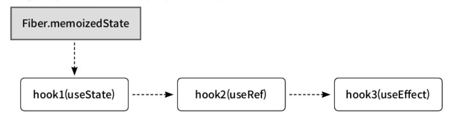

### 왜 훅이라고 부를까?

훅은 함수형 컴포넌트가 리액트의 핵심 기능에 갈고리를 걸어 사용한다는 비유에서 유래됨

훅이 등장하기 전, 함수형 컴포넌트는 프롭스를 받아 UI를 렌더링하는 상태 없는 컴포넌트에 불과했음

훅을 통해 함수형 컴포넌트는 상태를 직접 소유하고, 컴포넌트의 생명주기 시점에 맞추어 특정 로직을 실행할 수 있게 됨

클래스 컴포넌트가 가졌던 한계를 알게되면 함수형 컴포넌트와 훅이라는 새로운 패러다임의 도입 이유를 알 수 있음

</br>
</br>

### 클래스 컴포넌트에서 함수형 컴포넌트로

클래스 컴포넌트는 오랫동안 리액트의 표준이었지만, 다음과 같은 두 가지 주요 어려움이 존재했음

</br>
</br>

#### this 키워드의 혼란과 수동 바인딩의 번거로움

자바스크립트의 this는 함수가 선언된 위치가 아니라, 호출되는 방식에 따라 결정됨

→ 클래스 컴포넌트에서 예측하기 어려운 버그의 원인됨

이벤트 핸들러와 같이 컴포넌트 메서드가 다른 컨텍스트에서 호출될 때, this는 클래스 인스턴스를 가리키지 않고 `undefined` 가 되어 `this.setState()` 와 같은메서드를 호출할 때 에러의 원인이 되었음

</br>

다음 예제 코드는 클래스 컴포넌트의 `this` 컨텍스트의 3가지 문제와 해결법을 다룬 코드임

```jsx
class ThisContextExample extends React.Component {
	constructor(props) {
		super(props);
		this.state = {
			count: 0,
			message: 'this 컨텍스트 예제',
		};
		
		// 생성자에서 this를 바인딩
		this.handleIncrementBound = this.handleIncrementBound.bind(this);
	}
	
	handleIncrementUnbound() {
		console.log('Unbound this:', this);
		this.setState({ count: this.state.count + 1 });
	}
	
	handleIncrementBound() {
		console.log('Bound this:', this);
		this.setState((prevState) => ({ count: prevState.count + 1 }));
	}
	
	handleIncrementArrow = () => {
		console.log('Arrow function this:', this);
		this.setState((prevState) => ({ count: prevState.count + 1}));
	};
	
	render() {
		return (
			<div>
				<h1>{this.state.message}</h1>
				<p>Count: {this.state.count}</p>
				<button onClick={this.handleIncrementBound}>증가 (생성자에서 바인딩)</button>
				<button onClick={this.handleIncrementArrow}>증가 (화살표 함수ㅠ)</button>
			</div>
		);
	}
}
```

- `handleIncrementbound()`
    - `this` 가 바인딩되어 있지 않아, 버튼 클릭 시 `this` 는 `undefined` 가 됨
- `handleIncrementUnbound()`
    - 명시적으로 생성자에서 `this` 를 바인딩하여 해결
    - 컴포넌트에 메서드가 추가될 때마다 바인딩 코드를 추가해야 하는 번거로움이 존재
- `handleIncrementArrow`
    - 화살표 함수는 상위 스코프(여기서는 클래스 인스턴스)의 `this` 를 참조하야 해결

이처럼 `this` 를 다루기 위한 부가적인 코드와 자바스크립트 컨텍스트에 대한 깊은 이해가 요구되었음

</br>
</br>

#### 고차 컴포넌트와 래퍼 지옥

클래스 컴포넌트에서 상태 관련 로직이나 생명주기 로직을 여러 컴포넌트에 재사용하는 방법으로 고차 컴포넌트가 많이 사용되었음

하지만 여러 개의 다른 컴포넌트로 감싸는 구조였기에 래퍼 지옥이라 불리는 현상을 초래함

→ 복잡한 컴포넌트 트리, 떨어지는 코드이 가독성과 유지보수성

</br>

다음은 해당 문제점을 잘 보여주는 예시 코드임

```jsx
import React from "react";

export default function withWindowSize(WrappedComponent) {
	return class extends React.Component {
		state = { width: window.innerWidth, height: window.innerHeight };
		
		handleResize = () => {
			this.setState({ width: window.innerWidth, height: window.innerHeight });
		};
		
		componentDidMount() {
			window.addEventListener('resize', this.handleResize);
		}
		
		componentWillUnmount() {
			window.removeEventListener('resize', this.handleResize);
		}
		
		render() {
			return <WrappedComponent windowSize={this.state} {...this.props} />;
		}
	}
}

class SizeViewer extends React.Component {
	render() {
		const { width, height } = this.props.windowSize;
		return <div>Window size: {width}x{height}</div>;
	}
}

const WindowSizeViewer = withWindowSize(SizeViewer);
```

`SizeViewer` 컴포넌트는 HOC으로부터 `windowSIze` 라는 이름의 프롭스를 받을 것이라고 암묵적으로 기대하고 있음

이는 다음 두 가지 문제를 야기함

- **모호한 프롭스 출처**
    - `SizeViewer` 컴포넌트 코드만 봐서는 `windowSize` 프롭스가 어디서 오는지 명확히 알 수 없음
    - HOC의 내부 구현을 직접 확인해야함
- **프롭스 이름 충돌**
    - 또 다른 HOC가 같은 이름의 프롭스를 주입하려 한다면, 예기치 않은 버그를 발생시킬 수 있음

또, HOC는 함수가 클래스를 반환하는 다소 생소한 패턴을 사용하기에 직관적 이해가 어려울 수 있음

</br>
</br>

#### 커스텀 훅을 사용한 로직 재사용

앞서 살펴본 클래스 컴포넌트와 HOC 패턴의 한계를 극복하기 위해, 커스텀 훅이 나타남

커스텀 훅은 `use` 로 시작되는 이름의 자바스크립트 함수로, 컴포넌트의 상태관련 로직을 캡슐화하고 재사용할 수 있게 해줌

</br>

다음은 직전 HOC의 예제를 커스텀 훅을 사용한 코드로 바꾼 예제임

```jsx
function useWindowSize() {
	const [size, setSize] = useState({
		width: window.innerWidth,
		height: window.innerHeight,
	});
	
	useEffect(() => {
		const handleResize = () => {
			setSize({
				width: window.innerWidth,
				height: window.innerHeight,
			});
		};
		
		window.addEventListener('resize', handleResize);
		
		return () => window.removeEventListener('resize', handleResize);
	}, []);
	
	return size;
}

function WindowSizeViewer() {
	const { width, height } = useWindowSize();
	const router = useRouter();
	const auth = useAuthStore();
	return <div>Window size: {width}x{height}</div>;
}
```

- `useWindowSize()`
    - 자신만의 상태를 소유하고 관리함
    - 특정 컴포넌트에 종속되지 않고, 독립적으로 재사용될 수 있음
- `useEffect()`
    - 클래스 컴포넌트에서 3가지로 나뉘어 있던 이벤트 리스너 등록 및 해체 로직이 하나로 통합됨
- **로직의 결과물 반환**
    - 커스텀 훅은 JSX 대신, 상태나 상태를 변경하는 함수 등 필요한 결과물을 반환
    - 상태 관리 로직과 UI 렌더링의 책임이 완벽하게 분리됨
- **간결한 호출과 명시적 사용**
    - `useWindowSize()` 라는 함수 호출만으로 모든 복잡한 로직을 가져와 사용할 수 있음
- **의존성 추가 제거가 쉬움**
    - 함수형 컴포넌트에서 필요한 만큼 훅을 호출하면 됨

</br>
</br>

### 리액트 훅 사용 규칙

모든 훅에 공통적으로 적용되는 가장 중요한 규칙을 먼저 숙지해야함

</br>
</br>

#### 훅은 최상위에서만 호출해야 한다

컴포넌트 내부에서 호출 시 매번 렌더링될 때마다 각 훅들이 같은 순서로 호출되는 게 보장되어야 함

리액트 훅은 반복문, 조건문, 중첩된 함수 내에서 호출될 수 없음

리액트는 컴포넌트별로 훅의 상태를 저장하는 데 단일 연결 링크드 리스트를 사용함

훅이 호출되는 순서, 링크드 리스트를 순서대로 순회하며 각 훅의 상태를 가져오고 각 훅의 상태를 구분함

</br>

다음은 리액트가 내부적으로 훅을 관리하는 방식을 아주 단순회된 의사코드임

```jsx
// 현재 렌더링 중인 컴포넌트(Fiber 노드)를 가리키는 포인터
let currentlyRenderingFiber = null;
// 현재 처리 중인 훅(리스트의 마지막 훅 포인터)
let workInprogressHook = null;
// 현재 렌더링이 마운트인지, 재렌더인지
let isMount = true;

// isMount에 따라 새 훅 객체를 만들 것인지 업데이트 할 것인지 결정
export function useState(initialState) {
	return isMount ? mountState(initialState) : updateState(initialState);
}

export function useRef(initialValue) {
	return isMount ? mountRef(initialValue) : updateRef(initialValue);
}

export function useEffect(create, deps) {
	return isMount ? mountEffect(create, deps) : updateEffect(create, deps);
}

// 첫 번째 렌더링 시 해당 함수가 호출됨
export function renderWithHooks(fiber) {
	currentlyRenderingFiber = fiber;
	workInProgressHook = null;
	isMount = fiber.memoizedState === null;
	fiber.type(fiber.props);
}
```

마운트 시 리액트의 목표는 각 훅에 대한 링크드 리스트를 구성하는 훅 노드를 생성하고, 이들을 next 포인터로 연결하여 링크드 리스트를 구축하는 것임

</br>

이를 바탕으로 다음과 같이 훅이 순서대로 선언된 컴포넌트가 있다고 가정할때

```jsx
function MyComponent() {
	const [state, setState] = useState(initialState);
	const refContatiner = useRef(initialValue);
	useEffect(() => {
		// 내부 로직
	});
	// 컴포넌트 로직
}
```

</br>

`MyComponent()` 함수가 실행되면 다음의 함수들이 호출됨

```jsx
function mountState(initialState) {
	const hook = mountWorkInProgressHook();
	hook.memoizedState = initialState;
	const dispatch = (action) => { console.log(`State updated:', action);
	return [hook.memoizedState, dispatch];
}

function mountRef(initialValue) {
	const hook = mountWorkInProgressHook();
	hook.memoizedState = { current: initialValue };
	return hook.memoizedState;
}

function mountEffect(create, deps) {
	mountWorkInprogressHook();
}

function mountWorkInprogressHook() {
	const hook = { memoizedState: null, next: null };
	if (workInProgressHook === null) {
		currentlyRenderingFiber.memoizedState = workInProgressHook = hook;
	} else {
		workInprogressHook = workInProgressHook.next = hook;
	}
	return workInProgressHook;
}
```

호출 순서와 작동은 다음과 같음

- `mountState()` 호출
    - `mountWorkInProgressHook()` 은 첫 번째 훅 노드 `hook1` 을 생성함
    - `workInProgressHook` 변수가 `null` 이므로, 이 노드가 시작점이 됨
- `mountRef()` 호출
    - `mountWorkInProgressHook()` 은 두 번째 훅 노드 `hook2` 을 생성함
    - `workInProgressHook` 변수가 `hook1` 이므로, `hook1.next` 가 `hook2` 를 가리킴
- `mountEffect()` 호출
    - `mountWorkInProgressHook()` 은 세 번째 훅 노드 `hook3` 을 생성함
    - `workInProgressHook` 변수가 `hook2` 이므로, `hook2.next` 가 `hook3` 를 가리킴

</br>

렌더링이 끝나면 `MyComponent` 의 파이버에는 다음과 같은 훅의 연결 리스트가 구축됨



상태 업데이트 시 이전에 만들어둔 연결 리스트를 순서대로 순회하여 각 훅의 상태를 가져오게 됨

</br>

코드로 보면 다음과 같음

```jsx
function updateState(initialState) {
	const hook = updateWorkInProgressHook();
	const dispatch = (action) => { console.log(`State updated:', action);
	return [hook.memoizedState, dispatch];
}

function updateRef(initialValue) {
	const hook = updateWorkInProgressHook();
	return hook.memoizedState;
}

function updateEffect(create, deps) {
	updateWorkInprogressHook();
}
```

- `updateState()` 호출
    - `updateWorkInProgressHook()` 은 `workInProgressHook` 이 `null` 이므로 `hook1` 을 가져옴
    - `workInProgressHook` 포인터는 `hook1` 을 가리키고 `hook1` 에 저장된 상태를 반환함
- `updateRef()` 호출
    - `updateWorkInProgressHook()` 은 `workInProgressHook` 이 `hook1` 이므로 `hook2` 을 가져옴
    - `workInProgressHook` 포인터는 `hook2` 을 가리키고 `hook2` 에 저장된 `ref` 객체를 반환함
- `updateEffect()` 호출
    - `updateWorkInProgressHook()` 은 `workInProgressHook` 이 `hook2` 이므로 `hook3` 을 가져옴
    - `workInProgressHook` 포인터는 `hook3` 을 가리킴

즉, 컴포넌트가 리렌더링할 때마다 링크드 리스트를 순서대로 순회하며 기존에 저장해둔 노드에서 각 상태와 상태 업데이트 함수를 참조하기 때문에, 조건부 로직안에서 호출해서는 안됨

조건부 로직이 필요하다면, 훅의 호출 자체를 제어하는 것이 아니라 훅의 내부나 JSX에서 처리해야 함

</br>
</br>

#### 오직 리액트 함수 내에서만 훅을 호출해야 한다

리액트 훅이 호출될 수 있는 위치는 엄격하게 정해져 있음

리액트 함수 컴포넌트의 최상위 스코프와 커스텀 훅의 최상위 스코프를 제외한 나머지 함수, 메서드에서는 훅을 절대로 호출할 수 없음

→ 훅이 동작하려면 렌더링 컨텍스트가 필요하기 때문

</br>

다음은 훅을 잘못 사용한 예시 코드임

```jsx
function calculateSomething() {
	const [result, setResult] = useState(0);
	// ...
}

class MyComponent extends React.Component {
	componentDidMount() {
		calculateSomething();
		const [count, setCount] = useState(0);
	}
	// ...
}
```

- **일반 함수에서의 호출**
    - 일반 함수 `calculateSomething()` 내부에서 훅이 선언되어 있음
- **클래스 컴포넌트에서의 호출**
    - 클래스 컴포넌트는 `this.state` 와 생명주기 메서드를 통해 상태를 관리해야 함
    - 훅과는 함께 사용할 수 없음

</br>
</br>

#### 훅의 인수는 불변성을 가지고 있어야 한다

리액트의 성능 최적화는 대부분 얕은 비교에 의존함

→ 객체나 배열의 내용 전체를 비교하는 대신, 이전 렌더링과 현재 렌더링의 프롭스나 상태의 참조가 동일한지를 확인

이러한 원칙은 훅에서도 동일하게 적용됨

</br>

다음은 훅의 인수를 직접 변경하는 잘못된 사례임

```jsx
function useGoldenRabbitBad(rabbit: Rabbit): Rabbit {
	const theme = useContext(ThemeContext);
	
	if (rabbit.isSpecial) {
		rabbit.color = theme.golden;
		rabbit.glow = true;
	}
	
	return rabbit;
}
```

rabbit 객체가 다른 컴포넌트나 훅에서도 사용하고 있었다면, 그곳에서는 아무런 예고 없이 값이 바뀌는 연쇄적인 버그가 발생할 수 있음

</br>

이런식으로 스프레드 연산자를 사용하여 불변성을 지킬 수 있음

```jsx
function useGoldenRabbitBad(rabbit: Rabbit): Rabbit {
	const theme = useContext(ThemeContext);
	
	if (!rabbit.isSpecial) {
		return rabbit;
	}
	
	return {
		...rabbit,
		color: theme.golden,
		glow: true,
	};
}
```

</br>