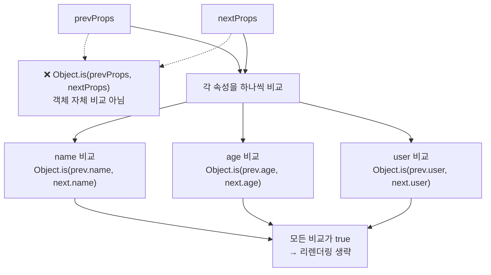
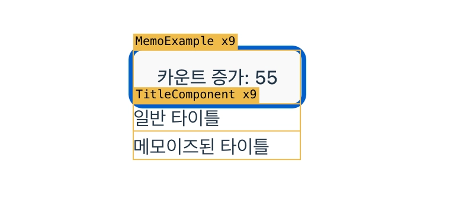
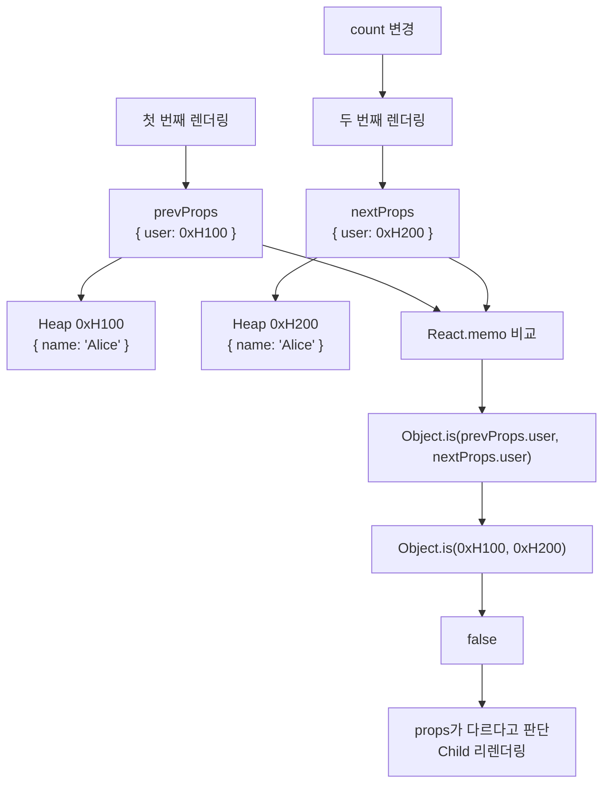
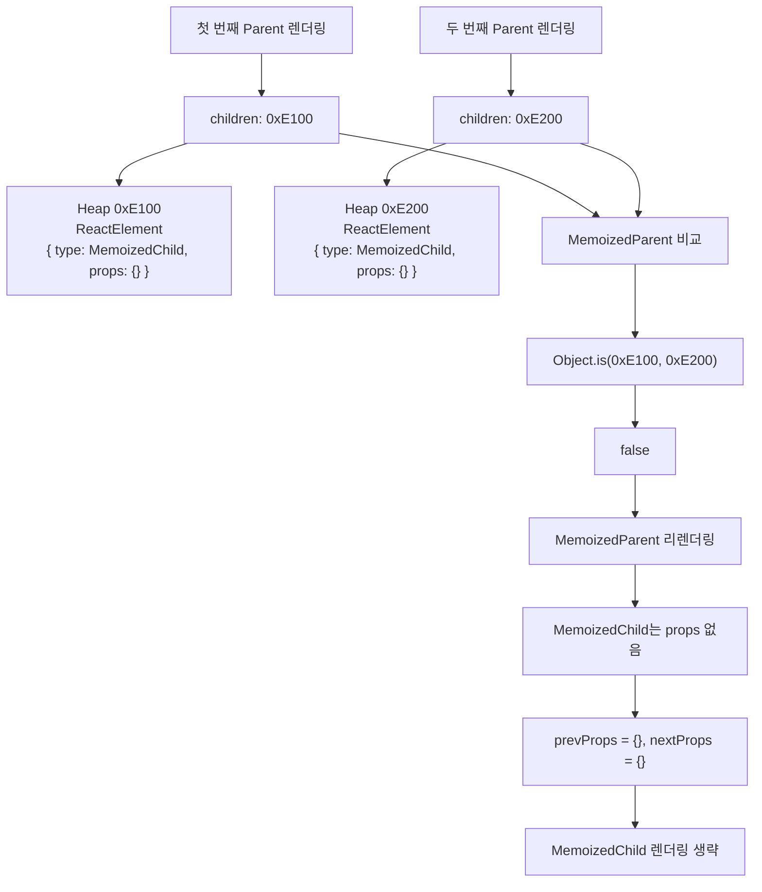
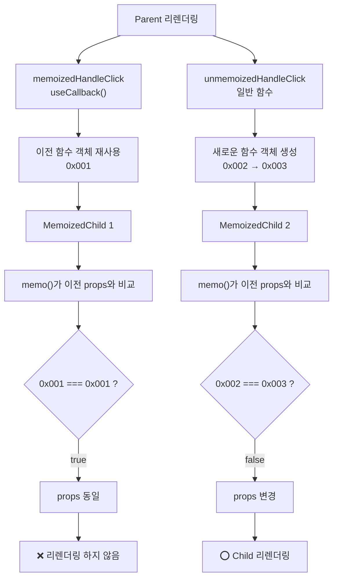
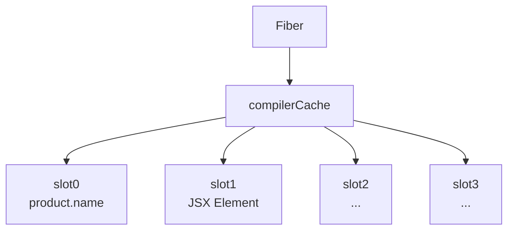

### Overview

성능 최적화를 위해서 `React.memo()` , `useCallback()` , `useMemo()` 사용하면 된다는 것을 떠올릴 수 있음

여기서 한단계 더 나아가 모든 코드에 성능 최적화를 하면 좋은게 아닐까? 하는 생각을 할 수 있음

무분별한 최적화에 대한 맹신은 때로는 의도치 않은 부작용을 낳거나, 심지어 성능을 악화시키는 원인이 될 수 있음

→ 메모이제이션 훅들을 깊이 이해하지 못했을 때 발생

이번 내용에서는 이러한 메모이제이션 훅들을 이해하고 메모이제이션을 자동화해주는 리액트 컴파일러에 대해 알아봄

</br>
</br>

### React.memo()

`React.memo()` 는 컴포넌트를 감싸서 프롭스를 비교하고, 변경되지 않았다면 이전에 렌더링한 결과를 재사용하여 불필요한 리렌더링을 방지하는 고차 컴포넌트임

하지만, `React.memo()` 가 유용해 보인다고 해서 모든 컴포넌트에 무분별하게 적용하는 것은 좋지 않음

→ 프롭스 비교에는 비용이 들기 때문에 오히려 성능에 악영향을 미칠 수 있음

</br>

그렇기에 다음과 같은 기준을 만족할 때 사용하는 것이 적절함

- **컴포넌트가 순수하고, 렌더링 비용이 비싼 상황**
- **부모 컴포넌트가 자주 렌더링되지만, 자식 컴포넌트는 동일한 props를 자주 받는 상황**
- **props에 객체, 배열, 함수가 포함되더라도 참조 동일성이 유지되는 상황**

</br>

`React.memo()` 의 기본 형태는 다음과 같음

`React.memo()` 는 첫 번째 인자로 최적화시키기 위한 컴포넌트를, 두 번째 인자로는 선택적으로 비교 함수를 넣을 수 있음

```jsx
React.memo(Component, arePropsEqual?)
```

선택적 함수를 생략하면 얕은 비교를 수행하고 직접 제공한다면, 해당 함수가 `true` 를 반환할때 리렌더링을 생략하고 `false` 를 반환할 때 리렌더링을 수행함

</br>



이때 얕은 비교는 `props` 객체 자체를 비교하는 것이 아니라, `prevProps` 와 `nextProps` 객체에 포함된 각각의 속성을 `===` 가 아니라 `Object.is()` 로 비교하는 방식을 말함

→ `Object.is` 는 대부분의 경우 `===` 와 동일하게 작동하나 부호 차이를 구분하고 `NaN` 끼리는 같은 값으로 본다는 차이점이 존재

</br>

다음 예제는 선택적 함수를 생략하고 익명 함수 컴포넌트를 넣은 형태임

```tsx
import * as React from "react";
import {useState} from "react";

const TitleComponent = ({title}: { title: string }) => {
    console.log(`${title} 렌더링`)
    return <h4>{title}</h4>
}

const MemoizedTitleComponent = React.memo(({title}: { title: string }) => {
    console.log(`${title} (메모이즈) 렌더링`)
    return <h4>{title}</h4>
})

export default function MemoExample() {
    const [count, setCount] = useState(0);

    return (
        <div>
            <button onClick={() => setCount((c) => c + 1)}>
                카운트 증가: {count}
            </button>

            <TitleComponent title="일반 타이틀"/>

            <MemoizedTitleComponent title="메모이즈된 타이틀"/>
        </div>
    )
}
```

</br>

실행 결과는 다음과 같음



`title` 프롭스가 변경되지 않았기에 `React.memo()` 가 사용된 `MemoizedTitleComponent` 는 리렌더링 되지 않는것을 볼 수 있음

</br>

다음과 같이 객체를 `props` 넘기게되면 `React.memo()` 가 효과가 없음

```tsx
import {useState} from "react";
import * as React from "react";

const Child = React.memo(({user}: { user: { name: string } }) => {
    console.log("Child 렌더링");
    return <h4>{user.name}</h4>;
})

export default function Parent() {
    const [count, setCount] = useState(0);

    return (
        <div>
            <button onClick={() => setCount((c) => c + 1)}>
                count: {count}
            </button>

            <Child user={{name: "Alice"}}/>
        </div>
    );
}
```

</br>

`Child` 는 다음과 같은 `props` 를 받음

```tsx
<Child user={{ name: "Alice" }} />

// 실제 props
props = {
  user: { name: "Alice" }
}
```

</br>

그렇기에 다음 그림과 같은 형태가 됨

→ 렌더링마다 객체 리터럴이 다시 평가되기에 새 객체가 생성되기에



즉, `prevProps.user` 는 `0xH100` 으로 `nextProps.user` 는 `0xH200` 으로 평가됨

→ 이걸 해결하기 위해서 객체 참조 안정화, 뒤에서 다룰 `useMemo()` 가 나오게 된 것

</br>
</br>

#### children도 props

위 객체 `props` 상황의 연장선으로 `children` `props` 에서도 비슷한 문제가 발생할 수 있음

다음은 `children` `props` 를 받는 익명 함수를 `React.memo()` 로 감싼 코드임

```tsx
const MemoizedParent = React.memo(({children}: { children: React.ReactNode }) => {
        console.log("부모 컴포넌트 렌더링");
        return <div>{children}</div>
    }
)

const MemoizedChild = React.memo(() => {
    console.log("자식 컴포넌트 렌더링");
    return <div>자식 컴포넌트</div>
})

export default function Parent() {
    const [count, setCount] = useState(0);

    return (
        <div>
            <button onClick={() => setCount((c) => c + 1)}>
                count: {count}
            </button>
            <MemoizedParent>
                <MemoizedChild/>
            </MemoizedParent>
        </div>
    )
}
```

`React.memo()` 메모로 감싼 두 컴포넌트 모두 별도의 `props` 를 받지 않기에 최적화가 된다 생각할 수 있음

→ 실제로는 `count` 가 변경될 때마다 `memoizedParent` 는 리렌더링 됨

이유는 `children` 도 결국 `props` 이기 때문임

</br>

즉, `MemoizedParent` 입장에서 실제 `props` 는 다음과 비슷하게 동작함

```tsx
props = {
	children: <MemoizedChild />
}

// 다음과 같은 객체 형태
{
	type: memoizedChild,
	props: {},
	key: null,
	ref: null
}
```

따라서 `Parent` 컴포넌트가 리렌더링될 때마다 JSX가 다시 평가되어 새로운 객체도 새로 생성됨

하지만, `children` `props` 로 전달한 `MemoizedChild` 의 `props` 는 없기에 최초 한 번만 렌더링됨

</br>

그림으로 보면 다음과 같음



결국 차이는 `props` 이름이 `user` 냐 `children` 이냐일 뿐, 핵심 원리는 동일함

</br>
</br>

### useMemo()

앞서 본 `React.memo()` 는 `props` 의 변경 여부를 판단하는 역할만 수행한다고 했음

따라서 객체나 함수가 매 렌더링마다 새롭게 생성된다면 `React.memo()` 만으로는 불필요한 리렌더링을 막을 수 없음

이를 해결하기 위해 React는 `useMemo()` 와 `useCallback()` 을 제공함

`useMemo()` 는 의존성이 변경되지 않는 경우 이전 값을 재사용하여 객체 참조를 유지할 수 있게 해주는 훅임

</br>

다만 `useMemo()` 만 사용한다고 해서 리렌더링이 방지되는 것은 아님

`useMemo()` 는 객체의 참조를 유지할 뿐이며, 해당 참조를 비교하여 렌더링 여부를 판단하는 것은 `React.memo()` 의 역할임

정리하자면

- `React.memo()` 는 `props` 를 비교하여 렌더링 여부를 결정함
- `useMemo()` 는 비교 대상이 되는 객체의 참조를 유지함

따라서 객체나 함수를 `props` 로 전달하는 경우, 일반적으로 `React.memo()` 와 `useMemo()` 를 함께 사용해야 불필요한 리렌더링을 방지할 수 있음

</br>

`useMemo()` 의 형태는 다음과 같음

```tsx
function useMemo(
	factory,  // 연산 결과를 반환하는 함수
	deps      // 의존성 배열
)
```

의존성 배열 안의 값이 변경될 때만 `factory` 함수를 다시 실행하고, 그 실행 결과값을 새로 저장함

변경 값 비교는 `Object.is()` 를 사용함

의존성 값이 변경되지 않으면 `factory` 를 실행하지 않고, 이전에 저장해둔 결과값을 그대로 재사용함

의존성 배열을 빈 배열로 준다면, 최초 마운트 시 계산 후 저장되어 비교 결과가 항상 같으므로 이전 값을 반환함

</br>

다음은 `useMemo()` 를 이해하기 위한 간소화된 의사코드임

```tsx
// 리액트 내부에서 컴포넌트별 훅 상태를 저장하는 가상의 저장소
const componentHooks: Map<any, { list: HookState[]; index: number }> = new Map();

// 현재 렌더링 중인 컴포넌트를 가리키는 포인터
let currentComponent: any = null;

interface HookState {
    memoizedValue: any;
    deps: any[] | undefined;
}

function createHook(): HookState {
    return {memoizedValue: null, deps: undefined}
}

// useMemo 훅의 간소화된 의사코드
function useMemo<T>(callback: () => T, dependencies: any[] | undefined): T {
    if (!currentComponent) {
        throw new Error("훅은 컴포넌트 렌더링 중에만 호출될 수 있습니다")
    }

    // 현재 컴포넌트에 해당하는 훅 저장소를 가져오거나 새로 생성함
    if (!componentHooks.has(currentComponent)) {
        componentHooks.set(currentComponent, {list: [], index: 0})
    }

    const hooks = componentHooks.get(currentComponent)!;
    // 현재 훅의 인덱스를 가져오고, 다음 훅을 위해 1 증가시킴
    const hookIndex = hooks.index++;

    let hook = hooks.list[hookIndex] as HookState | undefined;

    // 처음 호출시 상태를 초기화
    if (!hook) {
        hook = createHook();
        hooks.list[hookIndex] = hook;
    }

    // 의존성이 없거나 -> 첫 렌더링, 현재와 다르다면 값을 새로 계산함
    if (!hook.deps || !dependencies || !depsEqual(dependencies, hook.deps)) {
        hook.memoizedValue = callback();
        hook.deps = dependencies;
    }

    // 의존성이 같다면, 그대로 이전 값 반환
    return hook.memoizedValue;
}

// 두 의존성 배열을 비교하는 헬퍼 함수
function depsEqual(newDeps: any[], oldDeps: any[] | null): boolean {
    if (oldDeps === null) return false;
    if (newDeps.length !== oldDeps.length) return false;

    return newDeps.every((dep, i) => Object.is(dep, oldDeps[i]))
}
```

</br>

`useMemo()` 를 적용하기전 예시 코드임

```tsx
import { useState } from "react";

function calculateFibonacci(n: number): number {
  if (n <= 1) return 1;
  return calculateFibonacci(n - 1) + calculateFibonacci(n - 2);
}

function generateComplexPattern(seed: number, size: number): string[] {
  let pattern: string[] = [];
  for (let i = 0; i < size; i++) {
    let value = calculateFibonacci(seed + (i % 10));
    pattern.push(`hsl(${value % 360}, 70%, 50%`);
  }
  return pattern;
}

export default function UnoptimizedRabbitPatter() {
  const [seed, setSeed] = useState(0);
  const [count, setCount] = useState(0);

  const colors = generateComplexPattern(seed, 20);

  return (
    <div>
      <h2>최적화 전 (seed: {seed}</h2>
      <div>
        {colors.map((color, i) => (
          <div
            key={i} // 리액트 리스트 렌더링 시 필요한 key 속성
            className="w-8 h-8 rounded"
            style={{ backgroundColor: color }} // 각 div의 배경색을 설정함
          />
        ))}
      </div>

      <button type="button" onClick={() => setSeed((s) => s + 1)}>
        패턴 변경하기
      </button>

      <button type="button" onClick={() => setCount((c) => c + 1)}>
        클릭 횟수: {count}
      </button>
    </div>
  );
}
```

클릭 횟수 버튼을 누르면 `count` 상태가 변경되고 리렌더링됨

→ `colors` 를 계산하는 데 필요한 `seed` 값은 변경되지 않았음에도 무거운 로직의 `generateComplexPattern()` 함수가 불필요하게 다시 호출됨

</br>

`generateComplexPattern()` 호출 부분을 `useMemo()` 로 감싸고, 의존성 배열에 `seed` 를 전달하면 됨

```tsx
export default function optimizedRabbitPattern() {
  const [seed, setSeed] = useState(0);
  const [count, setCount] = useState(0);

  const colors = useMemo(() => {
    return generateComplexPattern(seed, 20);
  }, [seed]);
  // ..
  );
}
```

`count` 상태 변경으로 리렌더링이 발생하더라도 `useMemo()` 가 `seed` 값이 그대로임을 확인하고 이전에 계산하여 저장해둔 `colors` 배열을 그대로 반환함

여기서 `Memo` 를 같이 안 쓴 이유는 컴포넌트 렌더링 방지가 아니라 비용이 큰 계산 방지이기 때문임

</br>
</br>

### useCallback()

`useMemo()` 가 함수의 결과값을 메모이제이션했다면, `useCallback()` 은 함수 객체를 메모이제이션 함

`useCallback()` 의 기본 형태는 다음과 같음

```tsx
function useCallback(
	callback,
	deps
)
```

</br>

하지만 다음과 같이 `useCallback()` 은 `useMemo()` 만으로도 동일한 동작을 구현할 수 있음

```tsx
const memoizedFn1 = useCallback(fn, deps);

const memoizedFn2 = useMemo(() => fn, deps);
```

`useMemo()` 는 콜백 함수의 반환값을 메모이제이션하는 Hook이지만, 여기서는 반환값으로 `fn` 이라는 함수 객체를 반환하고 있기 때문임

</br>

자연스럽게, `useCallback()` 존재에 대한 의문이 생길 수 있음

→ 그 이유는 의도가 명확해지고 가독성이 좋아지기 때문임

다음 코드에서는 이 함수의 참조를 유지하려는 목적이라는 것을 바로 알 수 있음

```tsx
const handleClick = useCallback(() => {
  ...
}, []);
```

</br>

반면 다음 코드는 동일하게 동작하지만, 값을 메모이제이션하려는 것인지, 함수를 메모이제이션하려는 것인지 한 번 더 해석해야함

```tsx
const handleClick = useMemo(() => {
  return () => {
    ...
  };
}, []);
```

그렇기에 함수는 `useCallback()`, 그 외 값은 `useMemo()` 를 사용하는 것이 일반적인 패턴임

</br>
</br>

#### useCallback() 활용하기

`useCallback()` 의 필요성을 알아봤으니 다음은 어떤 상황에서 유용하게 사용될 수 있는지 살펴 볼 것임

</br>

**먼저 커스텀 훅에 콜백 함수를 전달할 때의 상황임**

해당 코드는 `useEffect` 부분에서 사용했던 예시 코드로 `onClose()` 를 인자로 받는 `useEscapeKey()` 커스텀 훅임

```tsx
export function useEscapeKey(onClose: () => void) {
  useEffect(() => {
    const handleKeyDown = (e: KeyboardEvent) => {
      if (e.key === 'Escape') {
        onClose();
      }
    };

    document.addEventListener('keydown', handleKeyDown);

    return () => {
      document.removeEventListener('keydown', handleKeyDown);
    };
  }, [onClose]);
}
```

</br>

만약 `useEscapeKey()` 를 사용하는 컴포넌트에서 `onClose()` 를 메모이제이션하지 않고 함수 인자로 전달했을때 문제가 발생함

```tsx
function ModalWithoutCallback() {
	const [isOpen, setIsOpen] = useState(false);
	const [count, setCount] = useState(0);
	
	const handleClose = () => {
		console.log('모달 닫기');
		setIsOpen(false);
	}
	
	useEscapekey(handleClose);
	
	// ... JSX 코드
}
```

`count` 의 상태가 변경되어 리렌더링시 이전과 기능이 완전한 동일함에도 불구하고, `handleClose()` 는 새로운 참조를 가진 함수 객체로 만들어짐

</br>

`useCallback()` 를 사용하면 `count` 가 변경되어도 `handleClose()` 함수의 참조는 동일하게 유지됨

```tsx
function ModalWithoutCallback() {
	const [isOpen, setIsOpen] = useState(false);
	const [count, setCount] = useState(0);
	
	const handleClick = useCallback(() => {
		console.log('모달 닫기');
		setIsOpen(false);
	}, []);
	
	useEscapekey(handleClose);
	
	// ... JSX 코드
}
```

</br>

**다음은 프롭스 메모이제이션에 상황임**

`memo()` 로 자식 컴포넌트를 최적화하더라도, 부모가 자식에게 함수를 프롭스로 전달하면 최적화가 깨짐

→ 계속 반복하는 내용, 함수는 객체

`memo()` 가 의도한 대로 동작하게 하려면, 프롭스로 전달되는 함수 역시 `useCallback()` 을 사용하여 메모이제이션해야 함

```tsx
import { memo, useCallback } from "react";

const MemoizedChild = memo(({ onClick }: { onClick: () => void }) => {
  return (
    <button type="button" onClick={onClick}>
      name
    </button>
  );
});

export default function ParentComponentForMemo() {
  const memoizedHandleClick = useCallback(() => {
    console.log("Memoized");
  }, []);

  const unmemoizedHandleClick = () => {
    console.log("UnMemoized");
  };

  return (
    <div>
      <MemoizedChild onClick={memoizedHandleClick} />
      <MemoizedChild onClick={unmemoizedHandleClick} />
    </div>
  );
}
```

</br>

그림으로 보면 다음과 같음



`useCallback` 은 함수 참조를 재사용하고, `memo` 는 그 참조를 얕은 비교하여 리렌더링 여부를 결정함을 볼 수 있음

</br>

**마지막으로 타이머 함수나, 특정 함수의 실행 빈도를 제어하는 유틸리티 함수와 함께 사용될 때임**

`useCallback()` 은 `setTimeout()` , `setInterval()` , `debounce()` , `throttle()` 처럼 내부 상태를 가지는 함수와 함께 사용할 때 특히 유용함

예를 들어 `debounce()` 는 내부적으로 타이머 정보를 저장하고 관리하는데, 컴포넌트가 리렌더링될 때마다 새로운 `debounce()` 가 생성되면 이전 타이머 정보를 잃어버리게 됨

```tsx
const debouncedSearch = debounce(searchApi, 300);
```

위 코드는 리렌더링마다 새로운 `debounce()` 가 생성되므로, 입력할 때마다 서로 다른 타이머가 동작하게 되어 `debounce()` 가 의도대로 동작하지 않을 수 있음

</br>

이를 방지하기 위해 `useCallback()` 으로 함수 참조를 유지함

```tsx
const debouncedSearch = useCallback(debounce(searchApi, 300), []);
```

이제 모든 렌더링에서 동일한 `debounce()` 를 사용하므로 내부 타이머 상태가 유지되고, `debounce()` 가 정상적으로 동작함

즉 `useCallback()` 은 단순히 불필요한 리렌더링을 방지하는 것뿐만 아니라, 함수 내부 상태를 유지해야 하는 라이브러리와 함께 사용할 때도 중요한 역할을 함

</br>
</br>

### 리액트 컴파일러를 이용한 자동 메모이제이션

지금까지 리액트 애플리케이션의 성능을 수동으로 최적화하는 방법을 배웠음

하지만 수동 메모이제이션의 한계는 명확함

- **코드 복잡성 증가**
    - UI의 상태를 설명하는 것에서 처리 방법까지 명시하게 되어 가독성이 떨어짐
- **실수하기 쉬움**
    - 의존성 배열을 잘못 관리하면 비효율적일 수 있음
- **유지보수의 어려움**
    - 코드가 변경됨에 따라 메모이제이션 로직도 함께 업데이트해야 함

이러한 고충을 해결하기 위해 리액트 컴파일러가 등장함

</br>

컴파일러가 적용되면 다음과 같은 변화가 발생함

- **자동 메모이제이션**
    - 프롭스나 리액트 훅의 의존성, 컴포넌트 그 자체를 자동으로 메모이제이션 함
- **캐스캐이딩 렌더링 방지**
    - 부모 컴포넌트가 리렌더링되면 자식 컴포넌트가 자동으로 리렌더링되는 현상을 말함
    - 자식 컴포넌트는 프롭스나 상태가 변경될 때만 리렌더링 됨
- **코드의 가독성 향상**

</br>
</br>

#### 리액트 컴파일러의 원리 및 동작 방식

컴파일러는 개발자가 작성한 코드를 깊이 있게 분석하여, 어떤 값이 변경될 수 있고 어떤 값이 그대로 유지되는지를 스스로 이해함

→ 리액트 규칙을 준수하여 작성되었는지 분석하여 위반시 해당 부분의 최적화를 건너뜀

이는 일부 컴포넌트만 최적화되더라도 전체 애플리케이션이 문제없이 동작함을 의미함

</br>

동작 방식을 알기 위해 아래에 컴포넌트를 바탕으로 어떤식으로 리액트 컴파일러가 변경하는지 알아 볼 것임

```tsx
interface ProductItemProps {
  product: { id: number; name: string; price: number };
  onAddToCart: (productId: number) => void;
}

const ProductItem = ({ product, onAddToCart }: ProductItemProps) => {
  return (
    <div>
      <p>
        <strong>{product.name}</strong>- {product.price.toLocaleString()}원
      </p>
      <button type="button" onClick={() => onAddToCart(product.id)}>
        장바구니에 추가
      </button>
    </div>
  );
};
```

</br>

위 컴포넌트를 리액트 컴파일러로 변경한 결과물은 다음과 같음

```jsx
import { c as _c } from "react/compiler-runtime"

const ProductItem = (t0) ==>=> {
	const $ = _c(13);
  const { product, onAddToCart } = t0;

  let t1;
  if ($[0] !== product.name) {
      t1 = <strong>{product.name}</strong>;
      $[0] = product.name;
      $[1] = t1;
      } else {
      t1 = $[1];
	}
	// 생략
}
```

</br>

`_c()` 는 메모이제이션 캐시를 생성하는 역할을 함

```jsx
import { c as _c } from "react/compiler-runtime"

const ProductItem = (t0) ==>=> {
	const $ = _c(13);
```

이 캐시는 개별 컴포넌트 인스턴스에 해당하는 Fiber와 연결되어 관리되며, 13개의 슬롯을 가진 `$` 배열을 반환함

</br>

개념적으로는 다음과 같은 형태로 저장된다고 볼 수 있음



`$` 배열은 컴포넌트가 렌더링되는 동안 필요한 정보를 저장하는 데 사용되며, React Compiler는 이 캐시를 활용하여 값의 재사용 여부를 판단함

→ JSX 엘리먼트, 함수 참조, 배열 등의 계산 결과와 이를 계산하는 데 사용된 props, state 등의 의존성

</br>

그 아래 `if` 문에서는 불필요한 JSX 생성을 피하기 위해 `product.name` 의 변경 여부를 판단하고 이를 캐싱함

```jsx
let t1;
  if ($[0] !== product.name) {
      t1 = <strong>{product.name}</strong>;
      
      $[0] = product.name;
      $[1] = t1;
  } else {
      t1 = $[1];
	}
```

즉 기존의 `useMemo()` 가 의존성과 계산 결과를 Fiber 내부 Hook 저장소에 보관했다면, React Compiler는 의존성과 계산 결과를 Compiler Cache 슬롯에 저장하여 동일한 최적화를 자동으로 수행하는 것임

</br>
</br>

#### 리액트 컴파일러의 수동 메모이제이션 대체 가능 여부

이에 대해서는 여러 의견이 있을 수 있겠지만 상황에 따라 직접 메모이제이션을 수행하는 게 더 합리적인 결과물을 가져다주기도 함

이를 알아보기위해 먼저 최적화 이전의 원본 컴포넌트 코드를 알아 볼 것임

```jsx
interface ProductListProps {
  products: { id: number; name: string; price: number }[];
  searchTerm: string;
  onAddToCart: (productId: number) => void;
}

function ProductList({ products, searchTerm, onAddToCart }: ProductListProps) {
  const filteredProducts = products.filter((product) => {
    return product.name.toLowerCase().includes(searchTerm.toLowerCase());
  });

  if (filteredProducts.length === 0 && searchTerm) {
    return <p>"{searchTerm}"에 해당 하는 제품이 없습니다.</p>;
  }

  return (
    <div>
      {filteredProducts.map((product) => (
        <ProductItem
          key={product.id}
          product={product}
          onAddToCart={onAddToCart}
        />
      ))}
    </div>
  );
}
```

필터링 로직인 `filteredProducts` 함수는 `ProductList` 가 리렌더링될 때마다 실행 됨

→ 배열 전체를 다시 순회하므로, 잠재적인 성능 병목 지점이 될 수 있음

</br>

`filteredProducts` 함수를 최적화한 코드는 다음과 같음

```jsx
// ...
if ($[1] !== onAddToCart || $[2] !== products || $[3] !== searchTerm) {
	if ($[6] !== searchTerm) {
	t32 = (product) => { /* ... */};
	$[6] = searchTerm;
	$[7] = t32;
	} else {
		t32 = $[7];
	}
	
	const filteredProducts = products.filter(t32);
	// ...
	} else {
	t1 = $[4];
	t2 = $[5];
	}
// ...
```

컴포넌트의 핵심 로직 전체를 거대한 `if` 문으로 감쌈

`products` , `searchTerm` , `onAddToCart` 중 어느 하나도 바뀌지 않았다면, 내부 로직을 전부 건너뛰고 이전 캐시 값을 즉시 반환

</br>

하지만 의존성 검사에서 상관없는 `onAddToCart` 함수까지 포함되어 있음

→ 해당 함수에서 필요한 값은 `products` , `searchTerm` 뿐임

```jsx
if ($[1] !== onAddToCart || $[2] !== products || $[3] !== searchTerm) {
```

이것이 리액트 컴파일러가 선택한 블록 단위 의존성 추론의 결과이자 트레이드 오프임

→ 코드 한 줄 한 줄이 아닌, 연관된 코드 블록 전체를 하나의 최적화 단위로 봄

</br>

만약 `useMemo` 로 직접 최적화했다면 다음과 같이 작성했을 것임

```jsx
const filteredProducts = useMemo(() => {
	return products.filter((product) => {
		return product.name.toLowerCase().includes(searchTerm.toLowerCase());
	});
}, [products, searchTerm]);
```

이런 상황에서는 수동 메모이제이션이 더 좋은 선택지가 될 수 있음

</br>