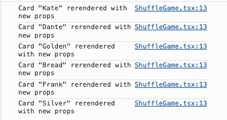

### Overview

리액트의 렌더링 프로세스 탐구를 통해 UI가 화면에 그려지기 까지의 내부 동작 원리를 이해하는 것을 목표로 함

트리거 → 렌더 → 커밋 단계를 통해 렌더링의 전체 흐름을 체계적으로 다루고, 더 나아가 리액트의 재조정 알고리즘과 리스트 렌더링에서 키 프롭스의 중요성에 대해 알아볼 것임

</br>
</br>

### 렌더링과 가상 DOM을 돌아봐야 하는 이유

구체적인 이유는 다음과 같음

- **예측 불가능한 버그 원천적 차단**
    - 리액트의 렌더링은 순수 함수처럼 동작해야 함
    - 이 원칙이 깨지면 같은 프롭스에도 다른 결과가 나와서 추적하기 어려운 버그가 생김
    - 렌더링 규칙을 이해하면 디버깅 시간을 크게 줄일 수 있음
- **성능 최적화의 핵심**
    - 불필요한 리렌더링은 반응성을 저해하는 가장 큰 요인
    - 컴포넌트가 왜 다시 그려지는지 정확히 안다면 최적화 API를 더 잘 활용 할 수 있음
- **가상 DOM과 key의 동작 원리 이해**
    - 리스트 렌더링 시 흔히 발생하는 상태 관리 이슈나 비효율적인 업데이트를 근본적으로 피할 수 있음

이러한 이유들을 제대로 체감하려면, 먼저 렌더링의 대상인 컴포넌트가 내부적으로 어떻게 다뤄지는지를 알아야 함

</br>
</br>

### 리액트 컴포넌트

리액트 엘리먼트를 반환하는 클래스 혹은 함수를 리액트 컴포넌트라고 함

→ 함수형 컴포넌트는 함수의 반환값, 클래스 컴포넌트는 `render()` 메서드의 반환값을 출력

</br>
</br>

#### 클래스 컴포넌트와 인스턴스

리액트가 클래스 컴포넌트를 렌더링할 때는 클래스의 새 인스턴스를 생성하고, 그 인스턴스의 `render()` 메서드를 호출함

```jsx
export default class ClassComponentExampel extends React.Component {
	constructor(props) {
		super(props);
		
		this.state = {
			count: 0,
		};
		
		this.incrementCount = this.incrementCount.bind(this);
		
		console.log('classComponentExample 인스턴스 생성됨', this);
	}
	
	componentDidMount() {
		console.log('ClassComponentExample 인스턴스 마운트됨:', this);
	}
	
	componentWillUnmount() {
		console.log('ClassComponentExample 인스턴스 언마운트됨:', this);
	}
	
	incrementCount() {
		this.setState({ count: this.state.count + 1 });
		console.log('incrementCount 호출됨. 현재 this', this);
	}
	
	render() {
		console.log('ClassComponentExampel 렌더링 중. 현재 this:', this);
		return (
			<div>
				<h2>클래스 컴포넌트 예제</h2>
				<p>현재 카운트: {this.state.count}</p>
				<button onClick={this.incrementCount}>카운트 증가</button>
				<p>전달된 메시지: {this.props.message || '기본 메시지'}</p>
			</div>
		);
	}
}
```

상태는 `this.state` 로 초기화하고 `this.setState()` 로 변경하며, 클래스 메서드 내부에서 `this` 가 인스턴스를 가리키도록 `bind(this)` 가 필요함

생명주기는 `componentDidMount()`, `componentWillUnmount()` 같은 개별 메서드로 관리함

</br>

클래스 컴포넌트에서 중요한 점은 인스턴스 안에 `this.state` , `this.props` , 직접 정의한 메서드, 생명주기 메서드가 모두 담긴다는 것임

→ 즉, 클래스 컴포넌트는 인스턴스 자체에 상태를 들고 있음

인스턴스가 없는 함수형 컴포넌트가 상태를 어디에 저장하는지를 이어서 살펴보겠음

</br>
</br>

#### 함수형 컴포넌트와 파이버 노드

위의 클래스 컴포넌트의 동일한 기능을 함수형으로 작성하면 다음과 같음

```jsx
function FunctionComponentExample({ message }) {
  const [count, setCount] = useState(0);

  useEffect(() => {
    console.log('마운트됨');

    return () => {
      console.log('언마운트됨');
    };
  }, []);

  const incrementCount = () => {
    setCount(count + 1);
  };

  return (
    <div>
      <h2>함수형 컴포넌트 예제</h2>
      <p>현재 카운트: {count}</p>
      <button onClick={incrementCount}>카운트 증가</button>
      <p>전달된 메시지: {message || '기본 메시지'}</p>
    </div>
  );
}
```

함수형 컴포넌트는 클래스 인스턴스를 생성하지 않기에 `this` 를 사용하지 않으므로 바인딩도 필요없음

생명주기는 `useEffect()` 를 통해 마운트, 업데이트, 언마운트 시점을 모두 제어할 수 있음

</br>

앞서 던진 질문의 답은 파이버 노드에 있음

리액트는 내부적으로 각 컴포넌트마다 파이버 노드라는 객체를 만들어서 관리함

→ 파이버 노드 안에 상태, 훅 정보, 트리 내 위치 등이 저장됨

이때, 훅은 파이버 노드 내부에서 연결 리스트로 관리되기 때문에, 조건문이나 반복문 안에서 호출하면 호출 순서가 달라져 상태가 꼬일 수 있으므로 항상 컴포넌트 최상위에서만 호출해야 함

</br>

클래스 컴포넌트는 인스턴스 자체에 상태를 들고 있지만, 함수형 컴포넌트는 이 파이버 노드에 상태를 저장함

컴포넌트가 무엇이고, 그 상태가 어디에 저장되는지를 알았으니 이제 이 컴포넌트들이 실제로 화면에 그려지는 과정을 살펴보겠음

</br>
</br>

### 렌더링

렌더링은 컴포넌트 함수를 호출해 새로운 가상 DOM을 생성하고, 이전 결과와 비교하여 실제 DOM에 반영하는 전체 과정을 말함

이 과정이 상태 변화 등으로 인해 다시 일어나는 것이 리렌더링임

함수형이면 `FunctionalComponent()`를, 클래스면 `ClassComponent.render()`를 리액트가 내부적으로 호출하여 반환값을 얻음

→ 리액트가 실제로 호출하는 방식이므로 개발자가 직접 호출해서는 안 됨

</br>

렌더링 과정은 트리거, 렌더, 커밋 세 단계로 나눌 수 있음

이 세 단계가 내부적으로 어떻게 동작하는지, 파이버 아키텍처와 함께 하나씩 살펴보겠음

</br>
</br>

#### 트리거 단계

`ReactDOM.createRoot()` 로 생성된 루트의 `render()` 메서드에 컴포넌트를 전달하면 최초 렌더링이 트리거됨

이때 전달되는 컴포넌트를 루트 컴포넌트라고 함

```jsx
import { createRoot } from 'react-dom/client';

// 컴포넌트 렌더링 트리거
createRoot(document.getElementById('root')).render(
  <StrictMode>
    <App />
  </StrictMode>,
)
```

이후의 리렌더링은 주로 `useState()` 나 `this.setState()` 호출을 통해 트리거됨

트리거를 통해 특정 컴포넌트의 렌더링이 시작되면, 해당 컴포넌트의 모든 자식 컴포넌트들도 순차적으로 렌더링됨

어느 컴포넌트에서 상태 업데이트가 발생했는지에 따라 애플리케이션의 일부만 리렌더링할지, 전체를 리렌더링할지가 결정됨

트리거가 발생했으니, 이제 리액트는 무엇이 바뀌었는가를 파악해야 함

</br>
</br>

#### 렌더 단계 - 파이버 트리 위에서의 비교

렌더 단계는 컴포넌트 함수를 호출하여 새로운 가상 DOM을 생성하고, 이전 가상 DOM과 비교하여 변경이 필요한 부분을 찾아내는 단계임

이 과정은 실제 DOM을 조작하지 않으며, 메모리 상에서 계산만 수행함

→ 가상 DOM(리액트 엘리먼트 트리)은 리액트 엘리먼트들이 모여서 만들어진 전체 트리 구조를 말함

이 비교가 구체적으로 어디에서 이루어지는지 보러면, 앞서 소개한 파이버 노드가 다시 등장함

</br>

앞서 각 컴포넌트마다 파이버 노드가 만들어진다고 했는데, 이 파이버 노드들이 부모-자식-형제 관계로 연결되어 파이버 트리를 구성함

예를 들어 `<div>` 안에 `<h1>`과 `<button>`이 있다면, `div`, `h1`, `button` 각각에 대해 파이버 노드가 하나씩 만들어짐

렌더 단계에서의 비교는 바로 이 파이버 트리 위에서 이루어짐

리액트는 파이버 트리를 순회하며 각 파이버에 대해 `beginWork()` 함수를 호출하고, 파이버의 타입에 따라 각기 다른 업데이트 함수를 실행함

</br>

다음 의사코드는 함수형 컴포넌트의 파이버를 처리하는 로직임

```jsx
function updateFunctionComponent(current, workInProgress, Component, nextProps, renderLanes) {
  prepareToReadContext(workInProgress, renderLanes);

  // ... Bailout 로직 ...

  const nextChildren = renderWithHooks(
    current,          // 이전 파이버
    workInProgress,   // 현재 작업 중인 파이버
    Component,        // 실행할 함수 컴포넌트
    nextProps,        // 새로운 props
    null,             // context(레거시)
    renderLanes       // 현재 렌더링의 우선순위 정보
  );

  // ... 상태 변경이 있었는지 최종 확인 후 Bailout 여부 결정 ...

  reconcileChildren(current, workInProgress, nextChildren, renderLanes);

  return workInProgress.child;
}
```

핵심 함수 두 가지만 이해하면 됨

- `renderWithHooks()`
    - 개발자가 작성한 컴포넌트 함수를 직접 호출하는 부분
    - `useState()`, `useMemo()` 등 모든 훅이 실행되고, 그 결과로 새로운 자식 엘리먼트인 `nextChildren` 이 반환 됨
- `reconcileChildren()`
    - 재조정 알고리즘이 실제로 동작하는 부분
    - `nextChildren` 과 이전 자식 파이버를 비교하여, 재사용할지, 생성할지, 삭제하거나 이동할지를 결정하고 해당 변경을 파이버에 작업 플래그로 표시함
    - 이때 사용되는 비교 로직이 디핑 알고리즘이며, 이 알고리즘의 상세 동작은 이후 재조정 섹션에서 다룸

작업 플래그는 파이버에 어떤 DOM 조작을 해야 하는지 표시해두는 값임

</br>

실제 코드를 통해 렌더 단계와 트리거가 일어나는 부분을 짚어보겠음

```jsx
// 컴포넌트 함수 호출 시 렌더 단계가 시작됨
function RenderPhaseExample() {
  const [count, setCount] = useState(0);

  useEffect(() => {
    console.log('마운트: 컴포넌트가 DOM에 추가됨');
    return () => {
      console.log('언마운트: 컴포넌트가 DOM에서 제거됨');
    };
  }, []);

  console.log('렌더 단계 실행: 가상 DOM 계산 중...');

  // 상태를 업데이트하는 함수로 리렌더링을 유발하는 트리거
  const handleIncrement = () => {
    setCount(prevCount => prevCount + 1);
  };

  return (
    <div>
      <h1>카운터: {count}</h1>
      <p>버튼을 클릭하면 상태가 업데이트되어 리렌더링이 발생합니다.</p>
      <button onClick={handleIncrement}>증가</button>
    </div>
  );
}
```

위 코드에서 `setCount()`로 상태를 변경하면 리액트는 이 컴포넌트의 리렌더링을 스케줄링하고, 이것이 다시 렌더 단계를 트리거함

렌더 단계의 결과물은 `return` 문에서 반환하는 JSX이며, 이 JSX가 가상 DOM으로 변환됨

</br>

리액트 18부터는 렌더링 작업을 중단했다 재개할 수 있는 동시성 기능이 도입되어, 렌더 단계는 더 중요한 업데이트가 들어오면 잠시 멈출 수 있음

이처럼 렌더 단계는 여러 번 실행되거나 중단될 수 있으므로, 부수 효과가 없는 순수 함수처럼 동작해야 하며 멱등성이 보장되어야 함

`beginWork()` 가 트리를 위에서 아래로 내려가며 각 파이버를 비교했다면, 이제 그 결과를 정리하며 올라가는 과정이 필요함

</br>
</br>

#### completeWork - 렌더 단계 마무리

`completeWork()`는 `beginWork()`와 반대로 트리를 아래에서 위로 거슬러 올라가며 그 결과를 정리함

Placement 플래그가 붙은 파이버를 위해 실제 DOM 노드 인스턴스를 만들고, 현재 파이버의 작업 플래그들을 부모 파이버로 전파함

이 과정이 루트까지 반복되면, 렌더 단계가 끝나고 리액트는 두 개의 결과물을 갖게 됨

- **WIP 트리**
    - 화면에 렌더링될 새로운 트리를 모두 반영하는 완성된 파이버 트리이며, 커밋이 완료되면 현재 트리로 교체됨
- **이펙트 리스트**
    - 렌더 단계 동안 기록된 작업 플래그를 기반으로 만들어진, 실제 DOM에 적용해야 할 작업들의 연결 리스트

이 두 결과물이 준비되면, 비로소 실제 화면을 바꿀 차례가 됨

</br>
</br>

#### 커밋 단계 - 실제 DOM 반영

렌더 단계가 무엇을 바꿔야 하는가를 계산하는 단계였다면, 커밋 단계는 그 계산 결과를 실제 DOM에 적용하는 단계임

이 단계에서의 DOM 변경은 중단 없이 동기적으로 수행됨

구체적으로는 이펙트 리스트를 순회하면서, 각 파이버의 작업 플래그에 따라 `domElement.setAttribute()`, `domElement.className` 같은 브라우저 DOM API를 호출하여 속성을 변경함

</br>

커밋 단계에서는 DOM 변경 외에도 `useEffect()`, `useLayoutEffect()`, 클린업 함수 호출 등이 실행되지만, 핵심은 이펙트 리스트에 따른 DOM 조작임

단, 렌더 단계가 일어난다고 꼭 커밋이 따라 발생하는 것은 아님

렌더 단계에서 이전 가상 DOM과 새 가상 DOM을 비교한 결과 변경이 필요하다고 판단될 때만 커밋이 실행됨

</br>

리액트 18버전부터 여러 상태 업데이트를 하나로 묶어 렌더링을 한 번만 수행하는 자동 배칭이 일반화되어, 여러 상태 업데이트가 발생해도 한 번의 커밋으로 처리함

→ 자동 배칭은 여러 상태 업데이트를 하나로 묶어서 렌더링을 한 번만 하는 과정을 말함

지금까지 트리거 → 렌더 → 커밋의 파이프라인을 살펴봤는데, 이 파이프라인이 컴포넌트의 생애 주기에서 언제 어떻게 실행되는지 정리하겠음

</br>
</br>

#### 마운트, 언마운트, 리렌더링

커밋 단계에서 컴포넌트가 처음으로 실제 DOM에 반영되는 경우, 이를 마운트라고 함

커밋이 완료된 이후 브라우저가 페인팅을 진행하여 화면에 표시함

마운트 이후부터 개발자가 `useEffect()`의 콜백 함수를 통해 DOM 조작, 이벤트 핸들러 부착, 웹소켓 연결 같은 리소스 등록을 할 수 있음

</br>

반대로 컴포넌트가 화면에서 더 이상 필요 없어지면 실제 DOM에서 제거되는데, 이를 언마운트라고 함

이 시점에서는 마운트 시점에 등록했던 이벤트, 구독, 타이머 등의 리소스를 반드시 해제해야 함

컴포넌트는 한 앱에서 여러 번 호출될 수 있기 때문에, 이를 놓치면 메모리 누수로 이어짐

</br>

마운트와 언마운트가 컴포넌트의 시작과 끝이라면, 그 사이에서 props 가 전달되거나 state 값이 변경될 때 화면을 갱신하는 과정이 리렌더링임

리렌더링은 기존 DOM을 전부 교체하는 것이 아니라, 이전 가상 DOM과 새로운 가상 DOM을 비교하여 변경된 부분만 실제 DOM에 반영하기 때문에 마운트보다 훨씬 가벼운 작업임

이 과정에서도 동일하게 렌더 단계와 커밋 단계를 거치며, 렌더 단계에서는 새로운 가상 DOM을 생성하고 이전 가상 DOM과 비교하여 변경된 부분을 판단하는데, 이 비교 과정이 바로 재조정임

</br>

하지만 이러한 비교를 단순한 트리 비교 알고리즘으로 수행하면 성능 비용이 매우 커지는 문제가 있음

따라서 리액트는 이를 효율적으로 처리하기 위해 몇 가지 가정을 기반으로 비교 과정을 단순화함

</br>
</br>

### 재조정 - Reconciliation

#### 두 가지 휴리스틱

일반적인 트리 비교 알고리즘은 최소 차이를 찾기 위해 O(n³)의 시간 복잡도를 가지며, 노드 수가 많아질수록 성능 비용이 급격히 증가함

이 문제를 해결하기 위해 리액트는 몇 가지 합리적인 가정을 기반으로 O(n) 수준의 재조정 알고리즘을 사용함

</br>

핵심은 다음 두 가지 기준임

- **type 기준 비교**
    - 서로 다른 타입의 엘리먼트는 완전히 다른 트리로 간주한다
    - 예를 들어 `<div>` → `<span>` 또는 `<A />` → `<B />` 로 변경되면 기존 트리를 유지하지 않고 새로 생성한다
- **key 기준 비교**
    - 동일한 타입의 자식 요소들은 key를 기준으로 식별한다
    - 이를 통해 리스트에서 요소의 추가, 삭제, 이동을 효율적으로 처리하고 불필요한 DOM 변경을 줄인다

</br>

결과적으로 재조정에서의 핵심 비교 기준은 type과 key 두 가지임

```jsx
// type 예시
<div>안녕</div>        // type: 'div'
<h1>제목</h1>          // type: 'h1'
<App />               // type: App (함수 자체)
<Button />            // type: Button (함수 자체)

// key 예시
<li key="apple">사과</li>   // key: 'apple'
<li key="banana">바나나</li> // key: 'banana'
<li>포도</li>                // key: null (지정하지 않으면 null)
```

type은 태그 이름이나 컴포넌트 자체를 의미하고, key는 동일한 타입의 요소들을 구분하기 위한 식별자임

</br>

비교의 결과로 각 파이버에는 작업 플래그가 부여됨

- **Update**
    - 기존 DOM 노드 유지, 프롭스만 업데이트
- **Placement**
    - 새로운 DOM 노드 생성 또는 기존 DOM 노드를 새로운 위치로 이동
- **Deletion**
    - 기존 DOM 노드 제거

이 플래그를 어떻게 결정하는지가 디핑 알고리즘의 핵심이며, 새로운 자식이 단일 엘리먼트인지, 엘리먼트 배열인지에 따라 다른 방식으로 비교를 수행함

</br>
</br>

### 디핑 알고리즘 - 단일 엘리먼트

```jsx
// 이전
<div>
  <h1>제목</h1>
</div>

// 이후
<div>
  <h2>제목</h2>
</div>
```

단일 엘리먼트의 경우, 리액트는 이전 자식 파이버들을 하나씩 순회하면서 새로운 엘리먼트와 일치하는 파이버를 찾음

</br>

리액트 내부 소스코드의 의사코드로 보면 다음과 같음

```jsx
function reconcileSingleElement(returnFiber, currentFirstChild, newElement) {
  let oldFiber = currentFirstChild;

  while (oldFiber !== null) {
    // Key 비교
    if (oldFiber.key === newElement.key) {
      // Type 비교
      if (oldFiber.elementType === newElement.type) {
        // Key와 Type 모두 일치시 재사용
        deleteRemainingChildren(returnFiber, oldFiber.sibling);
        const existing = useFiber(oldFiber, newElement.props);
        existing.return = returnFiber;
        return existing;
      }
      // Key는 같지만 Type이 다르면 재사용 불가
      deleteRemainingChildren(returnFiber, oldFiber);
      break;
    } else {
      // Key 불일치시 현재 파이버 삭제
      deleteChild(returnFiber, oldFiber);
    }
    oldFiber = oldFiber.sibling;
  }

  // 일치하는 파이버를 찾지 못하면 새 파이버를 생성
  const created = createFiberFromElement(newElement, returnFiber.mode, lanes);
  created.return = returnFiber;
  return created;
}
```

</br>

여기서 짚고 넘어가야 할 점은 key와 type 외에도 트리 내 위치가 재사용 여부에 영향을 미친다는 것임

같은 type의 컴포넌트라도 트리에서 어떤 위치에 렌더링되느냐에 따라 결과가 달라짐

```jsx
const Input = ({ name, ...props }) => {
  useEffect(() => {
    console.log(`Input "${name}" mounted`);
    return () => console.log(`Input "${name}" unmounted`);
  }, [name]);
  return <input {...props} name={name} />;
};

const First = () => {
  const [disabled, setDisabled] = useState(false);
  const toggle = () => setDisabled(!disabled);
  return (
    <div>
      {/* [0] */}
      <button type="button" onClick={toggle}>
        toggle disable
      </button>
      {/* [1] */}
      {disabled ? (
        <Input disabled name="disabled-input" />
      ) : (
        <Input name="active-input" />
      )}
    </div>
  );
};
```

`First` 컴포넌트는 삼항 연산자로 처리하기 때문에 어느 쪽이든 같은 위치에 `<Input>`이 하나 렌더링됨

리액트는 같은 자리에 같은 type이 있으니 기존 파이버를 재사용하고 props만 업데이트함

</br>

```jsx
import { useEffect, useState } from "react";

const Input = ({ name, ...props }) => {
  useEffect(() => {
    console.log(`Input "${name}" mounted`);
    return () => console.log(`Input "${name}" unmounted`);
  }, [name]);
  return <input {...props} name={name} />;
};

const Second = () => {
  const [disabled, setDisabled] = useState(false);
  const toggle = () => setDisabled(!disabled);
  return (
    <div>
      {/* [0] */}
      <button type="button" onClick={toggle}>
        toggle disable
      </button>
      {/* [1] */}
      {disabled ? <Input disabled name="disabled-input" /> : null}
      {/* [2] */}
      {!disabled ? <Input name="active-input" /> : null}
    </div>
  );
};
```

반면 `Second` 컴포넌트는 두 줄로 분리되어 있어서 각각 다른 위치임

key가 없는 엘리먼트는 리액트가 인덱스를 식별자로 사용함

→ 내부적으로 순서대로 번호를 매김

</br>

이처럼 단일 엘리먼트의 재사용은 key, type 그리고 트리 내 위치로 결정됨

단일 엘리먼트의 비교는 비교적 단순하지만 더 자주 마주치는 것은 리스트, 즉 `.map()` 등으로 동적으로 생성되는 자식 배열의 경우임

</br>
</br>

### 디핑 알고리즘 - 엘리먼트 배열

```jsx
// 이전
<ul>
  <li key="a">사과</li>
  <li key="b">바나나</li>
  <li key="c">포도</li>
</ul>

// 이후
<ul>
  <li key="c">포도</li>
  <li key="a">사과</li>
  <li key="d">딸기</li>
</ul>
```

엘리먼트 배열에 경우, 자식이 여러 개이므로 어떤 것이 추가되었고, 삭제되었고, 순서가 바뀌었는지를 모두 판단해야 하기 때문에 단일 엘리먼트보다 복잡함

</br>

리액트가 이 판단을 정확하게 하려면 각 자식을 식별할 수 있어야 하는데, 그 식별자가 바로 key임

배열의 맨 앞이나 중간에 새로운 항목이 추가, 삭제될 경우, 기존 항목들의 인덱스가 모두 1씩 밀리게 됨

리액트는 이를 모든 항목이 변경되었다고 오해하여 전체 리스트를 파기하고 다시 그리거나, 엉뚱한 상태를 유지하는 치명적인 버그를 발생시킬 수 있음

</br>

리액트 내부 소스코드의 의사코드로 보면 다음과 같음

```jsx
function reconcileChildrenArray(returnFiber, currentFirstChild, newChildrenArray) {
  const oldFiberMap = mapOldFibersByIdentifier(currentFirstChild);

  let resultingFirstChild = null;
  let previousNewFiber = null;
  let lastPlacedIndex = -1;

  // 새로운 자식 배열을 순회하며 비교 시작
  for (let newIdx = 0; newIdx < newChildrenArray.length; newIdx++) {
    const newElement = newChildrenArray[newIdx];

    // 새 엘리먼트의 Key로 이전 파이버를 Map에서 검색
    const identifier = newElement.key !== null ? newElement.key : newIdx;
    const matchedOldFiber = oldFiberMap.get(identifier);

    let newFiber;

    if (matchedOldFiber && matchedOldFiber.elementType === newElement.type) {
      // Key와 Type 모두 일치시 재사용
      newFiber = useFiber(matchedOldFiber, newElement.props);
      oldFiberMap.delete(identifier);

      // 이동 여부 판단
      if (matchedOldFiber.index < lastPlacedIndex) {
        newFiber.flags |= Placement;
      }
      lastPlacedIndex = Math.max(lastPlacedIndex, matchedOldFiber.index);
    } else {
      // 일치하는 파이버가 없으면 생성함
      newFiber = createFiber(newElement);
      newFiber.flags |= Placement;
      if (matchedOldFiber) {
        deleteChild(returnFiber, matchedOldFiber);
      }
    }
  }

  // Map에 남은 이전 파이버는 모두 삭제
  oldFiberMap.forEach(fiber => deleteChild(returnFiber, fiber));

  return resultingFirstChild;
}
```

이 코드는 크게 4단계로 동작함

- **이전 자식 맵핑**
    - 이전 자식 파이버들을 전부 순회하며 키 혹은 인덱스를 기반으로 Map 자료구조를 만듦
    - 이렇게 하면 새로운 자식의 key를 사용해 빠르게 찾아낼 수 있음
- **새로운 자식 순회**
    - 새로운 자식 엘리먼트 배열을 처음부터 끝까지 순회하며 하나씩 처리함
- **비교 및 처리**
    - key와 type이 모두 일치하면 파이버를 재사용하고, 순서가 바뀌었다면 작업 플래그로 표시함
    - key로 파이버를 찾지 못했거나 key는 같아도 type이 다르다면 새 파이버를 생성함
- **나머지 삭제**
    - Map에 남아 있는 파이버는 새로운 자식 리스트에 포함되지 않은 것들이므로 모두 Deletion 대상으로 표시

</br>
</br>

### 키 프롭스와 렌더링 최적화

리액트에는 불필요한 재조정을 건너뛰는 최적화 메커니즘이 있지만, 이 최적화가 제대로 동작하려면 키가 올바르게 사용되어야 함

먼저 키가 잘못 사용되면 발생하는 문제를 먼저 확인해보겠음

</br>
</br>

#### 키를 잘못 사용했을 때

다음 예제를 통해 알아보겠음

```jsx
const RabbitNameCard = ({ name }) => {
  useEffect(() => {
    console.log(`Card "${name}" mounted`);
    return () => console.log(`Card "${name}" unmounted`);
  }, []);

  useEffect(() => {
    console.log(`Card "${name}" rerendered with new props`);
  });

  return <input defaultValue={name} className="border border-gray-300 p-2 rounded text-center shadow-sm" />;
};
```

`RabbitNameCard` 컴포넌트는 프롭스로 받은 `name` 을 `<input>` 의 `defaultValue` 로 설정함

`defaultValue` 는 컴포넌트가 최초 마운트될 때 단 한 번만 `<input>` 의 값을 설정하고, 이후 프롭스가 변경되어 리렌더링되어도 `<input>`의 값을 변경하지 않음

→ props가 바뀌어도 무시하기에 파이버가 재사용된 건지 새로 마운트된 건지를 화면에서 바로 확인할 수 있음

</br>

다음 코드는 `rabbitDeck` 배열을 순회하며 `<RabbitNameCard>` 를 렌더링할 때, key 프롭스를 누락하여 사용하고 있음

```jsx
const RabbitShuffleDeck = () => {
  const initialRabbits = ["Golden", "Silver", "Dante", "Frank", "Kate", "Bread"];
  const [rabbitDeck, setRabbitDeck] = useState(initialRabbits);

  // 셔플 버튼 클릭 시 배열 순서를 무작위로 변경
  const handleClick = () => setRabbitDeck(shuffle(initialRabbits));

  return (
    // ...
    {/* key 프롭 없이 리스트를 렌더링 */}
    {rabbitDeck.map(rabbit => <RabbitNameCard name={rabbit} />)}
    // ...
  );
};
```

셔플 버튼을 눌러 배열의 순서가 바뀌었을 때 리액트는 다음과 같이 판단함

- 이전 렌더링의 `[index: 0]` 위치의 컴포넌트 타입은 `RabbitNameCard`, 리렌더링 시 `[index: 0]`의 컴포넌트 타입도 `RabbitNameCard` 이고 프롭스만 바뀜
- 같은 위치에 같은 타입의 컴포넌트가 있으니, 동일한 컴포넌트로 보고 재사용함

→ `rabbitDeck` 배열의 순서가 바뀌는 것을 확인할 수 있지만, 화면의 `<input>` 값들은 전혀 바뀌지 않는 것처럼 보임

</br>

리액트는 모든 인덱스에 대해 동일한 결정을 내림

즉, 컴포넌트를 이동시키지 않고 제자리에 그대로 둔 채 프롭스만 업데이트하는 것임

이런 이유로, 데이터의 순서가 바뀌거나 필터링되거나, 항목이 추가, 삭제될 수 있는 모든 리스트 렌더링에서 배열 인덱스를 키로 사용하는 것은 매우 위험하며 안티 패턴으로 간주됨

</br>

이 문제를 해결하려면, 각 엘리먼트의 정체성을 알려주는 고유하고 안정적인 키를 제공해야 함

이제 리액트는 key를 보고 정확히 식별함

컴포넌트를 재사용하는 대신, 각 컴포넌트를 올바른 위치로 이동시킴

컴포넌트가 그대로 유지된 채 위치만 바뀌므로, `<input>`에 담긴 내부 상태(유저가 입력한 값 등)도 그대로 보존됨

</br>
</br>

#### 키를 올바르게 사용해도 남는 문제 - 불필요한 리렌더링

```jsx
<div className="grid grid-cols-3 gap-2 w-full max-w-md">
  {rabbitDeck.map(rabbit => (
    <RabbitNameCard key={rabbit} name={rabbit} />
  ))}
</div>
```

키를 사용해 카드를 섞었을 때, 각 카드의 순서는 올바르게 변경됨

</br>



하지만 콘솔 창에 출력된 것을 보면 모든 `<RabbitNameCard>`가 리렌더링되는 것을 알 수 있음

</br>

`<RabbitNameCard>` 컴포넌트는 순서만 바뀌었을 뿐 각 카드의 내용인 `name` 프롭스는 변하지 않았으므로 이 리렌더링은 불필요한 작업임

일반적인 함수형 컴포넌트는 부모가 리렌더링되면 프롭스의 변경 여부와 관계없이 항상 함께 리렌더링되기 때문임

이 문제를 해결하는 것이 `React.memo`이고, 그 내부에서 사용되는 메커니즘이 얕은 비교임

</br>
</br>

### React.memo와 얕은 비교

`React.memo` 는 컴포넌트를 감싸서 렌더링 전에 이전 프롭스와 새 프롭스를 얕은 비교하는 고차 컴포넌트임

비교 결과가 `true` 이면 동일한 props 라고 판단하여 렌더링을 건너뛰고, `false` 이면 다른 props 라고 판단하여 리렌더링을 실행함

```jsx
// React.memo 사용 예시
const MemoizedComponent = React.memo(({ name, age }) => {
  console.log("렌더링 실행");
  return <div>{name}, {age}</div>;
});

// 부모가 리렌더링되어도 name과 age가 이전과 같다면, 렌더링 실행은 출력되지 않음
```

</br>

얕은 비교는 객체의 최상위 속성 참조만 `===` 로 비교하며, 중첩된 객체나 배열의 내부까지는 보지 않음

```jsx
// 얕은 비교의 동작 예시
const prevProps = { name: "Golden", style: { color: "red" } };
const nextProps = { name: "Golden", style: { color: "red" } };

prevProps.name === nextProps.name       // true
prevProps.style === nextProps.style     // false
```

위 예시에서 `style` 의 내용은 동일하지만 렌더링마다 새로운 객체가 생성되므로 참조가 달라져 얕은 비교는 `false` 를 반환함

→ 얕은 비교만으로는 놓치는 경우가 있지만, 깊은 비교(재귀적으로 모든 속성을 비교)는 연산 비용이 기하급수적으로 증가하여 UI 렌더링에 적합하지 않음

</br>

따라서 얕은 비교는 성능과 정확성 사이의 합리적인 절충안이며, `useEffect()`, `useMemo()`, `useCallback()` 훅의 의존성 배열을 비교할 때도 내부적으로 동일한 얕은 비교 로직이 사용됨

이 얕은 비교가 키와 만났을 때 결과가 어떻게 달라지는지 확인하겠음

</br>
</br>

### 올바른 Key + React.memo

올바른 키와 `React.memo()` 가 함께 사용되어야 하는 이유를 잘못된 키 사용과 비교하며 확인하겠음

`RabbitNameDisplay` 를 `React.memo()` 로 감싸고 인덱스를 키로 사용하면, 셔플 시 `key={0}` 에 매칭되는 name 이 Golden에서 Silver로 바뀌므로 얕은 비교가 `false` 를 반환함

```jsx
const MemoizedCardDisplay = React.memo(RabbitNameDisplay);

// 인덱스를 key로 사용
rabbitDeck.map((rabbit, index) => (
  <MemoizedCardDisplay name={rabbit} key={index} />
));
```

리액트는 모든 인덱스에 대해 이 과정을 반복하고, 결국 모든 컴포넌트는 리렌더링됨

→ `React.memo()` 를 사용한 의미가 없어짐

</br>

키로 인덱스 대신 각 데이터가 가진 고유하고 안정적인 값을 사용하면 결과가 달라짐

```jsx
const MemoizedCardDisplay = React.memo(RabbitNameDisplay);

rabbitDeck.map((rabbit) => (
  <MemoizedCardDisplay name={rabbit} key={rabbit} />
));
```

이제 리액트는 인덱스가 아닌 키 값 자체로 엘리먼트의 동일성을 판단함

- 이전 렌더링에서 `key="Golden"` 엘리먼트의 프롭스는 `{ name: "Golden" }`
- 새로운 렌더링에서도 위치가 변경되었을지라도 `key="Golden"` 엘리먼트의 프롭스는 여전히 `{ name: "Golden" }`
- 얕은 비교 수행 시 결과는 `true` 이므로 프롭스가 변경되지 않음
- 따라서 `<MemoizedCardDisplay>` 의 리렌더링을 건너뜀

</br>

키 덕분에 리액트는 엘리먼트가 단지 이동했을 뿐 내용 자체는 변하지 않았음을 정확히 인지하고 불필요한 리렌더링을 생략함

정리하면, 올바른 key는 재조정의 정합성을 보장하고, `React.memo()` 는 재조정의 효율성을 높임

두 가지가 합쳐져야 리스트 렌더링의 최적화가 완성됨

</br>