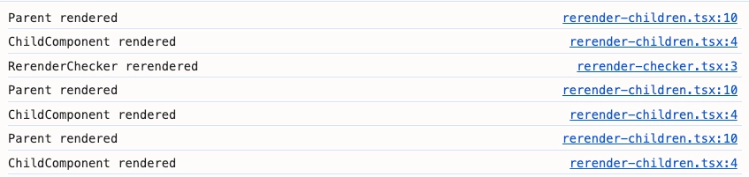
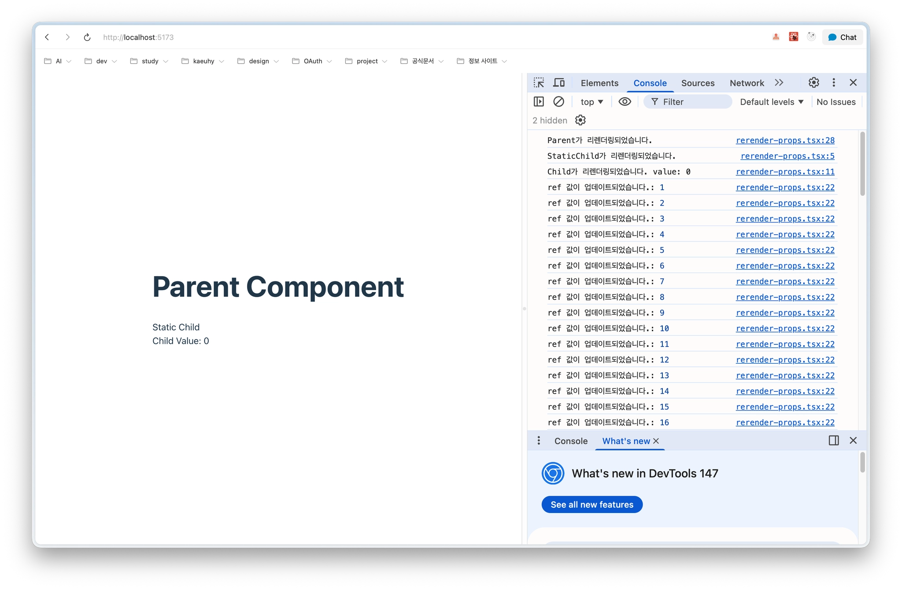

### 리액트 렌더링 규칙을 돌아봐야 하는 이유

많은 개발자가 리렌더링을 프롭스나 상태가 변경될 때만 발생한다 생각하지만 이는 정확한 답은 아님

정확한 렌더링 메커니즘을 알지 못한다면 예측 불가능한 버그, 유지보수하기 어려운 코드를 만들어냄

</br>
</br>

### 렌더링 조건

리액트 컴포넌트의 렌더링을 유발하는 조건은 다음과 같음

- **최초 렌더링**
    - 애플리케이션이 처음 로드될 때
- **상태 변경**
    - `useState()` 의 상태 변경 함수나 `useReducer()` 의 디스패처 함수가 호출될 때
- **부모 컴포넌트의 리렌더링**
    - 부모 컴포넌트가 렌더링되면, 자식 컴포넌트도 기본적으로 함께 렌더링 됨
- **컨텍스트 변경**
    - `useContext()` 훅을 통해 구독하고 있는 컨텍스트값이 변경될 때

</br>

렌더링 조건을 이해하기 위해선 다음 개념을 알아야 함

- **Reconciler(조정자)**
    - 컴포넌트의 상태가 변경되면, 조정자는 어떤 부분이 변경되어야 하는지 계산하는 역할을 함
- **Renderer(렌더러)**
    - Reconciler로부터 변경 사항을 전달받아, 실제 UI로 그려내는 역할을 함
    - react-dom → 웹 브라우저 환경을 위한 렌더러, react-native → 모바일 환경을 위한 렌더러

계산과 실행을 분리하여, 웹뿐만 아니라 모바일, 데스크톱 등 다양한 플랫폼에서 동작할 수 있는 유연성을 확보함

</br>
</br>

#### 최초 렌더링

애플리케이션의 모든 렌더링은 최초 렌더링에서 시작, 이는 react-dom renderer를 사용하여 리액트 애플리케이션을 실제 DOM에 연결할 때 발생함

```jsx
import { StrictMode } from "react";
import { createRoot } from "react-dom/client";
import App from "@/App.tsx";

const rootElement = document.getElementById("root");

if (rootElement) {
  createRoot(rootElement).render(
    <StrictMode>
      <App />
    </StrictMode>,
  );
} else {
  console.error("Failed to find the root element");
}
```

ReactDOM에서 제공하는 `createRoot` API를 통해 리액트 컴포넌트가 작성될 브라우저의 DOM 노드를 지정하고 `render()` 를 호출해 렌더링을 진행

</br>
</br>

#### 컴포넌트 내부 상태값의 변경으로 인한 리렌더링

컴포넌트는 각자 고유의 상태를 가지며, 이 상태가 변경될 때 UI를 업데이트하기 위해 리렌더링이 발생함

```jsx
export default function RerenderState() {
  // useState를 사용한 상태 관리
  const [count, setCount] = useState(0);
  // useReducer를 사용한 상태 관리
  const [reducerState, dispatch] = useReducer(reducer, { count: 0 });

  // toggle의 현재 값이 필요 없고 오직 set 함수만 필요한 경우 다음과 같이 사용
  const [, setToggle] = useState(false);

  const forceUpdate = () => setToggle((prev) => !prev);

  return (
    <div>
      <h2>함수형 컴포넌트</h2>
      <div>
        <h3>useState 예제</h3>
        <p>Count: {count}</p>
        <button type="button" onClick={() => setCount(count + 1)}>
          증가
        </button>
      </div>

      <div>
        <h3>예제</h3>
        <p>Count: {reducerState.count}</p>
        <button type="button" onClick={() => dispatch({ type: "increment" })}>
          증가
        </button>
      </div>
    </div>
  );
}

```

`setCount()` 호출 시 `count` 상탯값의 업데이트가 예약되며 컴포넌트가 리렌더링됨

`dispatch()` 함수를 통해서 컴포넌트에서 선언한 상태를 `reducer` 내부에 선언한 각 조건에 따라 업데이트할 수 있음

</br>
</br>

#### 부모 컴포넌트가 리렌더링되었을 때

리액트에서 부모 컴포넌트가 리렌더링되면 기본적으로 자식 컴포넌트들도 모두 리렌더링됨

→ 자식에게 전달되는 프롭스가 변경되었는지 여부와 관계없이 일어나는 기본 동작

```jsx
import { useEffect, useState } from "react";

const Child = ({ value }) => {
  return <div>Child (props: {value})</div>;
};

export default function Parent() {
    const [time, setTime] = useState(new Date());
    const [count, setCount] = useState(0);

    useEffect(() => {
        const interval = setInterval(() => {
            setTime(new Date());
        }, 1000);
        return () => clearInterval(interval);
    }, []);

    return (
        <div>
            <h1>Parent Component</h1>
            <p>현재 시간: {time.toLocaleTimeString()}</p>

            <button type="button" onClick={() => setCount(count + 1)}>
                Count 증가 (자식 prop 변경)
            </button>

            <Child value={count} />
        </div>
    )
};

```

Count 증가 버튼 클릭시 `count` 상태가 변경되어 `Parent` 가 리렌더링되고 `count` 를 props로 사용하는 `Child` 자식 컴포넌트도 리렌더링됨

</br>
</br>

#### 컨텍스트의 값이 변경되었을 때

컴포넌트의 내부 상태가 업데이트되면 해당 컴포넌트와 그 모든 자식 컴포넌트가 리렌더링되는 것을 알 수 있음

→ 컨텍스트에서는 내부 상태가 아닌 컨텍스트값

</br>

```jsx
export default function App() {
  return (
	  <MoodProvier>
		  <div>
			  <DisplayMood />
			  <ToggleMoodButton />
			</div>
		</MoodProvider>
	);
}
```

먼저, `<MoodProvier>` 컨텍스트 제공자를 하위 컴포넌트를 감싸 컨텍스트값 변경에 영향을 받을 수 있게 구현

</br>

컨텍스트 API를 사용하는 자식 컴포넌트들은 다음과 같음

```jsx
const DisplayMood = () => {
	const { mood } = useContext(MoodContext);
	
	return (
		<div>
			{mood === 'Happy' ? ' ' : ' '}
		</div>
	);
};

const ToggleMoodButton = () => {
	const { changeMood } = useContext(MoodContext);
	
	return (
		<button onClick={changeMood}>Toogle Mood</button>
	);
};
```

자식 컴포넌트들은 `useContext()` 를 통해 `MoodProvider` 가 제공하는 컨텍스트 값을 구독함

→ props나 내부 상태가 없어도, 컨텍스트에 의존하여 데이터를 받고 리렌더링될 수 있음

하지만 자식 컴포넌트들이 컨텍스트 API를 사용하지않더라도 Provider가 리렌더링시 자식 컴포넌트들은 리렌더링 됨

props drilling은 해결되었지만, 리렌더링되므로 이를 막으려면 값의 분리나 메모이제이션을 시도해야함

</br>
</br>

### 리렌더링에 대한 오해

리액트 리렌더링과 관련한 대표적인 두 가지 오해에 대해 짚고 넘어갈 것임

</br>
</br>

#### 자식 컴포넌트와 props.children

부모 컴포넌트가 리렌더링되면 그 안에 포함된 자식 컴포넌트들도 함께 리렌더링 됨

하지만 `props.children` 으로 전달된 요소들은 항상 함께 리렌더링되지 않음

이 동작의 차이는 리액트 엘리먼트가 생성되는 위치에 따라 결정됨

</br>

```jsx
// rerender-children.tsx
const ChildComponent = () => {
	console.log('ChildComponent renderd');
	return <div>자녀 컴포넌트</div>;
};

export default function Parent({ children }) {
	const [count, setCount] = useState(0);
	console.log("Parent rendered");
	
	useEffect(() => {
		const interval = setInterval(() => setCount(c => c + 1), 1000);
		return () => clearInterval(interval);
	}, []);
	
	return (
		<div>
			<h1>Count: {count}</h1>
			{/* 일반 자식 컴포넌트 */}
			<ChildComponet />
			
			{/* children prop으로 전달된 컴포넌트 */}
			{children}
		</div>
	);
};

// rerender-checker.tsx
// props.children으로 전달될 컴포넌트
export default function RerenderChecker() {
	console.log('RerenderChecker rerendered')
	return <div>props.children 컴포넌트</div>
}

// App.tsx
export default function App() {
  return (
    <Parent>
      <RerenderChecker />
    </Parent>
  );
}
```

</br>

실행하고 콘솔을 보면 다음과 같이 `Parent` 와 `ChildComponent` 는 1초마다 계속 렌더링되지만 `RerenderChecker` 는 초기 렌더링 이후 전혀 렌더링되지 않는 것을 확인할 수 있음



- `<ChildComponent />` JSX
    - `Parent` 컴포넌트의 `return` 문 내부에 있음
    - `Parent` 리렌더링 → 매번 `jsx()` 혹은 `React.createElement()` 가 호출되게 됨
- `<RerenderChecker>` JSX
    - `App` 컴포넌트의 `return` 문 내부에 있음
    - `App` 컴포넌트는 최초 한 번만 렌더링 → 한 번만 호출되게 됨
    - `children` 참조는 동일하게 유지

</br>
</br>

#### 컴포넌트에 전달되는 프로스값이 변경되었을 때?

자식에게 전달되는 프롭스가 변경되는 것이 자식 컴포넌트를 리렌더링시키는 트리거가 된다고 생각할 수 있음

하지만 프롭스의 변경 자체는 컴포넌트의 리렌더링을 트리거링하는 요소로 작용하지 않음

→ 변경된 프롭스를 적용하려면 부모 컴포넌트가 리렌더링되어야 함

</br>

```jsx
// 자식 컴포넌트 1
const StaticChild = () => {
  console.log("StaticChild가 리렌더링되었습니다.");
  return <div>Static Child</div>;
};

// 자식 컴포넌트 2
const Child = ({ value }) => {
  console.log(`Child가 리렌더링되었습니다. value: ${value}`);
  return <div>Child Value: {value}</div>;
};

// 부모 컴포넌트
export default function Parent() {
  const propRef = useRef({ value: 0 });

  useEffect(() => {
    const interval = setInterval(() => {
      propRef.current.value += 1;
      console.log("ref 값이 업데이트되었습니다.:", propRef.current.value);
    }, 1000);

    return () => clearInterval(interval);
  }, []);

  console.log("Parent가 리렌더링되었습니다.");

  return (
    <div>
      <h1>Parent Component</h1>
      <StaticChild />
      <Child value={propRef.current.value} />
    </div>
  );
}
```

</br>



1초마다 ref 값이 업데이트되었다는 로그는 나오지만 Child 컴포넌트는는 초기 렌더링 이후 전혀 호출되지 않는 것을 볼 수 있음

이를 통해, 프롭스값의 변경 자체는 자식 컴포넌트의 리렌더링과 무관하다는 점을 알 수 있음

→ `Parent` 가 리렌더링되지 않았기 때문에, `Child` 에게 새로운 프롭스를 전달하는 행위 자체가 일어나지 않은 것

</br>
</br>

### 리액트 렌더링 규칙

리액트는 예측 불가능성을 근본적으로 방지하기 위해 몇 가지 렌더링 규칙을 적용함

</br>
</br>

#### 부수 효과 제거와 멱등성 보장

부수 효과를 피하기 위해 작성하는 순수 함수와 같이 리액트 컴포넌트와 훅은 같은 조건에서 아무리 여러 번 렌더링되어도 항상 같은 결과를 화면에 만들어내는 멱등성이 보장되어야 함

즉, UI를 만드는 리액트 컴포넌트가 순수해야 함

</br>

다음은 멱등성을 보장하지 않는 예시임

```jsx
function useOnlineStatus() {
	return navigator.isOnline;
}
```

`navigator` 객체의 `isOnline` 에 접근해 값을 반환하는 것으로, 리액트가 알지 못하는 인터넷 연결 여부에 따라 다른 값을 반환함

</br>

순수한 컴포넌트는 항상 같은 인풋에 대해 같은 렌더링 결과를 반환하는 컴포넌트이며 외부 자원을 사용하지 않아야 함

외부 자원을 사용하거나 부수 효과를 일으키는 상황은 다음이 있음

- **콘솔 로깅**
    - 외부 시스템인 브라우저의 콘솔 API 이용
- **쿠키/저장소 접근**
    - 외부 환경인 브라우저 저장소 이용
- **상태 업데이트**
    - 렌더링 중에 또 다른 리렌더링이 예약됨
- **네트워크 요청**
    - 비동기 작업을 수행시 렌더링 시점 예측이 힘듦
- **외부 변수 변경**
    - 컴포넌트 외부의 변수를 수정 시 다른 컴포넌트의 동작에 영향을 줄 수 있음
- **작접적인 DOM 조작**
    - 리액트의 렌더링 메커니즘과 충돌하여 UI가 깨질 수 있음

</br>
</br>

#### JSX로 전달된 값의 불변성을 유지

리액트 애플리케이션의 성능과 예측 가능성을 유지하는 핵심 원칙 중 하나는 불변성임

→ 불변성은 배열과 데이터 구조가 한 번 생성된 후에는 그 내용을 변경하지 않는 것을 의미

</br>

변경이 필요하다면 항상 원본을 유지한 채 새로운 객체나 배열을 생성하여 다음과 같이 사용해야함

```jsx
// Bad pattern
function GoldenRabbitPageBad({ color }) {
  const styles = { color, sparkles: " ", size: "large" };
  const rabbitHeader = <RabbitHeader styles={styles} />;
  styles.size = "small";
  return <TabbitContent header={rabbitHeader} styles={styles} />;
}

// // Good pattern
function GoldenRabbitPageGood({ color }) {
  const headerStyles = {
    color,
    sparkles: "✨",
    size: "large",
  };
  const rabbitHeader = <RabbitHeader styles={headerStyles} />;
  const contentStyles = {
    ...headerStyles,
    size: "small",
  };
  return <RabbitCotent header={rabbitHeader} styles={contentStyles} />;
}
```

객체를 직접 수정하는 대신 스프레드 연산자를 사용하여 새로운 contentStyles 객체를 생성해야함

→ 이미 전달된 객체의 불변성을 유지하면서 다른 컴포넌트에 필요한 새로운 값을 안전하게 전달하는 올바른 방법

</br>