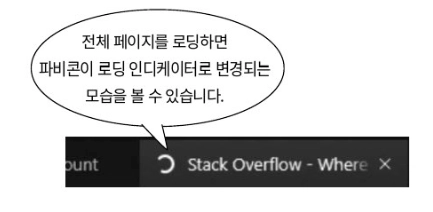
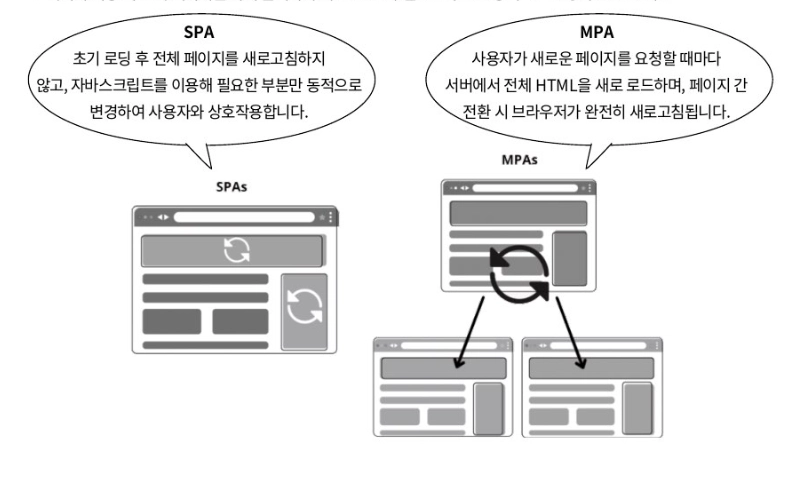
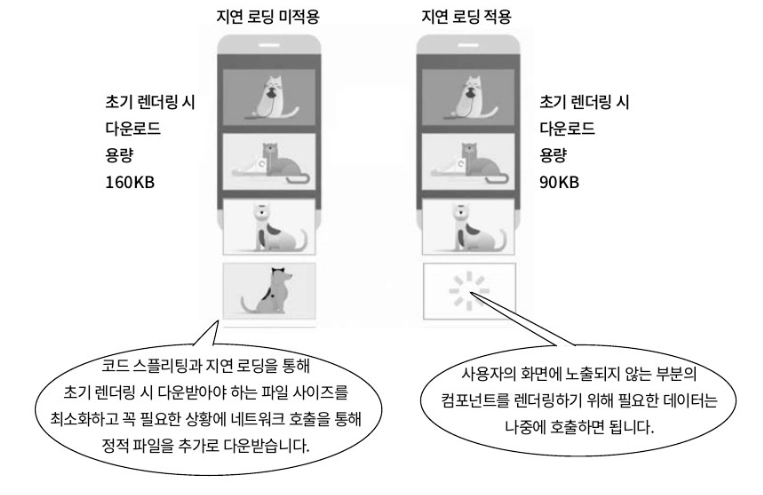

### 싱글 페이지 애플리케이션

웹이 발전하면서 당연히도 화면에 표시해야 할 시각적 요소와 인터랙션이 점차 복잡해지고 요구사항도 심화되었습니다.

그래서 단일 페이지 안에서 모든 요구사항을 만족시키는 애플리케이션 개발 방법이 개발됩니다.

</br>

SPA(single page application)은 최초로 불러오는 페이지 이후 다른 페이지가 필요할 경우 브라우저 전체를 새로고침하지 않고, 동적으로 컴포넌트 단위의 새로운 페이지를 화면에 렌더링해 유저 경험을 향상시킵니다.

또, 화면을 업데이트하는 데 필요한 데이터를 비동기적으로 불러와 성능을 개선하고, 개발 생산성을 높입니다.

</br>

SPA는 URL이 어떻게 변경되는 상관없이 항상 같은 `index.html` 을 유저에게 제공합니다.
→ 필요에 따라서는 여러 개의 html 템플릿을 제공합니다.

화면의 구성은 `bundle.js` 에 선언해둔 코드의 내용에 따라 변경됩니다.

번들러가 알아서 파일 하나로 합쳐주기 때문에 아무리 많은 자바스크립트, CSS 파일에 나누어 모듈을 작성해도 상관없습니다.

</br>
</br>

### 싱글 페이지 애플리케이션의 장점을 돌아봐야 하는 이유

리액트, 뷰, 앵귤러와 같은 현대 라이브러리 및 프레임워크는 모두 SPA 구축을 기본 전제로 설계되었습니다.

컴포넌트 기반 아키텍처, 클라이언트 사이드 라우팅, 상태 관리와 같은 개념들은 모두 SPA를 효율적으로 만들기 위한 과정에서 탄생하고 발전한 기술들입니다.

</br>

SPA의 등장은 프론트엔드와 백엔드의 역할을 분리시키는 계기가 되었습니다.

프론트엔드는 유저 인터피에스와 경험에 온전히 집중하는 클라이언트 애플리케이션으로 독립했고, 백엔드는 데이터 제공을 위한 API 서버의 역할에 충실하게 되었습니다.

</br>
</br>

### 네트워크 호출 빈도

페이지 하나를 그리려면 자바사크립트와 스타일을 담당할 CSS, 그리고 뼈대가 될 HTML을 서버에서 제공받아야 합니다.

HTML 파일 안에서는 매우 다양한 외부 정적 파일들을 참조할 수 있는데 서버 성능이 좋지 않거나 네트워크가 느린 환경이라면 페이지가 전활될 때마다 HTML을 포함해 다른 정적 파일들을 다시 불러와야합니다.

</br>



MPA에서 `a` 태그를 클릭해 다른 페이지로 이동하면 URL이 변경되기 때문에 새로운 페이지와 정적 파일을 다시 서버에 요청해서 받아와야 합니다.

</br>



SPA는 처음 보여지는 페이지뿐만 아니라 다른 페이지를 구성하는 데 필요한 데이터들을 최초 한 번만 불러옵니다.

이후에는 유저의 요청에 따라 필요한 부분만 동적으로 업데이트됩니다.

SPA는 URL이 변경되어도 최초 렌더링 시 받은 `index.html` 파일을 재사용하기 때문에 페이지 전환에 필요한 클라이언트와 서버 간의 네트워크 호출 횟수를 줄여 유저 친화적인 경험을 제공합니다.

</br>
</br>

### 성능 향상

SPA는 여러번 나뉘어 받을 파일을 하나로 뭉쳐서 받으면 파일 크기가 커져 MPA보다 오래 기다려야합니다.

이러한 부분을 보완하기위에 지연 로딩이라는 개념을 적용했습니다.



지연 로딩은 MPA와 같이 페이지 전체를 로딩하는 것이 아닌 자바스크립의 특정 코드 블록만 필요할 때 잘게 잘라 받아옵니다.

한 번 받아온 파일은 데이터가 저장되는 캐시작업을 거쳐 한 번 이어붙인 코드 조각들을 다시 받아올 필요가 없습니다.

</br>
</br>

### 생산성 향상

싱글 페이지 애플리케이션은 두 가지 관점에서 생산성 향상에 도움이 됩니다.

</br>

**프론트엔드와 백엔드 개발 영역의 엄격한 분리**

기존에는 API와 정적 파일을 서빙하는 웹 서버/웹 애플리케이션의 구분이 혼용되어 개발되었습니다.

SPA와 번들러 개념이 등장한 이후 백엔드 개발에 부분적으로 포함되어 있던 프론트엔드 개발이 더욱 독립적인 영역으로 구축하게 되었습니다.

</br>

**선언형 프로그램을 사용한 빠른 프로토타입 구현**

명령형 프로그래밍은 화면을 직접 조작하는 방식으로 동작 순서를 명확하게 기술하는 방식인 반면, 선언형 프로그래밍은 상태를 기반으로 화면을 자동으로 갱신하는 방식을 말합니다.

예시 통해 선언형 프로그래밍과 명령형 프로그래밍 동작 원리에 차이점을 살펴봅시다.

다음 코드는 명령형 프로그래밍으로 작성된 코드입니다.

```tsx
<body>
  <input type="text" id="todoInput">
  <button onclick="addTodo()">Add</button>
  <ul id="todoList"></ul>

  <script>
    function addTodo() {
      var input = document.getElementById('todoInput');
      var list = document.getElementById('todoList');
      var newItem = document.createElement('li');

      newItem.textContent = input.value;
      list.appendChild(newItem);

      input.value = "";
    }
  </script>
</body>
```

위 코드에서는 버튼 클릭시 `addTodo()` 함수를 호출해 직접 DOM을 조작하고 새로운 리스트 아이템을 추가하는 등, 구체적인 작업 절차를 명시하고 있습니다.

코드를 순서로 정리하면 다음과 같습니다.

- 화면을 업데이트하는 DOM을 선택합니다.
- 화면을 업데이트하는 DOM을 만듭니다.
- 업데이트한 DOM을 다른 DOM과 교체하거나 자식 태그로 할당합니다.
- 업데이트할 때 사용한 DOM을 원래대로 초기화시킵니다.

</br>

다음은 SPA 방식으로 작성된 코드입니다.

```tsx
function TodoApp() {
	const [todos, setTodos] = useState([]);
	const [newTodo, setNewTodo] = useState('');
	
	const addTodo = () => {
		setTodos([...todos, newTodo]);
		setNewTodo('');
	};
	
	return (
		<div>
			<input
				type="text"
				value={newTodo}
				onChange={(e) => setNewTodo(e.target.value)}
			/>
			<button onClick={addTodo}>Add</button>
			<ul>
				{todos.map((todo, index) => (
					<li key={index}>{todo}</li>
				))}
			</ul>
		</div>
	);
}
```

리액트의 `useState` 을 이용하기 때문에 DOM을 직접 조작하기 위해 클래스나 아이디를 별도로 작성할 필요는 없습니다.

어떤 위치에 `ul` 태그와 `button` 태그를 넣을지만 코드를 통해 표현하고 `newTodo` 와 `todos` 를 업데이트하는 것에만 집중하면 됩니다.

위의 과정을 정리하면 다음과 같습니다.

- 할 일을 표현할 `todos` 변수를 선언합니다.
- 새 할 일을 표현할 `newTodo` 변수를 선언합니다.
- `todos`, `newTodo` 를 버튼 클릭할 때마다 업데이트해줍니다.

</br>

선언적 프로그래밍은 앱 구성을 훨씬 간결하고 유지보수하기 좋은 코드를 만들 수 있도록 도와줍니다.

개발자는 화면을 표시하는 데 필요한 상탯값에만 집중하면 되기에 DOM에 직접 접근해 내부 속성값들을 조작해 생기는 부수 효과가 최소화됩니다.

프로그래밍에서 부수 효과란 특정 연산의 결과로 의도된 것과 다르게 나타나는 현상과 영향을 의미합니다.

</br>