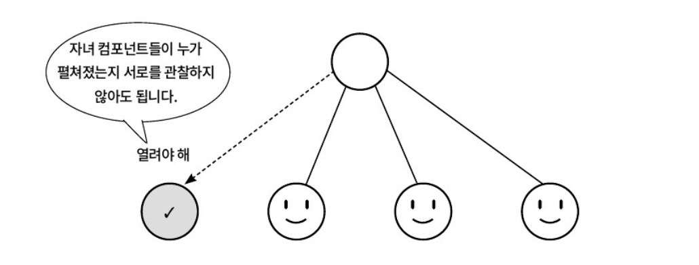
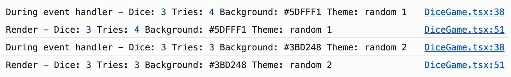
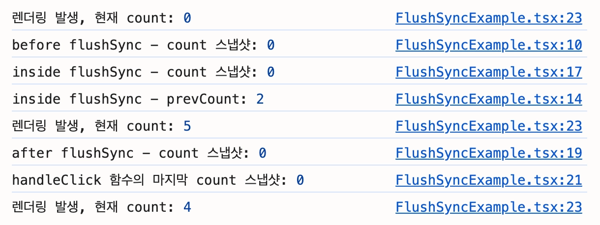

### Overview

이번 챕터에서는 React 상태가 동작하는 원리를 깊이 다룰 예정임

구체적으로는, 상태가 어떤 종류로 나뉘는지부터 시작해서, 데이터가 한 방향으로만 흘러가야 하는 이유, 그리고 여러 상태 업데이트를 React가 어떻게 효율적으로 묶어서 처리하는지까지 살펴봄

</br>
</br>

### 상태의 종류

React 앱의 동적인 UI는 상태에 의해 구동됨

상태는 단순한 변수가 아니라, 컴포넌트가 언제, 어떻게 다시 렌더링될지를 결정하는 핵심 정보임

`useState()` 같은 훅으로 관리되는 지역 상태와 이를 기반으로 계산되는 파생 상태, 상태가 특정 시점의 스냅샷으로 동작하는 원리와 그 이면의 업데이트 큐, 상태의 불변성을 간결하게 유지하는 방법, 그리고 여러 컴포넌트가 공유하는 상태를 다루는 상태 끌어올리기 패턴까지 살펴봄

</br>
</br>

#### 지역 상태와 파생 상태

컴포넌트 내부에 선언되어 다른 컴포넌트에서는 참조하지 못하는 내부 상태값을 지역 상태라고 함

다음은 일반 변수와 지역 상태의 차이점을 보여주는 예시 코드임

```tsx
import { useState } from "react";

export default function LocalStateVariable() {
  // 일반 변수 선언
  // 리렌더링시 일반 변수는 매번 새로 초기화
  let normalVariableCount = 0;

  // 지역 상태 선언
  const [localStateCount, setLocalStateCount] = useState(0);

  // 일반 변수 증가
  // 일반 변수의 변화는 감지하지 못해 UI가 업데이트되지 않음
  const handleIncrementNormalVariable = () => {
    normalVariableCount += 1;
  };

  // 지역 상태 증가
  const handleIncrementLocalState = () => {
    setLocalStateCount((prevCount) => prevCount + 1);
  };

  return (
  // ... 생략
  );
}
```

</br>

파생 상태는 React 내부적으로 실제 저장하며 관리하는 상태가 아니라, 기존 상태들을 기반으로 연산된 결과값임

이런 파생 상태를 별도의 `useState()` 로 보관하지 않고 리렌더링 시 계산하거나 `useMemo()` 등을 통해 메모이제이션 함

→ 별도 관리시 원본 데이터와 불일치 위험, 불필요한 상태 동기화 로직을 추가해야 하므로

</br>

다음은 파생 상태를 사용하는 예시임

```tsx
const [todos] = useState(allTodos);
const [filter, setFilter] = useState<Filter>('all');

// visibleTodos를 별도의 useState()로 관리하는 대신 새로 계산함
const visibleTodos = useMemo(() => {
	switch (filter) {
		case 'completed':
			return todos.filter((todo) => todo.completed);
		case 'active':
			return todos.filter((todo) => !todo.completed);
		default:
			return todos;
	}
}, [todos, filter]);
```

</br>
</br>

#### 상태와 스냅샷, 그리고 업데이트 큐

React의 상태는 특정 시점의 스냅샷과 같음

한 번의 렌더링이 진행되면, 그 렌더링 내부에서 참조하는 상태값은 UI에 반영된 후 해당 렌더링 동안 고정됨

→ 상태 업데이트가 진행되어도 새로운 값으로 다음 렌더링이 예약될 뿐, 즉시 바뀌지않음

이러한 특징 때문에 이벤트 핸들러나 비동기 콜백 함수가 특정 시점의 상태값을 기억하는 현상이 발생함

이를, stale closure라고 부름

</br>

다음은 stale closure 현상이 적용된 예시 코드임

```tsx
import { useState } from "react";

function StaleClosureExample() {
  const [count, setCount] = useState(0);

  // stale closure 현상을 보여주는 부분
  // count가 0인 상태에서 해당 함수 실행시 3초동안은 0인 상태에 갇힘
  const handleLogCount = () => {
    setTimeout(() => {
      console.log(`3초 전의 count 값: ${count}`);
    }, 3000);
  };
  
  return (
  // ... 생략
  );
}
```

</br>

stale closure를 피하는 가장 일반적인 방법이 함수형 업데이트임

함수형 업데이트는 `setState` 에 새 값을 직접 넘기는 대신, 이전 상태를 인자로 받아 다음 상태를 반환하는 함수를 넘기는 방식임

```tsx
import { useState } from "react";

function FunctionalUpdateExample() {
  const [count, setCount] = useState(0);

  // 함수형 업데이트를 사용하기에 최신 상태를 기반으로 업데이트함
  // React가 항상 최신 인자 C를 넘겨주기 때문
  const handleIncrement = () => {
    setCount((c) => c + 1);
  };

  // setCount 업데이트 함수도 항상 최신 인자 C를 받기에 stale closure 현상을 막을 수 있음
  const handleLogLatestCount = () => {
    setTimeout(() => {
      setCount((currentCount) => {
        console.log(`3초 후의 최신 count값: ${currentCount}`);
        return currentCount;
      });
    }, 3000);
  };
  
  return (
  // ... 생략
  );
}
```

</br>

React가 항상 최신 인자를 넘겨줄 수 있는 건, 내부의 업데이트 큐 메커니즘 때문임

`setState` 호출은 상태를 즉시 바꾸는 행위가 아니라, 다음 렌더 전에 처리할 작업을 큐에 등록하는 행위임

React는 호출을 받으면 아래와 같은 업데이트 객체를 만들어 큐에 적재함

```tsx
update = {
  lane,            // 업데이트의 우선순위
  action,          // setState에 전달된 값 또는 함수
  hasEagerState,   // 사전 계산된 결과가 있는지 여부
  eagerState,      // 사전 계산해 둔 다음 state 값
  next,            // 큐 내 다음 update 노드
};
```

</br>

적재된 큐는 다음 렌더 직전에 펼쳐져 reduce 방식으로 처리됨

→ reduce는 초기값에서 시작해, 항목을 하나씩 누적시켜 최종 값 하나로 만드는 과정을 말함

```tsx
let state = baseState;
for (const update of queue) {
  state = typeof update.action === "function"
    ? update.action(state)   // 인자는 지금까지 누적된 최신 state
    : update.action;
}
```

인자가 결정되는 시점이 `setter` 를 호출한 시점이 아니라 큐가 처리되는 시점이므로, 함수형 업데이트는 항상 누적된 최신 `state` 를 인자로 받음

그렇기에 클로저에 박제된 옛 값이 아닌, React가 처리 시점에 넣어주는 누적 `state` 를 받기 때문에 stale closure 문제가 발생하지 않음

</br>
</br>

#### 상태의 불변성

상태를 불변하게 다뤄야 하는 이유는 이전에 다룬 바 있음

이번에는 그 불변성을 좀 더 간결하게 유지하는 방법에 초점을 둠

기본적으로는 스프레드 연산자를 사용해 `prevState` 를 복사한 뒤 업데이트를 진행했었음

```tsx
setState(prevState => ({
	...prevState,
	count: prevState.count + 1
}));
```

하지만 상태 구조가 깊고 복잡해지면 매번 스프레드 연산자를 사용하는 것은 번거롭고 코드가 길어질 수 있음

</br>

`immer` 라이브러리를 사용하면 간결하게 작성할 수 있음

```tsx
bun add immer
```

`immer` 는 빌드 도구가 아니라 런타임에 동작하는 라이브러리이므로, devDependencies가 아닌 일반 의존성으로 설치함

</br>

`immer` 가 적용된 코드는 다음과 같음

```tsx
import { produce } from "immer";
import { useState } from "react";

export default function Immutability() {
  const [user, setUser] = useState({
    name: "진수",
    profile: {
      age: 25,
      social: {
        twitter: "@jinsu",
      },
    },
    items: ["옷", "신발"],
  });

  // immer의 produce() 함수는 현재 상태를 받아 draft라는 프록시 객체를 만듦
  // draft 객체를 수정하면, 함수 실행 종료 후 immer가 최종적으로 불변성이 유지된 객체를 반환해줌
  const updateUser = () => {
    setUser(
      produce((draft) => {
        draft.profile.age += 1;
        draft.items.push("가방");
      }),
    );
  };
}
```

</br>

`immer` 는 다음과 같이 zustand와 같은 상태 관리 라이브러리들에서도 내부적으로 사용됨

```tsx
import { create } from 'zustand';
import { devtools, combine } from 'zustand/middleware';
import { immer } from 'zustand/middleware/immer';
import type { TabId } from '@/types/tab';

const initialState = {
  activeTab: 'home' as TabId,
};

const useTabStore = create(
  devtools(
    immer(
      combine(initialState, (set) => ({
        actions: {
          setActiveTab: (tab: TabId) =>
            set((state) => {
              state.activeTab = tab;
            }),

          resetTab: () =>
            set((state) => {
              state.activeTab = 'home';
            }),
        },
      }))
    ),
    { name: 'TabStore' }
  )
);
```

</br>
</br>

#### 상태 끌어올리기

여러 컴포넌트가 같은 데이터를 공유해야 하는 상황이 자주 발생함

각 컴포넌트가 자신의 상태를 따로 들고 있으면 동일한 데이터가 여러 곳에 분산되어, 동기화가 어긋날 위험이 있음

이를 해결하는 패턴이 상태 끌어올리기임

공유해야 할 상태를 가장 가까운 공통 조상 컴포넌트로 옮겨 한 곳에서 관리하고, 하위 컴포넌트들은 프롭스를 통해 데이터를 전달받음

```tsx
interface AccordionItemProps extends PoemItem {
	isOpen: boolean;
	onClick: () => void;
}

// 부모로부터 자신의 상태를 전달받음
// 그렇기에 AccordionItem 컴포넌트는 상태를 소유하지 않음
export default function AccordionItem({ 
	author, content, isOpen, onClick,
}: AccordionItemProps) {
	return (
  // ... 생략
  );
}
```

상태가 부모로 끌어올려지면, 하위 컴포넌트는 자신의 상태를 갖지 않고 부모 프롭스에 의해 완전히 제어되는 형태가 되는데, 이를 제어 컴포넌트라고 부름

`AccordionItem` 제어 컴포넌트는 UI 표현에만 집중하게 되어 재사용성이 높아지고 동작 예측이 쉬워짐

</br>



주로 형제 컴포넌트 간에 공통 상태가 필요할 때 활용됨

</br>
</br>

### 컴포넌트 간의 데이터 흐름

앞 절에서 상태 끌어올리기를 통해 데이터가 부모에서 자식으로 흐르는 구조를 살펴봤음

→ 이렇게 데이터가 한 방향으로만 흐르는 원칙을 단방향 데이터 흐름이라고 부름

React는 기본적으로 부모 컴포넌트에서 자식 컴포넌트 방향의 단방향 데이터 흐름을 가짐

</br>
</br>

#### 단방향 데이터 흐름과 단방향 바인딩

단방향 데이터 흐름은 애플리케이션 구조의 모듈화라는 장점이 존재함

상위 컴포넌트는 상태와 로직을 관리하고 하위 컴포넌트는 `props` 를 받아 표시 역할을 담당하므로 관심사가 분리됨

단방향 바인딩은 상태(Model)가 UI(View)를 일방적으로 결정하며, View에서의 변경이 Model에 직접 영향을 주지 않는 데이터 흐름 원칙을 말함

```tsx
import { useState } from "react";

export default function ParentComponent() {
  const [currentMessage, setCurrentMessage] = useState("초기 메시지입니다.");

  // 상태 변경 로직은 항상 상태를 소유한 부모 컴포넌트에서 관리
  const handleMessageUpdate = (newMessage: string) => {
    if (newMessage.trim() === "") {
      alert("메시지를 입력해주세요.");
      return;
    }
    setCurrentMessage(newMessage);
  };
  
  return (
	  <div>
	    {/* 
	    message props를 전달받아 화면에 표시할 뿐 직접 수정할 수 없음 -> 이것이 단방향 바인딩임
	    */}
		  <DisplayComponent message={currentMessage} />
		  <InputComponent onMessage={handleMessageUpdate} />
		</div>
	);
}

```

</br>
</br>

#### 양방향 데이터 흐름과 양방향 바인딩

양방향 바인딩은 상태(Model)와 UI(View)가 서로의 변경 사항을 자동으로 반영하는 데이터 흐름 원칙을 말함

데이터의 흐름이 양방향으로 일어나므로, 개발자가 별도의 이벤트 핸들러를 작성하지 않아도 UI와 상탯값이 항상 동기화 됨

</br>

양방향 바인딩을 제공하는 다른 프레임워크(Vue.js, Angular 등)와는 달리 React는 제공하지 않기에 제어 컴포넌트 패턴을 사용하여 양방향 바인딩과 유사한 동작을 구현할 수 있음

```tsx
import type { ChangeEvent } from "react";
import { useState } from "react";

export default function ControlledComponentExample() {
  const [inputValue, setInputValue] = useState<string>("");

  const handleChange = (e: ChangeEvent<HTMLInputElement>) => {
    setInputValue(e.target.value);
  };

  return (
    <div>
      <input 
	      type="text" 
	      value={inputValue}  // React 상태를 input 요소의 값으로 설정 (상태 -> 뷰)
	      onChange={handleChange}  // 유저 입력 시 상태를 업데이트 (뷰 이벤트 -> 상태)
	    />
    </div>
  );
}
```

</br>
</br>

### React 배칭

앞 부분에서 `setState` 가 즉시 상태를 바꾸지 않고 업데이트 큐에 적재된다는 점을 다뤘음

큐에 쌓인 업데이트를 언제, 어떻게 한번에 처리할지를 결정하는 정책이 바로 배칭임

</br>

배칭의 구체적 동작은 다음과 같음

한 이벤트 핸들러 안에서 `setState` 가 몇 번 호출되든, React는 그 호출들을 모두 큐에 적재해두고 해당 블록의 실행이 끝날 때까지 리렌더를 시작하지 않음

블록이 끝난 직후 큐를 한 번에 처리해 최종 state를 계산하고, 단 한 번의 리렌더로 모든 변화를 반영함

</br>

다음 코드에서는 한 이벤트 핸들러 안에서 여러 상태를 동시에 업데이트하는 상황이 존재함

```tsx
import { useState } from "react";

interface DiceGameProps {
  maxTries?: number;
}

export default function DiceGame({ maxTries = 5 }: DiceGameProps) {
  const [diceNumber, setDiceNumber] = useState(1);
  const [remainingTries, setRemainingTries] = useState(maxTries);
  const [backgroundColor, setBackgroundColor] = useState("#FFFFFF");
  const [theme, setTheme] = useState("Default");

  const rollDice = () => {
    const newDiceNumber = Math.floor(Math.random() * 6) + 1;
    const newRemainingTries = remainingTries - 1;
    const newBackgroundColor = getRandomColor();
    const newTheme =
      newDiceNumber === 6
        ? "GoldenRabbit"
        : `random ${maxTries - newRemainingTries}`;

    // 이벤트 핸들러 내의 상태 업데이트 함수를 4번 호출
    setDiceNumber(newDiceNumber);
    setRemainingTries(newRemainingTries);
    setBackgroundColor(newBackgroundColor);
    setTheme(newTheme);

    console.log(
      "During event handler - Dice:",
      newDiceNumber,
      "Tries:",
      newRemainingTries,
      "Background:",
      newBackgroundColor,
      "Theme:",
      newTheme,
    );
  };

  console.log(
    "Render - Dice:",
    diceNumber,
    "Tries:",
    remainingTries,
    "Background:",
    backgroundColor,
    "Theme:",
    theme,
  );

  return (
    <div>
      <p>{diceNumber}</p>
      <p>{remainingTries}</p>
      <p>{theme}</p>
      <button type="button" onClick={rollDice} disabled={remainingTries === 0}>
        주사위 던지기 게임
      </button>
    </div>
  );
}
```

</br>

실행 결과는 다음과 같음



`setState` 를 4번 호출했음에도 `Render - Dice` 로그는 단 한 번만 찍히는 것을 볼 수 있음

→ 배칭 덕분에 지역 상태 개수와 무관하게 한 번만 리렌더링됨

</br>
</br>

#### 비동기 동작에서의 배칭 프로세스

위 예시는 동기 이벤트 핸들러 안에서의 배칭이었음

다음으로 `setTimeout` 이나 `Promise` 같은 비동기 콜백 안의 `setState` 가 어떻게 동작하는지 살펴봄

React 18버전부터는 `ReactDOM.createRoot()` 를 사용해 애플리케이션을 렌더링한다면, `setTimeout()` , `Promise` 콜백, 네이티브 이벤트 핸들러에서 발생하는 상태 업데이트들도 자동으로 배칭 처리됨

→ React 17까지는 이벤트 핸들러 안에서만 배칭이 동작했고, `setTimeout` , `Promise` 콜백 같은 비동기 환경에서는 매 호출마다 리렌더가 발생했음

</br>

```tsx
import { useState } from "react";

interface DiceGameProps {
  maxTries?: number;
}

export default function DiceGame({ maxTries = 5 }: DiceGameProps) {
  const [diceNumber, setDiceNumber] = useState(1);
  const [remainingTries, setRemainingTries] = useState(maxTries);
  const [backgroundColor, setBackgroundColor] = useState("#FFFFFF");
  const [theme, setTheme] = useState("Default");

  // 기존 코드에 setTimeout 함수를 통해 비동기 콜백 함수 내에서도 배칭이 수행되는지 확인
  const rollDiceAsync = () => {
    setTimeout(() => {
      const newDiceNumber = Math.floor(Math.random() * 6) + 1;
      const newRemainingTries = remainingTries - 1;
      const newBackgroundColor = getRandomColor();
      const newTheme =
        newDiceNumber === 6
          ? "GoldenRabbit"
          : `random ${maxTries - newRemainingTries}`;

      setDiceNumber(newDiceNumber);
      setRemainingTries(newRemainingTries);
      setBackgroundColor(newBackgroundColor);
      setTheme(newTheme);

      console.log(
        "During event handler - Dice:",
        newDiceNumber,
        "Tries:",
        newRemainingTries,
        "Background:",
        newBackgroundColor,
        "Theme:",
        newTheme,
      );
    }, 1000);
  };

  console.log(
    "Render - Dice:",
    diceNumber,
    "Tries:",
    remainingTries,
    "Background:",
    backgroundColor,
    "Theme:",
    theme,
  );

  return (
    <div>
      <p>{diceNumber}</p>
      <p>{remainingTries}</p>
      <p>{theme}</p>
      <button
        type="button"
        onClick={rollDiceAsync}
        disabled={remainingTries === 0}
      >
        주사위 던지기 게임
      </button>
    </div>
  );
}
```

</br>

실행 결과는 다음과 같음



비동기 콜백 안에서 여러 상태를 업데이트해도 단 한 번만 리렌더링된다는 사실을 확인할 수 있음

</br>
</br>

#### react-dom의 flushSync()

배칭 덕분에 여러 `setState` 가 한 번의 리렌더로 묶이는 걸 확인할 수 있었음

하지만 매우 드물게, 특정 업데이트를 즉시 DOM에 반영해야 하는 경우가 있음

이때 사용할 수 있는 API가 `react-dom` 의 `flushSync()` 임

</br>

React 18에서 도입된 기능으로, 자동 배칭을 의도적으로 건너뛰고 특정 업데이트를 즉시 강제로 처리하여 DOM을 동기적으로 갱신함

```tsx
import { useState } from "react";
import { flushSync } from "react-dom";

export default function FlushSyncExample() {
  const [count, setCount] = useState(0);
  
  console.log("렌더링 발생, 현재 count:", count);

  const handleClick = () => {
    setCount(count + 1);
    setCount(count + 2);
    console.log("before flushSync - count 스냅샷:", count);

    flushSync(() => {
      setCount((prevCount) => {
        console.log("inside flushSync - prevCount:", prevCount);
        return prevCount + 3;
      });
      console.log("inside flushSync - count 스냅샷:", count);
    });
    console.log("after flushSync - count 스냅샷:", count);
    setCount(count + 4);
    console.log("handleClick 함수의 마지막 count 스냅샷:", count);
  };

  return (
    <div>
      <p>Count: {count}</p>
      <button type="button" onClick={handleClick}>
        Increment
      </button>
    </div>
  );
}
```

</br>

실행결과는 다음과 같음


`console.log("렌더링 발생, 현재 count:", count);` 이 2번 찍히는 것을 볼 수 있음

즉, 렌더 타이밍을 둘로 나누면서 렌더링이 2번 발생한 것임

</br>
</br>

#### flushSync() 작동 원리

위 예시 코드가 작동하는 과정에 들어가기 전, `setState` 와 `flushSync` 가 어떤 일을 하는지 짚어두면 단계별 추적이 훨씬 직관적으로 보임

가장 먼저 알아 볼 것은 `setState` 호출은 두 가지 일을 동시에 일으킨다는 것임

```tsx
setState(...) 호출
    ├─ ① 큐에 enqueue           ← 자료구조에 쌓기
    └─ ② 렌더 스케줄링            ← "이 컴포넌트 다시 그려야 해"라고 React에 알리기
                                   (scheduleUpdateOnFiber)
```

큐에 적재된 뒤 따로 렌더가 일어나는 게 아니라, `setState` 호출이 큐 적재와 렌더 예약을 한 번에 일으키는 것임

</br>

큐는 지금 실행 중인 동기 코드 블록이 끝나는 시점에 처리됨

여기서 동기 코드 블록은 다음과 같은 단위임

- 이벤트 핸들러
    - 핸들러가 `return` 할 때
- `setTimeout` , `Promise.then` 콜백
    - 콜백이 return 할 때
- `async` 함수의 `await` 사이 구간
    - 다음 `await` 만나거나 함수가 `return` 할 때

→ 한 블록 안의 모든 `setState` 가 블록 종료 시점에 한꺼번에 처리되는 게 자동 배칭임

`flushSync` 는 이 규칙의 특별 케이스로, 자연스러운 블록 종료를 기다리지 않고 콜백이 `return` 하는 즉시 큐를 강제로 처리함

</br>

구체적인 동작 순서는 다음과 같음

- **콜백을 동기적으로 실행**
    - 콜백 안의 `setState` 들이 큐에 적재
- **콜백이 끝나면 즉시 큐를 처리**
- **컴포넌트 함수를 동기로 재호출**
    - 새 `state` 로 리렌더가 즉시 일어남
- **DOM을 동기로 갱신**
    - 화면도 즉시 바뀜
- **이 모든 게 끝난 뒤에야** `return`
    - `flushSync` 다음 줄로 제어가 넘어감

</br>

그 결과 한 이벤트 핸들러 안에 처리 시점이 둘로 나뉨

원래는 `handleClick` 종료 시점에 한 번만 처리됐을 텐데, `flushSync` 가 처리 시점을 강제로 하나 추가하면서 렌더 타이밍이 둘로 나뉘는 것임

</br>
</br>

#### 단계별 동작 과정

이제 `FlushSyncExample` 의 실행을 컴포넌트 마운트부터 마지막 렌더까지 단계별로 따라가 살펴보겠음

흐름을 정확히 보기 위해, 같은 `count` 라도 두 가지를 분리해서 봐야 함

→ React 내부에 저장된 진짜 값, 함수 클로저 안에 박제된 값

</br>

평소엔 둘이 일치하지만, `flushSync` 를 사용하는 순간 어긋나는 구간이 생김

그래서 각 시점마다 다음 네 가지를 함께 추적함

- `state`
    - React 내부 저장소의 현재 값
    - 컴포넌트별 Fiber 객체 안에 보관됨
- `count`
    - 현재 실행 중인 함수의 클로저 값
- `queue`
    - 업데이트 큐의 현재 내용
    - state와 같이 Fiber 객체 안에 존재
- `console`
    - 출력된 로그

</br>

**컴포넌트 마운트시**

```tsx
state   : 0
count   : 0
queue   : []
console : 렌더링 발생, 현재 count: 0
```

</br>

**버튼 클릭 → handleClick 실행**

`setCount(count + 1)`

```tsx
state   : 0
count   : 0
queue   : [ {action: 1} ]
console : (없음)
```

`count + 1` 은 클로저의 `count = 0` 으로 계산되어 `1` 이 됨

이 값이 큐에 적재되고 변수 `count` 자체는 변하지 않음

</br>

`setCount(count + 2)`

```tsx
state   : 0
count   : 0
queue   : [ {action: 1}, {action: 2} ]
console : (없음)
```

</br>

`console.log("before flushSync - count 스냅샷:", count);`

```tsx
state   : 0
count   : 0
queue   : [ {action: 1}, {action: 2} ]
console : before flushSync - count 스냅샷: 0  // 클로저값 0을 그대로 출력
```

`setCount` 호출이 큐에 적재만 했을 뿐 변수 `count` 를 바꾸지 않았기에, `console.log` 는 클로저의 0 을 그대로 출력함

</br>

**flushSync(() => { ... }) 진입**

`setCount((prev) => { ... return prev + 3 })`

```tsx
state   : 0
count   : 0
queue   : [ {action: 1}, {action: 2}, {action: prev=>prev+3} ]
console : (없음)
```

큐에는 함수 그 자체가 적재됨

`setState` 호출은 큐 등록만 할 뿐이고, 함수 본체는 `flushSync` 콜백이 끝나는 시점에 비로소 실행됨

</br>

`console.log("inside flushSync - count 스냅샷:", count)`

```tsx
state   : 0
count   : 0
queue   : [ {action: 1}, {action: 2}, {action: prev=>prev+3} ]
console : inside flushSync - count 스냅샷: 0  // 클로저값 0을 그대로 출력
```

</br>

**flushSync 콜백 종료, 즉시 큐를 동기 flush**

콜백이 끝나면 `flushSync` 가 큐를 reduce함

```tsx
초기값      : 0
{action:1}  : 0 → 1   (값 형태, 덮어쓰기)
{action:2}  : 1 → 2   (값 형태, 덮어쓰기)
{action:fn} : fn(2) 호출 → console.log("prevCount: 2") → return 5
              2 → 5
```

</br>

다음과 같이 적용됨

```tsx
state   : 5  ← React 내부 상태가 바뀜
count   : 0  ← 함수 클로저는 여전히 0
queue   : []
console : inside flushSync - prevCount: 2
```

</br>

**flushSync가 동기 렌더 강제**

큐 처리가 끝나자 `flushSync` 는 다음 단계로 컴포넌트 함수를 다시 호출함

→ `FlushSyncExample()` 가 새로 실행됨

```tsx
state   : 5
count   : 5  ← 새 렌더의 클로저값 (단, 이건 새 렌더의 것이지 handleClick과 무관)
queue   : []
console : 렌더링 발생, 현재 count: 5
```

- `useState` 가 최신값 5 를 반환 → 새 컨텍스트의 `count = 5`
- `console.log("렌더링 발생, count: 5")` 출력
- `const handleClick = () => {...}` 줄이 다시 실행되며 새 `handleClick` 함수 객체가 만들어짐 (count=5 를 클로저로 가짐)
- React DOM 의 `onClick` 이 새 `handleClick` 으로 교체됨

</br>

새 `handleClick` 이 만들어졌지만, 지금 콜스택에서 실행 중인 함수는 여전히 원래 `handleClick` 임

원래 `handleClick` 은 `flushSync` 가 자기 일을 하는 동안 콜스택에서 빠지지 않고 그대로 있음

`flushSync` 가 `return` 하면 자기 차례를 이어받아 다음 줄부터 계속 실행함

원래 함수의 클로저는 여전히 0임

</br>

**flushSync 빠져나옴, handleClick 계속 실행**

`console.log("after flushSync ...")`

```tsx
state   : 5
count   : 0  ← 화면은 5인데 변수는 0
queue   : []
console : after flushSync - count 스냅샷: 0
```

원래 `handleClick` 의 클로저라 `count` 는 여전히 0

</br>

`setCount(count + 4)`

```tsx
state   : 5
count   : 0
queue   : [ {action: 4} ]
console : (없음)
```

이 시점에 화면에 5가 보이지만, 함수는 자기 클로저의 0을 보고 4를 계산

</br>

`console.log("handleClick 함수의 마지막 ...")`

```tsx
state   : 5
count   : 0
queue   : [ {action: 4} ]
console : handleClick 함수의 마지막 count 스냅샷: 0
```

</br>

**두 번째 배치 처리 - handleClick 종료 후**

```tsx
초기값      : 5
{action:4}  : 5 → 4   (값 형태, 덮어쓰기)
```

```tsx
state   : 4
queue   : []
```

</br>

**컴포넌트 재렌더**

```tsx
state   : 4
console : 렌더링 발생, 현재 count: 4
```

</br>

**콜스택 관점에서 본 핵심**

```tsx
┌─────────────────────────────────┐
│ FlushSyncExample() (Render #2)  │ ← 현재 실행 중 (새로 푸시됨)
├─────────────────────────────────┤
│ flushSync 내부 — 리렌더 처리      │
├─────────────────────────────────┤
│ handleClick (원래것)             │ ← 빠지지 않고 그대로 살아 있음
├─────────────────────────────────┤
│ React 이벤트 핸들러 래퍼          │
└─────────────────────────────────┘
```

`flushSync` 가 큐 처리 + 리렌더를 하는 동안 그 위로 새 호출들이 쌓였다가 빠지지만, 그 아래의 원래 `handleClick` 은 한 번도 빠지지 않음

함수의 실행 컨텍스트가 콜스택에 살아 있으니 그 클로저(count=0) 도 그대로 유지됨

</br>

위의 과정을 정리하자면 다음과 같음

- **첫 번째 배치 -** `flushSync` 콜백 종료 시점
    - 큐
        - `[{action:1}, {action:2}, {action: prev=>prev+3}]`
    - 처리
        - `0 → 1 → 2 → 5`
- **두 번째 배치 -** `handleClick` 종료 시점
    - 큐
        - `[{action:4}]`
    - 처리
        - `5 → 4`

</br>

`handleClick` 전체가 하나의 배치로 묶여 한 번의 리렌더로 끝났을 텐데, 중간에 `flushSync` 가 끼면서 배치가 둘로 나뉘어 렌더가 2번 발생한 것임

이게 바로 `flushSync` 가 배칭을 건너뛴다는 말의 정확한 의미임

이처럼 `flushSync()` 는 React의 기본 렌더링 방식을 우회할 수 있는 강력한 해법을 제공함

하지만 자동 배칭의 성능적 이점을 포기하는 것이므로, 신중하게 사용해야 함

</br>