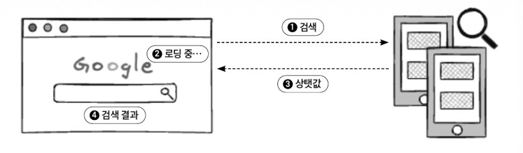
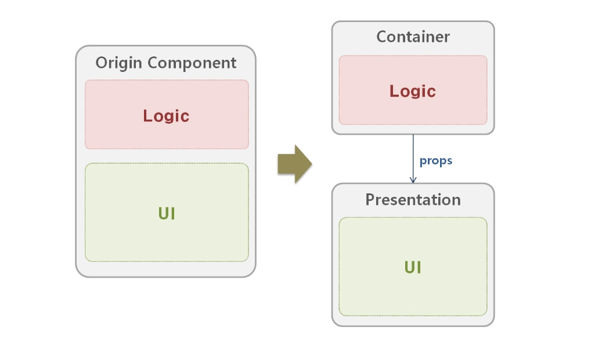
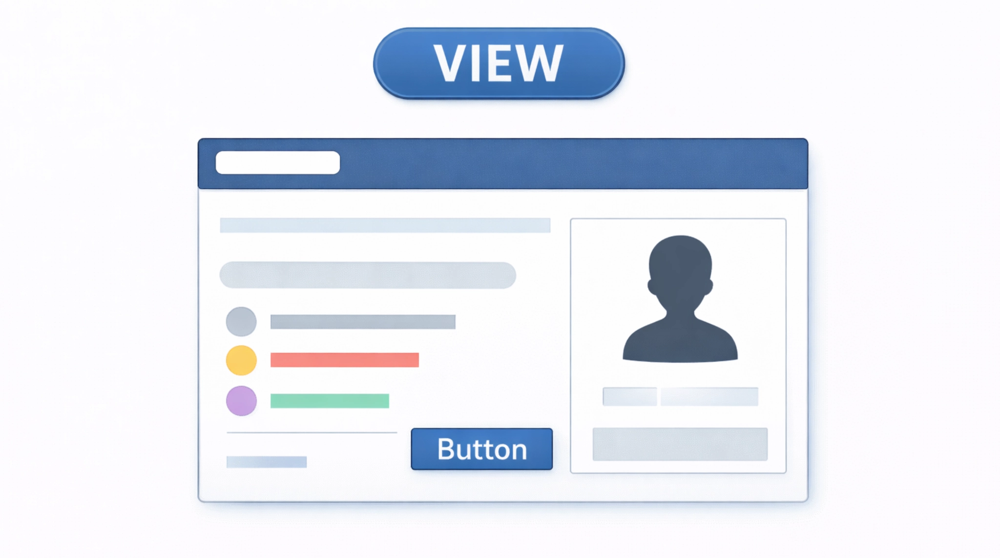
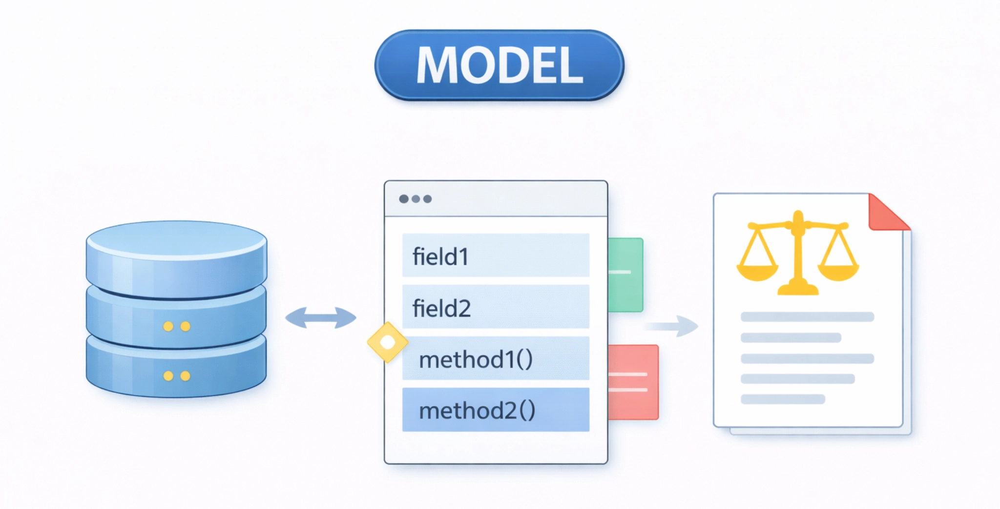
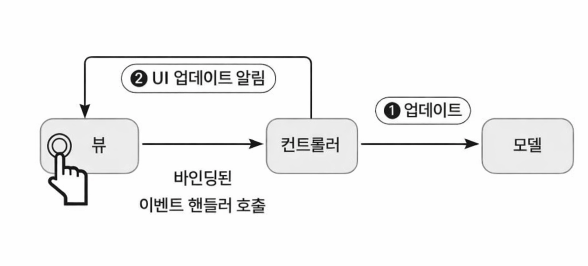
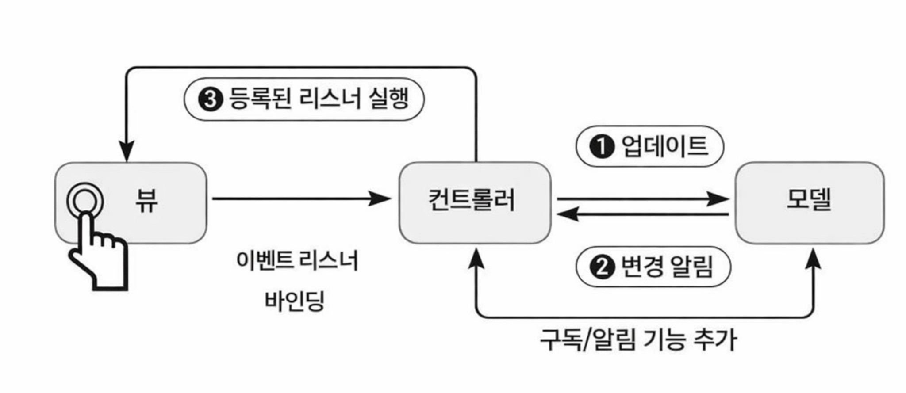
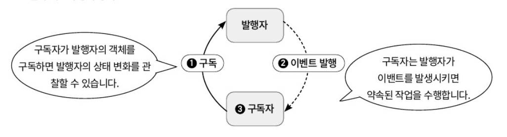
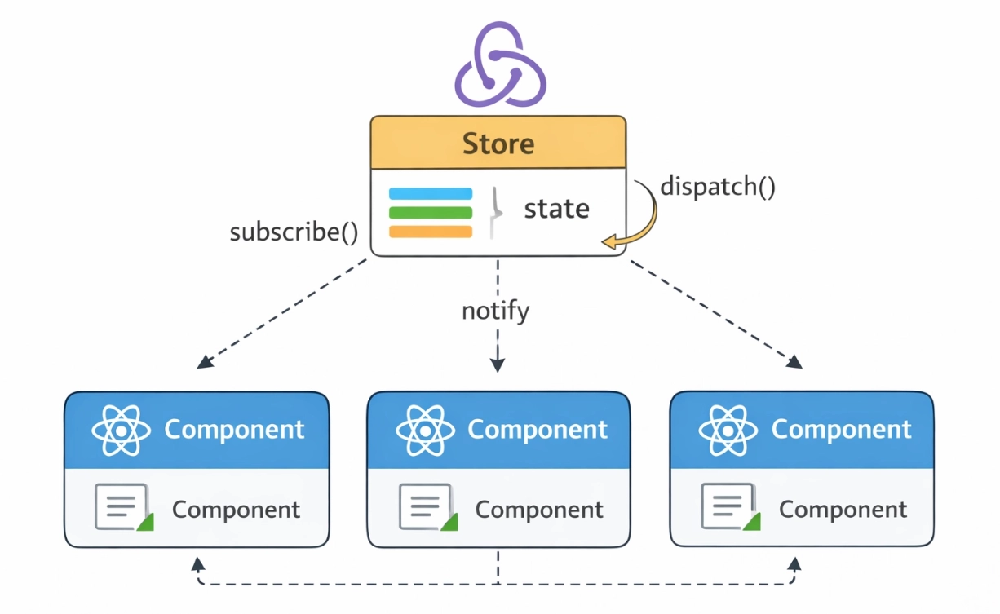
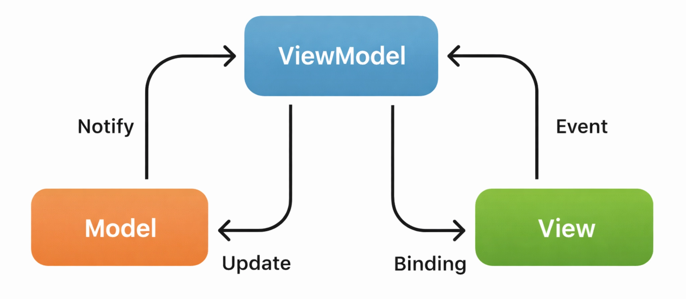
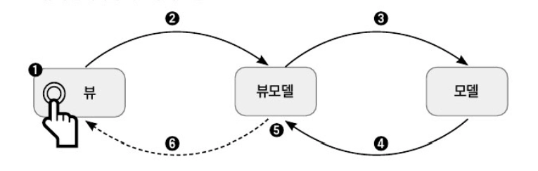

### 상태와 반응성을 돌아봐야 하는 이유

리액트와 같은 모던 자바스크립트 라이브러리의 핵심에는 상태와 반응성이 있습니다.

각 프레임워크 및 라이브러리가 상태를 다루는 문법은 저마다 다르지만, 유저 인터렉션 등으로 상태를 변경하면 UI가 이에 맞춰 업데이트된다는 근본적인 원리는 같습니다.

- **상태**
    - UI를 표현하고 렌더링하는 데 사용되는 데이터를 말함
- **반응성**
    - 상태가 변경될 때 UI가 자동으로 업데이트되는 원리를 말함

</br>

상태와 반응성의 원리를 깊이 이해하면, 단순히 눈앞의 기능을 구현하는 것을 넘어 애플리케이션 전체의 데이터 흐름을 설계하는 아키텍트의 시야를 가질 수 있습니다.

MVC(Model View Controller), MVVM(Model View ViewModel) 같은 고전적인 디자인 패턴이 현대 프레임워크에서 어떻게 변주되고 활용되는지 이해하면, 프로젝트의 성격에 가장 적합한 상태 관리 전략을 수립할 수 있게 됩니다.

→ MVC, MVVM 패턴이 애플리케이션 전체 데이터 흐름을 설계하는 대표적인 모델이기 때문

</br>
</br>

### 상태와 설계 컴포넌트

웹 애플리케이션의 UI는 개발자가 정의한 여러 상탯값을 기반으로 현재 페이지의 모습이 결정됩니다.

가령 유저의 인증 상태에 따라 홈페이지 또는 로그인 페이지를 보여주고, 서버는 이 인증 상태를 근거로 민감한 데이터를 클라이언트에 전달할지 여부를 결정합니다.

</br>

웹 애플리케이션의 상태는 관리 주체와 역할에 따라 크게 서버 상태와 클라이언트 상태로 나뉩니다.

- **서버 상태**
    - 주로 데이터베이스의 원시 데이터를 기반으로 비즈니스 로직에 따라 가공된 상태
    - 유저의 정보, 게시글 목록 등이 이에 해당하며 서버 API 응답을 통해 클라이언트에 전달됨
- **클라이언트 상태**
    - API 요청으로 받은 유저 목록 등 서버로부터 받은 데이터를 화면에 표시하기 위해 사용
    - 모달의 열림/닫힘 여부와 같이 UI와 직접적인 상호작용을 위해 사용

두 상태는 서로 유기적으로 상호작용합니다.

</br>

검색 페이지의 동작을 통해 알아봅시다.



유저가 검색어를 입력하고 검색 아이콘을 클릭하면, 클라이언트는 API 요청을 보내는 동시에 화면에 로딩 스피너와 텍스트를 표시합니다.

이때, 로딩 중이라는 표시를 보여줘야 하는지에 대한 여부가 바로 클라이언트가 자체적으로 관리하는 UI 상태입니다.

</br>

만약 상태라는 개념 없이, 유저의 모든 인터랙션에 대응해 DOM을 직접 선택하고 수정하는 명령형 방식으로 UI를 개발한다면 코드의 복잡도는 기하급수적으로 증가할 겁니다.

예를 들어 검색어 입력, 이전 검색 결과 유지, 페이지네이션 등 상태가 늘어날수록 각 상황에 맞게 어떤 DOM을 보여주고 숨길지, 어떤 데이터를 렌더링할지를 이벤트마다 직접 제어해야 하기 때문입니다.

</br>

이런 문제점을 해결하고 복잡한 UI 로직과 데이터를 효과적으로 관리하기 위해 등장한 것이 디자인 패턴입니다.



디자인 패턴은 애플리케이션을 더 읽기 쉽고 유지보수하기 좋은 구조로 설계하는 방법을 제시하는 검증된 해법입니다.

이는 단순히 코드 작성 스타일뿐만 아니라, 애플리케이션을 어떤 기능 단위로 구성할 것인가, 구성 컴포넌트는 어떤 역할을 책임지는지 정의하는 구조적 지침을 포함합니다.

여기서 말하는 기능 단위는 컴포넌트라고 불리기도 하며, 리액트의 UI 컴포넌트와는 다른, 아키텍처 설계를 위한 독립적인 영역을 의미합니다.

</br>

웹 애플리케이션의 로그인 기능을 기능 단위, 컴포넌트를 알아봅시다.

- **Auth Controller 컴포넌트**
    - 클라이언트 요청을 받아 로그인 로직을 시작하는 역할
- **Auth Service 컴포넌트**
    - 실제 로그인 로직을 처리하는 역할
- **User Repository 컴포넌트**
    - 데이터베이스에서 사용자 정보를 조회하거나 저장하는 역할
- **Token Manager 컴포넌트**
    - Access Token/Refresh Token 생성 및 검증하는 역할

이처럼 각 컴포넌트는 특정 책임만 담당하고 서로 명확한 인터페이스로 상호작용합니다.

</br>

정리하면, 여기서의 컴포넌트는 UI 요소가 아닌 아키텍처 수준의 모듈로 하나의 명확한 책임을 가집니다.

또, 다른 컴포넌트와 협력하여 시스템을 구성하고 코드 가독성과 유지보수성을 높이기 위해 시스템을 기능 단위로 분리한 구조적 요소를 말합니다.

</br>
</br>

### UI, 인터랙션을 담당하는 VIEW

이제 디자인 패턴에서 사용하는 주요 컴포넌트에는 어떤 것들이 있는지 살펴봅시다.

MVC, MVP, MVVM, FLUX와 같은 디자인 패턴은 애플리케이션을 구성하는 각 구셩 요소를 역할에 따라 명확히 분리하여, 코드의 가독성과 확장성을 높이는 것을 공통된 목표로 삼습니다.

각 패턴은 저마다의 구조를 가지지만, 대부분 몇 가지 공통된 구성 요소를 공유합니다.

</br>

이제 반응형 시스템을 이해하는 데 필수적인 공통 구성 요소중 뷰에 대해 알아봅시다.



뷰는 프레젠테이션 레이어(presentation layer)라고도 불리며, 유저가 화면에서 보고 직접 상호작용하는 모든 것을 책임집니다.

즉, UI를 화면에 렌더링하고 유저의 입력을 받아내는 것이 뷰의 핵심 역할입니다.

</br>

뷰는 사용하는 기술 스택에 따라 다음과 같이 다양한 형태로 구현됩니다.

- **바닐라 자바스크립트**
    - 정적 HTML이 UI의 기본 골격을 형성하고, DOM API를 직접 호출하는 자바스크립트 코드가 동적 UI 업데이트를 담당하며 뷰의 역할을 수행
- **React**
    - JSX로 작성된 선언적인 UI 컴포넌트가 뷰에 해당
- **Vue.js**
    - `<template>` 구문을 사용하는 선언적인 UI 컴포넌트가 뷰의 역할을 함
    - `<template>` 구문은 사용자에게 실제로 렌더링될 HTML 구조를 작성하는 곳

</br>

뷰는 상태가 변경되면 자동으로 업데이트되는 반응성을 가집니다.

뷰의 역할은 데이터를 화면에 표시하는 것에서 그치지 않고, 유저의 입력을 시스템에 전달하는 최전선에 위치하는 인터페이스입니다.

</br>
</br>

### 데이터를 담당하는 모델



모델은 애플리케이션의 데이터와 그 데이터를 처리하는 비즈니스 로직을 모두 포함하는 부분으로, 애플리케이션에서 화면에 표시하는 데이터의 원천 역할을 수행합니다.

뷰와 모델을 간단하게 비교하면 다음과 같습니다.

- **뷰**
    - 애플리케이션의 시작과 인터랙션을 담당
- **모델**
    - 무엇을, 그리고 어떤 규칙으로 처리할 것인가에 집중

모델이 관리하는 데이터가 변경되면, 이 데이터를 구독하는 뷰는 화면을 자동으로 업데이트할 수 있습니다.

</br>

모델은 프론트엔드와 백엔드에서 구현 방식과 역할이 다음처럼 나뉩니다.

- **프론트엔드**
    - 클라이언트 상태와 그 상태를 관리하는 로직이 해당
    - Redux, Zustandm Mobx와 같은 전역 상태 관리 라이브러리를 사용해 모델을 구축하기도 함
- **백엔드**
    - 데이터베이스 스키마, ORM(Object relational mapping) 객체 등이 해당
    - 단순 데이터베이스뿐만이 아닌 각 애플리케이션 비즈니스 규칙(도메인 규칙)을 포함하여 데이터의 상태와 그 상태가 어떻게 변경될 수 있는지까지 관리

</br>

모델이 수행하는 주요 역할은 다음과 같이 두 가지로 정리할 수 있습니다.

- **데이터 관리**
    - 애플리케이션의 핵심 데이터를 보유하고 관리
    - 모델은 데이터를 어떤 자료구조로, 어떻게 저장하고 유지할지를 결정
- **비즈니스 로직**
    - 애플리케이션의 고유한 규칙과 정책을 코드로써 실행
    - 서버 API를 호출하여 데이터를 가져오거나 데이터를 서버에 저장하고, 그 과정에서 발생하는 오류를 처리하는 모든 과정이 포함

</br>

결론적으로 모델은 애플리케이션에서 각 도메인에 따라 주요한 로직과 데이터의 원천을 책임지는 주요 컴포넌트입니다.

모든 데이터의 흐름을 모델을 통해 관리되며, 모델의 상태 변경이 곧 애플리케이션 전체의 변화를 이끌어냅니다.

</br>
</br>

### 모델과 뷰를 이어주는 중재자

뷰와 모델은 각자의 역할인 UI 렌더링과 데이터 관리에만 집중해야 합니다.

아키텍처에서는 뷰는 모델의 존재를, 모델은 뷰의 존재를 직접 알아서는 안 됩니다.

→ 이런 관심사의 분리 원칙을 지킬 때 시스템의 유연성과 확장성이 극대화

</br>

이 둘은 중재자를 통해 상호작용합니다.

중재자는 뷰와 모델 사이의 다리 역할을 하며, 둘 사이의 통신을 책임지고 조율합니다.

중재자 역할은 사용되는 디자인 패턴에 따라 다른 이름으로 불립니다.

- **MVC 패턴**
    - 컨트롤러(Controller)
- **MVP 패턴**
    - 프레젠터(Presenter)
- **MVVM 패턴**
    - 뷰모델(ViewModel)
- **Flux 아키텍처**
    - 액션(Action)과 스토어(Store)의 조합을 통한 단방향 파이프라인 구성

</br>

이름은 다르지만, 핵심 역할은 유사합니다.

- **입력 처리**
    - 뷰로부터 유저의 입력을 전달받음
- **로직 실행 및 상태 변경**
    - 전달받은 입력을 해석하여 모델의 데이터를 변경하거나 특정 비즈니스 로직을 수행하도록 모델에 요청
- **데이터 가공**
    - 모델의 데이터를 뷰가 표시하기 좋은 형태로 가공하여 전달
- **로직 캡슐화**
    - 뷰가 순수하게 UI 렌더링에만 집중할 수 있도록, 데이터 유효성 검사와 같은 복잡한 프레젠테이션 로직을 캡슐화

</br>

전통적인 웹 개발에서는 모델, 뷰, 컨트롤러를 별개의 파일이나 클래스로 명확하게 분리했지만 리액트와 같은 모던  프레임워크에서는 그 경계가 유연해졌습니다.

리액트 컴포넌트 안에서 작성하는 `useState`, `useReducer` 같은 훅으로 상태(모델)을 정의하고, 이벤트 핸들러 함수로 유저 입력에 반응하여 상태를 변경하는 로직(중재자)을 작성하며, JSX로 UI(뷰)를 반환합니다.

이처럼 관련된 모델, 뷰, 중재자 로직이 하나의 컴포넌트 파일 안에 함께 위치하는 경우가 많습니다.

→ 코드의 응집도를 높여 재사용성을 극대화하는 컴포넌트 기반 아키텍처의 특징

</br>

다음 코드를 통해 리액트 컴포넌트 안에서 중재자 로직이 어떻게 작성되는지 알아봅시다.

```jsx
import { useState } from "react";

export default function FormController() {
  const [formData, setFormData] = useState({ email: "", password: "" });
  const [errors, setErrors] = useState({});

  const validateForm = () => {
    const newErrors = {};

    if (!formData.email.includes("@")) {
      newErrors.email = "Invalid email address";
    }

    if (formData.password.length < 6) {
      newErrors.password = "Password must be at least 6 characters long";
    }

    return newErrors;
  };

  const handleSubmit = () => {
    const validationErrors = validateForm();

    if (Object.keys(validationErrors).length > 0) {
      setErrors(validationErrors);
    } else {
      console.log("Form submitted successfully:", formData);
    }
  };

  return (
    <div>
      <input
        type="email"
        name="email"
        value={formData.email}
        onChange={(e) =>
          setFormData({ ...formData, email: e.target.value })
        }
      />
      {errors.email && <span>{errors.email}</span>}

      <input
        type="password"
        name="password"
        value={formData.password}
        onChange={(e) =>
          setFormData({ ...formData, password: e.target.value })
        }
      />
      {errors.password && <span>{errors.password}</span>}

      <button onClick={handleSubmit}>Submit</button>
    </div>
  );
}
```

- `useState()`
    - 모델 부분으로 애플리케이션의 데이터 상태와 그 상태를 계산하는 로직을 가짐
- `validateForm()`, `handleSubmit()`
    - 전통적인 컨트롤러나 프레젠터의 역할을 수행
    - 유저의 입력을 받아 유효성을 검사하고, 그 결과에 따라 `errors` 상태를 업데이트하며, 최종적으로 폼 데이터를 처리하는 흐름을 제어
- **JSX 부분**
    - 뷰 부분으로 로직들을 알 필요 없이 그저 상태에 따라 화면에 표시하고, 유저 이벤트를 핸들러에 연갈하는 역할만 수행

</br>

**하지만** `validateForm()`**이 모델일 수도 있지않을까???**

패턴을 어떤 관점에서 보느냐에 따라 분류가 달라집니다.

```jsx
const validateForm = () => {
  const newErrors = {};
  if (!formData.email.includes("@")) newErrors.email = "Invalid email address";
  if (formData.password.length < 6)
    newErrors.password = "Password must be at least 6 characters long";
  return newErrors;
};
```

해당 함수는 입력 데이터를 읽고, 규칙을 검사하고, 결과를 만들어 반환합니다.

즉, 역할만 본다면 입력 데이터 → 규칙 검사 → 결과 반환이므로 유효성 검사 로직, 모델이라고 볼 수 있습니다.

</br>

그렇다면 책에서는 왜 중재자라고 했을까요?

책에서 `validateFrom` 이 유효성 검사 흐름을 캡슐화한다고 표현했는데, 뷰는 `validation` 의 규칙을 알지 못하고 모델도 UI 흐름을 알지 못합니다.

그저 `validateForm` 은 뷰와 모델 두 사이에서 판단 로직을 수행하기에 유효성 검사 로직을 캡슐화했다는 의미가 더 정확합니다.

</br>
</br>

### 주요 디자인 패턴을 사용한 반응성 구현

상태가 변경되면 UI가 자동으로 업데이트되는 이 강력한 기능 덕분에, 개발자는 DOM을 직접 조작하는 복잡한 과정에서 벗어나 비즈니스 로직에 온전히 집중하여 높은 생산성을 달성할 수 있습니다.

만약 프레임워크의 도움 없이 상태 변경을 감지하고, DOM의 어느 부분을 어떻게 효율적으로 업데이트할지 결정하는 반응형 시스템을 직접 구축한다면 매우 많은 양의 코드를 작성해야 할 것 입니다.

전통적인 MVC와 MVVM 패턴을 기반으로 간단한 반응형 시스템을 직접 구현을 통해 모던 프레임워크가 내부적으로 어떤 문제를 해결해주고, 그로 인해 개발자가 얼마나 생산성 증대가 되었는지 알아봅시다.

</br>
</br>

### 비 반응성 MVC 패턴 중재자 만들기

MVC 패턴은 애플리케이션을 모델, 뷰, 컨트롤러라는 세 가지 독립적인 컴포넌트로 나누어 설계하는 고전적인 아키텍처 패턴입니다.

각 컴포넌트가 맡은 역할이 명확히 분리되어 있어 코드의 테스트와 유지보수가 용이해진다는 장점이 있습니다.

</br>

바닐라 자바스크립트만을 간단한 Todo List를 MVC 패턴을 작성해 만들어보며 각 구성 요소를 어떻게 작성하는지 알아봅시다.

먼저 뼈대가 될 `index.html` 파일을 작성합니다.

```jsx
// ..
// 코드가 길어 설명을 위한 코드만 가져왔습니다.
<body>
  <div id="app">
  </div>
  <script type="module" src="todo.js"></script>
</body>
</html>
```

</br>

그다음 유저에게 보여지는 UI의 생성과 렌더링을 책임질 `TodoView` 클래스를 작성합니다.

```jsx
export class TodoView {
  constructor() {
    // 앱을 실행시킬 엘리먼트
    this.app = document.getElementById('app');
    // 투두리스트를 렌더링할 엘리먼트
    this.todoList = document.createElement('ul');
    // 새로운 투두를 입력받을 필드
    this.input = document.createElement('input');
     // 입력받은 투두를 등록할 버튼
    this.addButton = document.createElement('button');
    this.addButton.textContent = 'Add';

    // appendChild 메서드를 통해 app 요소 아래에 자식 노드를 추가
    this.app.appendChild(this.input);
    this.app.appendChild(this.addButton);
    this.app.appendChild(this.todoList);
  }
  
  // 투두리스트 앱을 렌더
  renderTodos(todos) { 
    this.todoList.innerHTML = '';
    todos.forEach((todo, index) => {
      const listItem = document.createElement('li');
      listItem.textContent = todo;
      const deleteButton = document.createElement('button');
      deleteButton.textContent = 'Delete';
      deleteButton.dataset.index = index;

      listItem.appendChild(deleteButton);
      this.todoList.appendChild(listItem);
    });
  }
}
```

`TodoView` 클래스는 오직 UI를 그리고 사용자에게 보여주는 역할만 책임집니다.

생성자에서는 화면에 필요한 DOM 요소들을 만들고 `renderTodos` 메서드에서는 외부에서 받은 `todos` 데이터를 바탕으로 화면을 다시 그립니다.

즉, 해당 `TodoView` 클래스는 데이터를 직접 저장하거나 삭제 로직을 직접 처리하거나 무엇을 삭제할지 최종 판단하지 않고 화면 요소를 만들고 전달받은 데이터를 그려줍니다.

</br>

이제 애플리케이션의 데이터와 비즈니스 로직을 담당할 `TodoModel` 클래스를 작성합니다.

```jsx
export class TodoModel {
  constructor() {
    this.todos = [];
  }

  addTodo(todo) {
    this.todos.push(todo);
  }

  removeTodo(index) {
    this.todos.splice(index, 1);
  }

  getTodos() {
    return this.todos;
  }
}
```

`TodoModel` 클래스는 애플리케이션의 상태 `todos` 배열과 그 상태를 변경하는 로직 `addTodo()`, `removeTodo()` 를 모두 캡슐화합니다.

</br>

이어서 모델과 뷰를 있는 중재자인 `TodoController` 클래스를 작성합니다.

```jsx
export class TodoController {
  // 생성자 인자로 모델과 뷰를 전달 받습니다
  constructor(model, view) {
    this.model = model;
    this.view = view;
    this.view.addButton.addEventListener('click', this.handleAddTodo.bind(this));
    this.view.todoList.addEventListener('click', this.handleDeleteTodo.bind(this));
    this.updateView();
  }
  
  handleAddTodo() {
    const todoText = this.view.input.value.trim();
    if (todoText) {
      this.model.addTodo(todoText);
      this.updateView();
      this.view.input.value = '';
    }
  }
  
  handleDeleteTodo(event) {
    if (event.target.tagName === 'BUTTON') {
      const index = parseInt(event.target.dataset.index, 10);
      this.model.removeTodo(index);
      this.updateView();
    }
  }

  updateView() {
    const todos = this.model.getTodos();
    this.view.renderTodos(todos);
  }
}
```

컨트롤러는 `TodoModel` 의 메서드를 호출할 뿐, 내부적으로 어떻게 동작하는지 알 필요가 없습니다.

컨트롤러는 모델의 변경을 감지하고 뷰의 업데이트를 직접 책임집니다.

이러한 방식을 비 반응성 방식이라고 합니다.

</br>

마지막으로, 지금까지 만든 각 컴포넌트 모듈을 가져와 조립하고 애플리케이션을 실행하는 진입점 파일을 작성합니다.

```jsx
import { TodoModel } from './TodoModel.js';
import { TodoView } from './TodoView.js';
import { TodoController } from './TodoController.js';

// 각 클래스의 인스턴스를 생성하고, Controller에 Model과 View를 주입하여 앱을 초기화함
const app = new TodoController(new TodoModel(), new TodoView());
```

</br>

이처럼 전통적인 MVC 패턴에서는 모델의 상태가 변경될 때마다 컨트롤러가 뷰의 함수 `renderTodos()` 를 명시적으로 호출해야만 UI가 업데이트됩니다.



이는 개발자의 책임에 전적으로 의존하는 방식으로, 만약 상태를 변경하는 로직 뒤에 렌더링 함수 호출을 누락하는 사람의 실수가 발생하면 UI는 최신 상태를 반영하지 못하는 버그로 이어집니다.

→ 애플리케이션의 복잡도가 증가하면 유저 인터랙션에 대응해 상태를 변경하고, 그에 맞는 뷰를 하나한씩 수동으로 업데이트하는 코드를 반복적으로 작성해야함

</br>
</br>

### MVC 패턴에 반응성 주입하기

비 반응성 MVC 패턴의 가장 큰 특징은 컨트롤러가 모델의 상태를 변경할 때마다 뷰의 렌더링 함수를 직접 호출해야 한다는 점이었습니다.

이 구조에 반응성을 주입하면 모델이 변경되었을 떄 스스로 변경 사실을 외부에 알려 컨트롤러는 뷰를 수동으로 업데이트하는 책임에서 벗어나게 됩니다.

</br>

먼저, 상태가 변경되면 이를 구독하는 리스너들에게 자동으로 알림을 보내는 반응형 `TodoModel` 클래스를 작성합니다.

```jsx
export class TodoModel {
  constructor() {
    this.todos = [];
    this.listeners = []; 
  }

  subscribe(listener) {
    this.listeners.push(listener);
  }

  notify() {
    this.listeners.forEach(listener => listener(this.todos));
  }

  addTodo(todo) {
    this.todos.push(todo);
    this.notify();
  }

  removeTodo(index) {
    this.todos.splice(index, 1);
    this.notify();
  }

  getTodos() {
    return this.todos;
  }
}
```

비 반응성 모델과 비교해보면 세 가지 핵심적인 변화가 있습니다.

- `listeners()`
    - 모델의 상태 변경을 통지받고 싶어 하는 리스너들을 저장하는 배열
- `subscribe()`
    - 모델의 상태가 바뀌면 특정 함수를 실행해달라고 예약하는 메서드
- `notify()`
    - 상태가 변경되었을 때 모델이 `listeners` 배열에 등록된 모든 콜백 함수를 실행하여 변경 사실을 전파하는 메서드

</br>

이제 모델의 변경을 구독하여 뷰를 자동으로 업데이트하는 `TodoController` 를 작성합니다.

```jsx
export class TodoController {
  constructor(model, view) {
    this.model = model;
    this.view = view;

    this.model.subscribe((todos) => {
      this.view.renderTodos(todos);
    });

    this.view.addButton.addEventListener(
      "click",
      this.handleAddTodo.bind(this),
    );
    this.view.todoList.addEventListener(
      "click",
      this.handleDeleteTodo.bind(this),
    );

    this.view.renderTodos(this.model.getTodos());
  }

  handleAddTodo() {
    const todoText = this.view.input.value.trim();
    if (todoText) {
      this.model.addTodo(todoText);
      this.view.input.value = "";
    }
  }

  handleDeleteTodo(event) {
    if (event.target.tagName === "BUTTON") {
      const index = parseInt(event.target.dataset.index, 10);
      this.model.removeTodo(index);
    }
  }
}
```

생성자에서 `model.subscribe()` 를 통해 모델이 바뀌면 `view.renderTodos()` 를 실행하라는 규칙을 한 번만 등록합니다.

그 결과, `handleAddTodo()` , `handleDeleteTodo()` 메서드에서 모델의 상태를 변경한 후, 뷰를 업데이트하기 위해 `updateView()` 를 수동으로 호출했던 코드가 사라졌습니다.

→ 컨트롤러는 모델의 변경만 유발할 뿐, 뷰를 직접 제어하지 않음

</br>



반응성 MVC 패턴에서는 모델에 변경이 발생하면, 모델이 스스로 구독자인 컨트롤러의 콜백 함수에게 이를 알리고, 구독자는 약속한 동작인 뷰의 렌더링을 수행합니다.

개발자는 더 이상 상태와 뷰의 동기화를 수동으로 관리할 필요가 없어집니다.

→ 데이터 소스인 모델이 변경되었을 때 자신에게 의존하는 리스너들에게 자동으로 알림을 보내 업데이트하는 디자인 패턴을 관찰자 패턴이라고 함

</br>
</br>

### 관찰자 패턴 알아보기

직전 MVC 패턴에 반응성을 추가하기 위해 사용했던 구조가 관찰자 패턴입니다.



발행-구독 패턴 모델로 설명하기도 하며, 주요 참여자인 발행자, 구독자로 구성됩니다.

- **발행자**
    - 관찰의 대상이 되는 객체로, 자신의 상태 변화를 외부에 알림
- **구독자**
    - 발행자의 상태 변화를 통지받는 객체

구독자는 발행자의 이벤트 발행을 구독하고 있다가 상태가 변경되면, 발행자는 자신이 관리하는 구독자 목록 전체에 변경 사실을 통지합니다.

구독자들은 이 통지를 받아 각자 약속된 작업을 수행합니다.

</br>

이 패턴의 강점은 일대다(One-to-many) 관계를 매우 효율적으로 관리 할 수 있다는 점입니다.

기존의 방식에서는 모델의 데이터가 변할 때 화면을 그리는 `renderTodos()` 메서드 하나만 호출했다면, 관찰자 패턴을 사용하면 모델의 상태가 변경될 때 여러 개의 독립적인 뷰들이 다음과 같이 동시에 업데이트되도록 만들 수 있습니다.

```jsx
// TodoView.js
const renderTodos = (todos) => {
  console.log("--- 할 일 목록 업데이트 ---");
  todos.forEach(todo => console.log(`- ${todo.text}`));
};

// TodoCounterView.js
const renderCount = (todos) => {
  console.log(`[카운터] 현재 총 할 일 개수: ${todos.length}개`);
};

// LatestTodoView.js
const renderLatest = (todos) => {
  const latest = todos[todos.length - 1];
  if (latest) {
    console.log(`[최근 항목] 방금 추가된 일: "${latest.text}"`);
  }
};
```

</br>

위 코드에서처럼 뷰 컴포넌트를 새로 추가한다고 해도, `TodoModel` 은 단순히 구독자 목록에 등록하기만 하면 됩니다.

→ 모델의 상태 변경 시 이들 모두에게 자동으로 통지가 전달되어 별도 연결 코드 작성 없이 각 뷰가 독립적으로 동작

```jsx
export default class TodoModel {
  constructor() {
    this.todos = [];
    this.subscribers = [];
  }

  // 해당 메서드를 통해 renderTodos, renderCount 같은 구독 함수들을 
  // subscribers 배열에 차례대로 보관
  // ex) this.subscribers = [ renderTodos, renderCount ];
  subscribe(subscriber) {
    this.subscribers.push(subscriber);
  }

  notify() {
    this.subscribers.forEach(subscriber => subscriber(this.todos));
  }

  addTodo(text) {
    this.todos.push({ text, completed: false });
    this.notify();
  }
}TodoModel.j
```

즉, 상태가 한 번 변경될 때 모델은 어떤 뷰가 몇 개 있는지 신경 쓸 필요 없이 그저 모든 구독자에게 일괄적으로 변경 사실을 통지하기만 하면 되므로, 시스템을 효율적이고 유연하게 확장할 수 있습니다.

</br>

이런 특성 때문에 관찰자 패턴은 애플리케이션뿐만 아니라 상태 관리 라이브러리를 구성하는 중요한 기반 기술로 사용됩니다.

관찰자 패턴을 구현하는 발행자는 일반적으로 세 가지 핵심 인터페이스를 제공합니다.

- **Subscirbe(listener)**
    - 구독을 신청하는 메서드
    - 구독자는 자신의 로직이 담긴 콜백 함수인 리스너를 인자로 전달하여 발행자의 구독자 목록에 등록
- **Notify()**
    - 등록된 모든 구독자에게 변경 사실을 알림
    - 구독자들이 최신 데이터를 가지고 필요한 작업을 수행하기에 변경된 최신 데이터를 인자로 전달
- **Unsubscribe(listener)**
    - 구독을 취소하는 메서드
    - 메모리 누수 방지를 위해 더 이상 상태 변경 알림을 받을 필요가 없을 때 자신을 제거

</br>

리액트 생태계에서 관찰자 패턴을 사용한 가장 유명한 전역 상태 관리 라이브러리로는 리덕스가 있습니다.

→ Zustand, Mobx, Recoil 또한 관찰자 패턴을 사용한 전역 상태 관리 라이브러리



리덕스의 스토어가 발행자의 역할을 하며, 리액트 컴포넌트들은 이 스토어를 구독하다 스토어의 상태가 변경되면 알림을 받아 리렌더링합니다.

이처럼 관찰자 패턴을 사용하여 상태와 뷰의 동기화 문제를 효율적으로 해결함으로써 개발 생산성을 크게 향상 시켰습니다.

</br>
</br>

### MVVM 패턴과 반응성

MVVM 패턴은 모던 프론트엔드 프레임워크에 가장 영향을 크게 미친 디자인 패턴입니다.

이 패턴의 핵심은 유저 인터페이스(View)와 데이터 및 비즈니스 로직(Model)의 분리를 유지하되, 그 사이를 뷰모델이라는 특별한 중재자를 통해 연결합니다.



뷰모델은 뷰에 표시되어야 할 상태와 뷰에서 사용될 로직을 모두 담고 있는 객체입니다.

뷰는 이 뷰모델에 자신을 바인딩하여 뷰모델의 상태가 바뀌면 자신의 모습을 자동으로 업데이트합니다.

</br>

MVC 패턴에서는 컨트롤러가 `view.render()` 와 같이 뷰의 업데이트를 명령했지만, MVVM 패턴에서는 뷰가 뷰모델의 변경에 반응하여 스스로 업데이트합니다.

→ 이 자동화된 동기화 과정을 데이터 바인딩이라고 함

아래에 도식화 이미지 바탕으로 MVVM 패턴의 데이터 흐름을 알아봅시다.



- **유저 입력의 흐름 (뷰 → 뷰모델 → 모델)**
    - 뷰는 유저의 이벤트를 바탕으로 인터랙션을 발생시킴
    - 뷰는 데이터 바인딩을 통해 연결된 뷰모델의 특정 메서드를 호출
    - 뷰모델은 전달받은 내용을 바탕으로 실제 데이터와 비즈니스 로직을 담고 있는 모델의 상태 변경을 요청
- **상태 변경의 흐름 (모델 → 뷰모델 → 뷰)**
    - 상태가 변경된 모델은 관찰자 패턴을 통해 뷰모델에게 변경 사실 통지
    - 통지를 받은 뷰모델은 모델로부터 최신 데이터를 가져와 뷰에 표시하기 적합한 형태로 가공하여 자신의 상태를 업데이트
    - 뷰는 뷰모델의 상태 변경을 감지하고, 자동으로 변경 부분의 UI를 렌더링

</br>

이런 구조 덕분에 개발자는 더 이상 DOM을 직접 제어하는 코드를 작성할 필요가 없어집니다.

MVC패턴에서 DOM 요소를 직접 찾아 이벤트를 처리했던 명령형 방식에서 벗어나 데이터가 바뀌면 UI는 이런 모습이어야 한다고 선언하기만 하면 됩니다.

</br>
</br>

### 단방향 바인딩과 양방향 바인딩

데이터 바인딩은 뷰와 뷰모델의 데이터를 자동으로 동기화하는 강력한 메커니즘입니다.

이 데이터의 흐름을 제어하는 방식에 따라 크게 단방향 바인딩과 양방향 바인딩으로 나뉩니다.

</br>

**단방향 바인딩**

데이터가 한쪽 방향, 즉 뷰모델에서 뷰로만 흐릅니다.

단방향 바인딩에서는 뷰모델의 상태가 변경되면 뷰의 UI가 자동으로 업데이트 되지만 뷰에서 발생한 변경이 뷰모델의 상태를 자동으로 변경하지는 않습니다.

→ 뷰모델의 데이터를 변경하려면 상태를 직접 업데이트해야 함

</br>

리액트는 단방향 바인딩을 기본 철학으로 채택한 대표적인 라이브러리입니다.

단방향 바인딩이기에 개발자가 `useState()` 로 상태를 만들고 `value` 속성으로 UI에 연결한 뒤, `onChange()` 핸들러로 상태를 업데이트합니다.

데이터는 항상 모델에서 뷰로 흐르기 때문에 상태 변경은 이벤트 핸들러를 통해서만 명시적으로 발생합니다.

</br>

**양방향 바인딩**

데이터가 양쪽, 뷰모델/뷰 사이를 자유롭게 흐릅니다.

뷰모델의 상태 변경이 뷰에 반영되고 뷰에서 발생한 변경 또한 자동으로 뷰모델의 상태를 업데이트합니다.

앵귤러의 `[(ngModel)]` 의 문법과 Vue.js의 `v-model` 도구들이 양방향 바인딩을 제공합니다.

양방향 바인딩은 이벤트 핸들러와 같은 보일러플레이트 코드를 줄여 개발 속도가 빠르지만 데이터가 어디서 변경되었는지 추적하기 어려울 수 있습니다.

</br>
</br>

### MVVM 패턴을 적용한 할 일 리스트 작성하기

MVC 패턴에서 DOM을 직접 조작하는 대신, 선언적인 뷰를 HTML작성하고 뷰모델과 데이터 바인딩으로 연결하는 엔진을 만들어봅시다.

먼저 뷰를 담당하는 HTML 코드를 작성합니다.

```jsx
// ..
// 코드가 길어 설명을 위한 코드만 가져왔습니다.
<body>
<div id="app">
  <h2>Todo List (MVVM Example)</h2>

  // data-bind를 통해 input의 value를 뷰모델의 newTodo 속성과 양방향으로 바인딩
  <input
    type="text"
    data-bind="newTodo"
    placeholder="Enter a new todo..."
  />

  // data-click을 통해 button 클릭시 뷰모델의 addTodo 실행
  <button data-click="addTodo">Add Todo</button>

  // data-list를 통해 todos 배열 데이터를 기반으로 목록을 렌더링, 배열 변경시 자동으로 업데이트
  <ul data-list="todos"></ul>
</div>
<script type="module" src="./todo.js"></script>
</body>
```

MVC 패턴과 다른점은 MVVM 패턴은 해당 HTML이 어떻게 UI를 업데이트할지 전혀 모릅니다.

`data-` 속성을 통해 뷰모델의 어떤 데이터 로직과 연결된다고 선언할 뿐입니다.

</br>

다음으로 애플리케이션의 두뇌 역할을 할 `ViewModel` 을 작성합니다.

뷰모델은 뷰에 대해 아무것도 알지 못하는 순수한 자바스크립트 클래스로 오직 뷰가 사용할 상태와 로직을 제공하는 역할만 합니다.

→ 편의상 모델의 역할까지 뷰모델이 함께 수행하도록 설계

```jsx
export class ViewModel {
  constructor() {
    // 상태 변경을 알리기 위한 구독자 목록
    this.observers = [];

    // 뷰가 사용할 초기 상태 정의
    this.newTodo = "";
    this.todos = [];
  }

  // 외부에서 상태 변경을 구독하기 위한 인터페이스
  subscribe(callback) {
    this.observers.push(callback);
  }

  // 등록된 모든 구독자에게 특정 속성의 변경을 알림
  notify(property, value) {
    this.observers.forEach((cb) => cb(property, value));
  }

  // 상태를 안전하게 변경하고 변경 사실을 통지하는 반응형 세터
  set(property, value) {
    this[property] = value;
    this.notify(property, value);
  }

  // 현재 속성값을 반환하는 게터
  get(property) {
    return this[property];
  }

  // --- 뷰에서 사용할 비즈니스 로직 ---
  // 새로운 할 일을 추가하는 로직
  addTodo() {
    const text = this.newTodo.trim();
    if (text) {
      this.todos.push(text);
      this.notify("todos", this.todos);
      this.set("newTodo", "");
    }
  }

  // 특정 할 일을 제거하는 로직
  removeTodo(index) {
    this.todos.splice(index, 1);
    this.notify("todos", this.todos);
  }
}
```

`ViewModel` 클래스는 애플리케이션의 상태와 로직을 모두 캡슐화합니다.

뷰에서 사용할 비즈니스 로직을 구현하여 뷰모델은 DOM에 대한 지식 없이도, 데이터의 변경만으로 UI 업데이트를 트리거할 수 있게 됩니다.

</br>
</br>

### 바인더 작성하기

바인더는 MVVM 패턴에서 뷰와 뷰 모델 사이의 모든 상호작용을 책임지는 엔진과 같습니다.

→ 이러한 중재자 역할을 수행하기 때문에 뷰와 뷰모델은 각자의 책임에만 집중 가능

우리가 작성할 바인더는 `data-` 로 선언된 HTML 엘리먼트의 속성값을 사용해 반응성을 구현합니다.

바인더가 수행하는 핵심적인 역할은 다음과 같이 정리할 수 있습니다.

- **돔 스캔 및 초기 바인딩**
    - 애플리케이션 시작될 때, HTML 문서를 스캔하여 특별한 속성을 가진 모든 요소를 찾음
    - 각 속성에 명시된 뷰모델의 데이터나 메서드에 해당 DOM 요소를 바인딩
- **뷰모델 구독**
    - 뷰모델의 `subscribe()` 를 호출하여 스스로 구독자로 등록
- **뷰 업데이트**
    - 뷰모델로부터 상태 변경 통지를 받으면, 어떤 속성이 변경되었는지 확인 후 업데이트
- **뷰 이벤트 리스닝**
    - 뷰에서 발생하는 유저 입력을 감지하는 이벤트 리스너를 설정하여 이벤트 발생시, 해당 이벤트에 연결된 뷰모델의 메서드를 호출

</br>

이제 바인더를 구현해봅시다.

`bindViewModel()` 함수는 양방향 바인딩, 이벤트 바인딩, 리스트 렌더링 총 세 가지의 주요 역할을 수행합니다.

```jsx
export function bindViewModel(viewModel, root) {
  // 양방향 바인딩 처리
  const boundInputs = root.querySelectorAll("[data-bind]");
  boundInputs.forEach((inputEl) => {
    const property = inputEl.getAttribute("data-bind");

    inputEl.value = viewModel.get(property) || "";

    // 양방향 부분
    // 뷰 → 뷰모델, 사용자가 input에 타이핑할 때마다 뷰모델의 상태를 업데이트
    inputEl.addEventListener("input", (e) => {
      viewModel.set(property, e.target.value);
    });

    // 뷰모델 → 뷰, 뷰모델의 상태가 변경되면, input의 value를 업데이트
    viewModel.subscribe((changedProp, newValue) => {
      if (changedProp === property && inputEl.value !== newValue) {
        inputEl.value = newValue;
      }
    });
  });

  // 이벤트 바인딩 처리
  const clickableEls = root.querySelectorAll("[data-click]");
  clickableEls.forEach((clickEl) => {
    const methodName = clickEl.getAttribute("data-click");

    // 뷰에서 클릭 이벤트가 발생하면, 뷰모델에 정의된 해당 이름의 메서드를 실행
    clickEl.addEventListener("click", () => {
      if (typeof viewModel[methodName] === "function") {
        viewModel[methodName]();
      }
    });
  });

  // 리스트 렌더링 처리
  const listEls = root.querySelectorAll("[data-list]");
  listEls.forEach((listEl) => {
    const property = listEl.getAttribute("data-list");

    // 배열 데이터를 받아 <li> 목록을 렌더링하는 헬퍼 함수
    const renderList = (items) => {
      listEl.innerHTML = ""; // 기존 목록을 초기화
      items.forEach((item, index) => {
        const li = document.createElement("li");
        li.textContent = item;

        const removeBtn = document.createElement("button");
        removeBtn.textContent = "삭제";
        removeBtn.style.marginLeft = "8px";
        removeBtn.addEventListener("click", () => {
          viewModel.removeTodo(index);
        });

        li.appendChild(removeBtn);
        listEl.appendChild(li);
      });
    };

    // 초기 렌더링 실행
    renderList(viewModel.get(property) || []);

    // 뷰모델의 todos 배열이 변경될 때마다, renderList 함수를 다시 호출하여 UI를 업데이트
    viewModel.subscribe((changedProp, newValue) => {
      if (changedProp === property) {
        renderList(newValue);
      }
    });
  });
}

```

</br>

마지막으로, 지금까지 만든 뷰모델과 바인더를 사용해 애플리케이션을  최종적으로 조립하고 실행하는 진입점인 `todo.js` 를 구현해봅시다.

```jsx
import { bindViewModel } from "./binder.js";
import { ViewModel } from "./ViewModel.js";

// 뷰모델 인스턴스 생성
const vm = new ViewModel();
// 애플리케이션의 루트 DOM 요소를 찾음
const rootElement = document.getElementById("app");
// 바인더를 통해 뷰모델과 뷰를 연결
bindViewModel(vm, rootElement);
// 뷰모델의 'set' 메서드를 사용해 초기 데이터를 설정.
// 이 코드가 실행되는 즉시, 바인더가 변경을 감지하여 UI에 목록을 렌더링함.
vm.set("todos", ["양방향 바인딩 구현하기", "단방향 바인딩 공부하기"]);
```

MVC 패턴의 진입점과 비교하면, `new TodoView()` 처럼 뷰를 위한 별도의 클래스 인스턴스를 생성하는 과정이 필요없습니다.

MVC 패턴 → `const app = new TodoController(new TodoModel(), new TodoView());`

MVVM 패턴에서는 HTML 그 자체가 선언적인 뷰의 역할을 하므로, 별도의 뷰 객체를 관리할 필요가 없습니다.

</br>

이제 `ViewModel` 의 상태만 변경하면, 뷰는 별도의 DOM 조작 코드 없이 자동으로 업데이트됩니다.

이처럼 선언적 프로그래밍과 반응성을 직접 구현하려면, 바인더와 같이 보이지 않는 곳에서 동작하는 복잡한 보일러플레이트 코드를 미리 작성하고 그 내부 구조를 깊이 이해해야 합니다.

→ 이러한 이유 때문에 현업 프로젝트에서는 리액트와 같이 고유의 아키텍처를 제공하는 라이브러리나 프레임워크를 도입하는 것

</br>