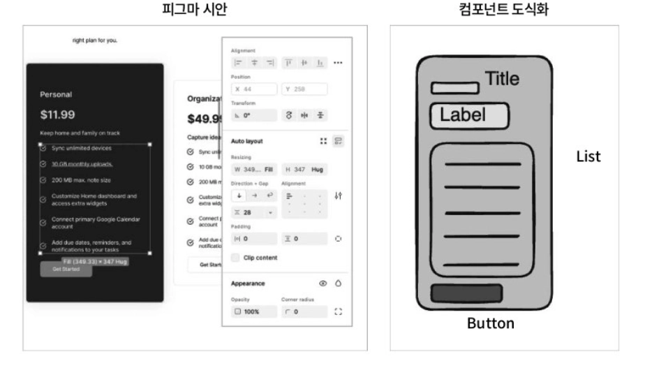
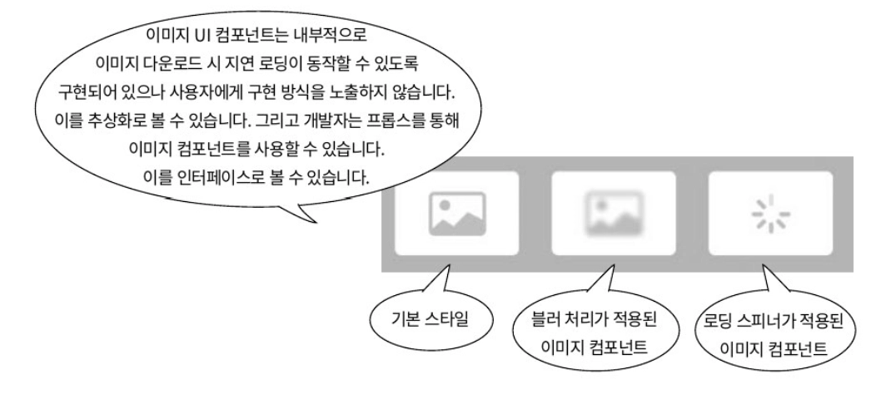
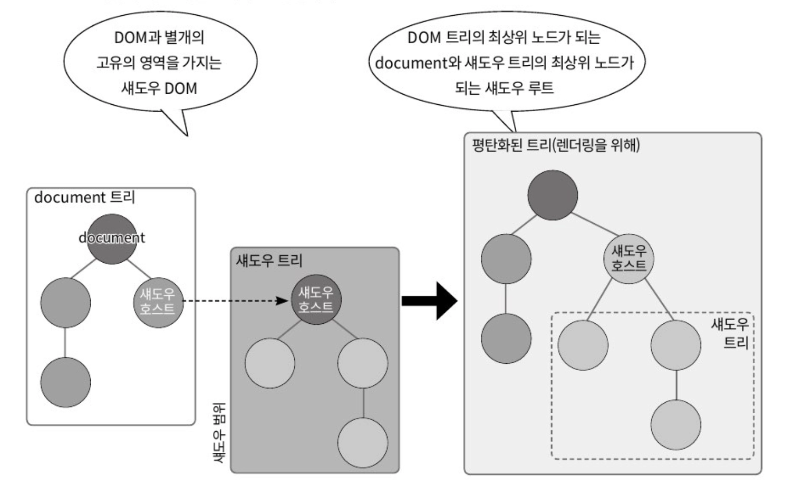
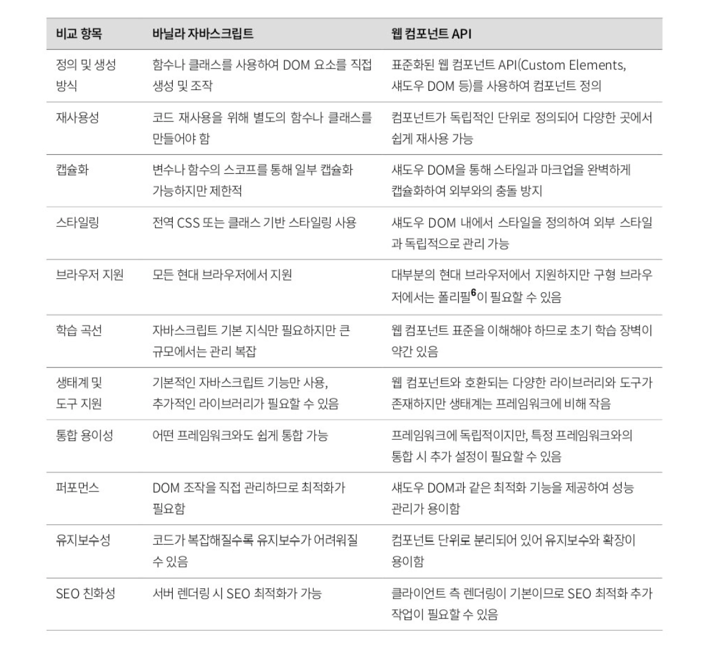

### UI 컴포넌트의 위상을 돌아봐야 하는 이유

특정 프레임워크로 개발을 시작했다면, 컴포넌트는 원래 이렇게 만드는 것이라는 라이브러리 및 프레임워크 중심적인 사고에 갇히기 쉽습니다.

UI 컴포넌트라는 개념 자체의 위상을 살펴봅시다.

UI 컴포넌트는 재사용 가능하고, 서로 다른 컴포넌트를 사용할 수 있는 추상화된 코드 조각을 의미합니다.

</br>

**프레임워크로부터 독립과 개념적인 이해를 위해**

리액트의 JSX는 UI 컴포넌트를 만들기 위한 도구일 뿐, 컴포넌트의 본질이 아닙니다.

컴포넌트의 진짜 본질은 추상화, 인터페이스 설계, 그리고 캡슐화라는 핵심 원칙에 있습니다.

</br>

**더 나은 추상화 설계 능력을 기르기 위해**

훌륭한 컴포넌트는 그 자체로 잘 만들어진 하나의 작은 제품과 같습니다.

명확한 API인 `Props` 를 가지고, 내부의 복잡한 구현은 숨기며, 예측 가능하게 동작해야 합니다.

컴포넌트의 위상을 다시 생각해보면 무엇을 만들고 어떻게 상호작용해야 하는지에 대한 설계 관점으로 시야가 확장됩니다.

</br>

**웹 표준의 흐름을 자연스럽게 이해하기 위해**

UI 컴포넌트의 중요성이 커지면서, 별도의 외부 라이브러리나 프레임워크를 설치하지 않고, 브라우저가 자체적으로 해당 기능을 해석하고 실행할 수 있는 표준 규격을 갖추려는 움직임이 생겨났습니다.

→ 웹 컴포넌트(Web components)라는 표준 기술입니다.

</br>
</br>

### 프론트엔드 개발에서 UI 컴포넌트의 위상

피그마, 제플린과 같은 디자인 프로토타입 도구는 제작자가 웹 사이트를 설계할 때 미리 유저의 입장에서 UX의 이곳저곳을 살펴볼 수 있는 청사진과 같은 역할을 합니다.

미리 구상한 청사진을 가지고 설계하는 디자이너의 시선과 실제 구현하는 프론트엔드 개발자가 기대하는 완성품 모습의 간극이 적어야 디자인 시안에서 의도헌 대로 구현되어 유저에게 제공될 확률이 높아집니다.



프론트엔드 개발자는 레이아웃과 색상, 폰트 크기와 같은 규격들을 재사용 가능한 컴포넌트 코드로 변환하여 웹페이지 어디서든 같은 UX를 제공할 수 있도록 만들어낼 줄 알아야 합니다.

</br>

UI 컴포넌트를 미리 만들어두면, 다른 프로젝트에서 화면을 구현할 때 소요 시간을 줄일 수 있습니다.

→ 이후 UI 변경도 미리 정의된 컴포넌트를 조합하는 방식으로 이뤄지므로, 추가 요구사항이나 변경 사항에 대응하기 훨씬 쉬워집니다.

</br>
</br>

### UI 컴포넌트의 추상화, 인터페이스, 캡슐화

리액트로 웹 프로그래밍을 처음 시작한 프론트엔드 개발자는 컴포넌트 제작 시 `State` 와 `Props` 가 왜 존재하고 필요한지 고민하는 시간이 없을 수 있습니다.

`State` 는 리액트 컴포넌트 내부에서 변경 가능한 동적인 데이터를 의미합니다.

`State` 는 `useState()` 훅이나 클래스 컴포넌트의 `this.state` 를 사용하여 관리되며, 값이 변경되면 컴포넌트가 다시 렌더링됩니다.

`Props` 는 리액트에서 컴포넌트 간 데이터를 전달하는 방식을 의미합니다.

부모 컴포넌트에서 자식 컴포넌트로 값을 전달할 때 사용되며, 자식 컴포넌트는 전달받은 `props` 를 수정할 수 없습니다.

</br>

UI 컴포넌트를 편리하게 사용할 수 있는 이면에는 추상화와 인터페이스가 있습니다.

추상화는 공통 특성을 일반화하고, 복잡한 세부사항을 감춰 간결한 모델로 표현하는 과정을 말합니다.

인터페이스는 추상화된 컴포넌트가 외부에 약속으로 제시하는 공개 API(메서드, 프로퍼티, 이벤트)의 집합입니다.

컴포넌트를 사용하는 외부 코드에서는 인터페이스에 의존해 컴포넌트를 사용 할 것을 보장받아야 합니다.

</br>

UI 컴포넌트에서 추상화는 컴포넌트에서 내부적으로 상태를 어떻게 다루는지에 대해 구현되어 있는 부분을 말합니다.

리액트 디자인 시스템에서 버튼 컴포넌트는 `useState()` 를 사용해 포커싱 및 로딩 상태를 내부적으로 관리하지만 외부에는 `<Button disabled onClick{…}>` 과 같은 간결한 인터페이스만 노출합니다.

바닐라 자바스크립트로 만든 UI 컴포넌트에서는 클래스의 메서드와 생성자 파라미터가, 리액트 컴포넌트에서는 프롭스가 인터페이스를 담당합니다.

</br>

다음은 지연 로딩을 수행하는 이미지 컴포넌트를 추상화하는 예시입니다.



해당 컴포넌트는 `props` 혹은 `class` 에서 외부로 제공되는 메서드 인터페이스를 통해 이미지가 다운로드되는 동안 블러처리, 혹은 로딩 인디케이터를 보여줄 수 있습니다.

리액트로 작성된 컴포넌트면 `loading=”lazy”` , `placeholder=”blur”` 와 같은 `props` 를 통해 외부에 인터페이스를 제공합니다.

이때 유저와 이미지 컴포넌트를 사용하는 프론트엔드 개발자는 모두 내부 구현이 어떻게 되어 있는짖 알 필요가 없습니다.

이처럼 캡슐화를 적용하면 객체의 내부 동작을 숨기고, 외부에 필요한 인터페이스만 제공하여 복잡성을 줄이고 결합도를 낮출 수 있습니다.

</br>
</br>

### 바닐라 자바스크립트로 컴포넌트 만들기

지연 로딩이 구현된 이미지 컴포넌트를 직접 바닐라 자바스크립트를 이용해 작성해보고 추상화와 인터페이스가 어떻게 구현되는지 알아봅시다.

</br>

다음 코드는 지연 로딩을 적용하기 위한 `LazyImageLoader` 클래스 입니다.

해당 클래스는 내부적으로 웹 API인 인터섹션 옵저버를 활용하여, 유저가 직접 API를 다루지 않고도 화면에 표시되는 이미지에 한해 자동으로 로딩을 수행할 수 있도록 설계되었습니다.

```jsx
<script>
class LazyImageLoader {
  // 어떤 image 엘리먼트에 로딩 효과가 필요한지 저장하는 내부 상태값
  #loadingStates;

  constructor(options = {}) {
    // 클래스를 인스턴스화할 때 전달되는 options의 기본 속성 초기화
    this.options = {
      // 블러 효과를 보여줄지 결정
      blurEffect: options.blurEffect || false,
      // 로딩 스피너를 표시 여부
      loadingIndicator: options.loadingIndicator || false,
      // 생략
    };

    // 화면에 엘리먼트가 노출되는지 확인
    this.observer = new IntersectionObserver(
      this.#handleIntersection.bind(this),
      {
        root: this.options.root,
        rootMargin: this.options.rootMargin,
        threshold: this.options.threshold
      }
    );

    // 가비지 콜렉터를 사용해 불필요한 상태값이 더 이상 메모리에 저장하지 않게 함
    this.#loadingStates = new WeakMap();
  }

  // DOM API인 querySelectorAll을 사용해 image 태그를 지정 및 이미지 다운 로드 시작
  observe(selector) {
    const images = document.querySelectorAll(selector);
    // 이미지 엘리먼트를 대상으로 내려받을 이미지와 로딩 이펙트 설정
    images.forEach(img => this.#setupImage(img));
  }
}
</script>
```

- `#loadingState`
    - `WeakMap` 을 사용하여 이미지 요소의 로딩 상태를 저장하는 `private` 상탯값이므로 클래스  외부에서는 접근할 수 없습니다.
    - `WeakMap` 으로 설정한 이유는 DOM 엘리먼트가 가비지 컬렉션의 대상이 되었을 때 해당 상태 데이터도 자동으로 메모리에서 해제되도록 하여 메모리 누수를 방지하기 위함입니다.
- `constructor`
    - 유저가 전달하는 옵션을 설정하며, 기본값을 포함해 블러 효과, 로딩 스피너, 옵저버 설정 등을 초기화합니다.
    - 유저는 생성자의 파라미터를 통해 클래스의 동작을 제어할 수 있으며, 별도로 복잡한 설정을 할 필요 없이 간편하게 사용할 수 있습니다.
- `observe`
    - `querySelectorAll()` 를 사용하여 특정 CSS 셀렉터에 해당하는 이미지 태그를 찾아내고, 이를 `#setupImage()` 메서드를 사용해 지연 로딩 설정을 수행합니다.

</br>

개발자는 다음과 같이 `LazyImageLoader` 의 인터페이스 역할을 하는 생성자와 `observe()` 메서드만 사용하면 블러 효과 또는 스피너 효과를 적용한 이미지 지연 로딩 기능을 쉽게 구현할 수 있습니다.

```jsx
// LazyImageLoader의 생성자 파라미터를 사용해 스피너의 색상과 블러 이펙트 사용 유무 적용
const loader = new LazyImageLoader({
  blurEffect: true,
  loadingIndicator: true,
  blurAmount: '10px',
  loadingSpinnerColor: 'green'
});

// 인자로 전달된 count 개수만큼의 image 엘리먼트를 생성
function generateImages(count = 10) {
  const container = document.getElementById('imageContainer');
  container.innerHTML = '';

  for (let i = 0; i < count; i++) {
    const wrapper = document.createElement('div');
    wrapper.className = 'image-container';

    // image 엘리먼트를 생성하고 클래스와 내려받을 이미지 등록
    const img = document.createElement('img');
    img.className = 'lazy-image';
    // Lorem Picsum 서비스를 이용해 랜덤 이미지 생성
    img.src = `https://picsum.photos/800/400?random=${i}`;
    img.alt = `Lazy loaded image ${i + 1}`;

    wrapper.appendChild(img); // 부모 엘리먼트에 image 엘리먼트 등록
    container.appendChild(wrapper);
  }

  // 앞서 생성한 image 엘리먼트 대상으로 지연 로딩 적용
  loader.observe('.lazy-image');
}

generateImages();
```

- 유저
    - `LazyImageLoader` 의 생성자에 옵션을 전달하여, 지연 로딩 시 블러 효과와 로딩 스피너의 사용 여부 및 스타일을 결정할 수 있습니다.

이렇게 하면 유저는 직접 `Intersection Observer API` 를 다룰 필요 없이, `LazyImageLoader` 의 생성자와 `observe()` 메서드만 호출하여 효율적인 지연 로딩 기능을 적용할 수 있습니다.

</br>
</br>

### 웹 컴포넌트 API

바닐라 자바스크립트로 작성한 클래스를 사용하는 개발 방식이 웹 컴포넌트보다 더운 유연하고 개발자에게 더욱 많은 구현 자유도를 제공하지만 리액트가 훅을 도입하기 이전과 유사하게 많은 양의 상태 관리 코드를 작성해야 합니다.

바닐라 자바스크립트로 만든 UI 컴포넌트의 경우, 내부 클래스가 아닌 외부에서 작성된 자바스크립트의 DOM API를 사용시 컴포넌트를 만드는 개발자가 의도치 않은 동작을 강제할 수 있습니다.

→ 상태와 UI의 불일치, 내부 구현의 노출과 취약성, 예외 상황 처리의 한계 등…

</br>

웹 컴포넌트를 사용하면 `div` , `p` , `span` 과 같은 표준 HTML 엘리먼트 외에도 내가 원하는 이름의 커스텀 엘리먼트를 만들어 사용할 수 있습니다.



또한 섀도우 DOM API를 활용하면, 컴포넌트 외부에서 내부 구현을 임의로 조작하는 것을 막아, 컴포넌트의 고유한 동작 방식과 기능을 보호할 수 있습니다.

</br>

캡슐화 이외에도 장점이 있는데, 리액트가 컴포넌트 리렌더링 시 전달된 프롭스를 사용하듯이 커스텀 엘리먼트의 생명주기 메서드를 사용해 엘리먼트에 전달된 속성값이 변경되면 이에 반응성을 지닌 UI 컴포넌트를 손쉽게 만들 수 있습니다.

웹 컴포넌트 API는 리액트와는 다르게 버추얼 DOM을 사용하지 않고 섀도우 DOM이라는 자바스크립트 API를 사용합니다.

</br>

버추얼 DOM은 리액트와 같은 라이브러리가 사용하는 가상 메모리 내의 DOM 복사본으로, 변경사항을 비교하여 실제 DOM에 최소한의 업데이트를 수행합니다.

섀도우 DOM은 웹 컴포넌트에서 개별적인 DOM 트리를 생성하여 스타일과 구조를 격리시키는 기술로, 외부 CSS나 자바스크립트의 영향을 받지 않도록 합니다.

즉, 버추얼 DOM은 성능 최적화를 위한 가상 구조이고, 섀도우 DOM은 캡슐화를 위한 독립적인 DOM입니다.

섀도우 DOM의 대표적인 예는 `<video>` , `<input>` 같은 브라우저 기본 요소로 내부 구현이 섀도우 DOM으로 캡슐화되어 있다.

</br>
</br>

### 바닐라 자바스크립트 vs 웹 컴포넌트 API를 사용한 컴포넌트 비교

앞서 살펴본 바닐라 자바스크립트와 웹 컴포넌트 API로 만든 UI 컴포넌트의 특징을 정리하면 다음과 같습니다.

- UI 컴포넌트를 추상화할 수 있습니다.
- 재사용 가능한 컴포넌트를 작성할 수 있습니다.
- interactivity를 제공하려면 여전히 명령형 프로그래밍을 사용해야 합니다.

</br>

지금까지 섀도우 DOM을 사용하려면 명령형 자바스크립트를 이용해 섀도우 루트를 작성해야 했습니다.

이는 브라우저에서만 실행 가능한 API였기에 서버 사이드에서 섀도우 DOM을 사용해 HTML을 표현할 수 있는 방법이 없었습니다.

크롬 90, 에지 91 버전부터 서버에서 선언적으로 섀도우 DOM을 작성하는 기능을 제공하기 시작했고 이를 통해 서버에서도 섀도우 DOM을 포함한 HTML을 렌더링할 수 있지만, 동적인 기능을 추가하려면 자바스크립트 명령형 코드를 작성해야 합니다.

→ Lit, Hybrid.js, Stencil.js, FAST를 사용하여 선언형 방식으로 웹 컴포넌트를 더욱 쉽게 활용할 수 있습니다.

</br>

다음은 바닐라 자바스크립트와 웹 컴포넌트 API를 사용한 컴포넌트 만들기를 다양한 측면에서 비교한 표입니다.



</br>