### Overview

DDD에 대한 간략한 이해를 바탕으로 이벤트스토밍에 대해 알아보자

 
 

### DDD - Domain-Driven-Design

서비스를 개발할때, 대부분의 서비스는 고객의 요구사항이나 비즈니스 환경의 변화에 따라 지속적으로 업데이트되고 변화 함
→ 이런 변화를 수용하면서 시스템의 복잡성을 관리하기에는 많은 문제가 발생

이러한 문제를 해결하기 위해 제안된 개발 방법론이 바로 도메인 주도 설계, DDD

도메인 주도 설계는 복잡한 소프트웨어 시스템을 개발할 때 비즈니스 도메인을 중심으로 설계를 이끌어가는 방법론

 

> 왜 DDD를 쓰는가?
> 
- 복잡한 도메인을 명확히 모델링
- 유지보수성과 확장성이 뛰어남
- 도메인 전문가와 개발자가 효과적으로 소통 가능
- 기술보다 비즈니스에 집중 가능

 
 

### 도메인 - Domain

각각의 기능적인 문제에 영역들을 정의
소프트웨어가 해결하려는 비즈니스 영역 또는 문제 공간

ex) 공동구매 플랫폼의 경우, 도메인은 “장바구니 공유 및 실시간 공동구매”

 

**DDD를 알기위해 필요한 개념**

> 엔티티 - Entity
> 

고유 식별자를 갖는 객체

ex) 사용자, 주문, 장바구니

 

> 값 객체 - Value Object
> 

식별자 없이 속성 값 자체가 중요한 객체

ex) 주소, 수량

 

> 도메인 서비스 - Domain Service
> 

엔티티에 포함시키기 애매하지만, 도메인 로직이 필요한 경우 사용하는 서비스

 

> 응용 서비스 - Application Service
> 

비즈니스 로직이 아닌, 유스케이스 실행을 담당

 

> 레포지토리 - Repository
> 

엔티티를 DB에서 꺼내오거나 저장하는 역할 

 
 

### 유비쿼터스 언어 - Ubiquitous Language

개발자, 기획자, 디자이너 등 모든 구성원이 공통으로 사용하는 도메인 용어
→ 업무용어를 통일
즉 개발뿐만 아니라 기획과 개발 사업까지 전체적인 팀 내부에서 단일화된 커뮤니케이션 방식

ex) “장바구니”, “참여 인원”, “최소 수량” 등의 용어를 소스 코드, 문서, 대화에 동일하게 사용

 
 

### Bounded Context

범위를 구분해 놓은 하위 도메인 개념

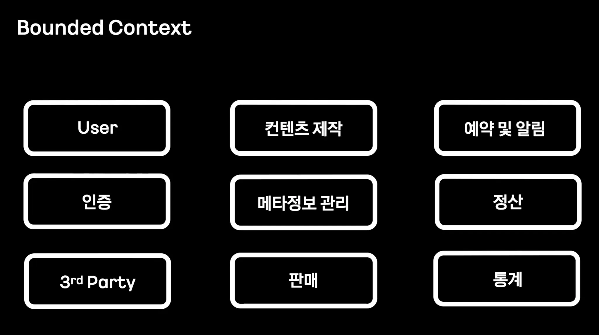

다양한 영역들을 가지고 각 영역들을 분류하여 서로에 대한 의존성을 줄이기 위해 일종의 경계를 구성

 

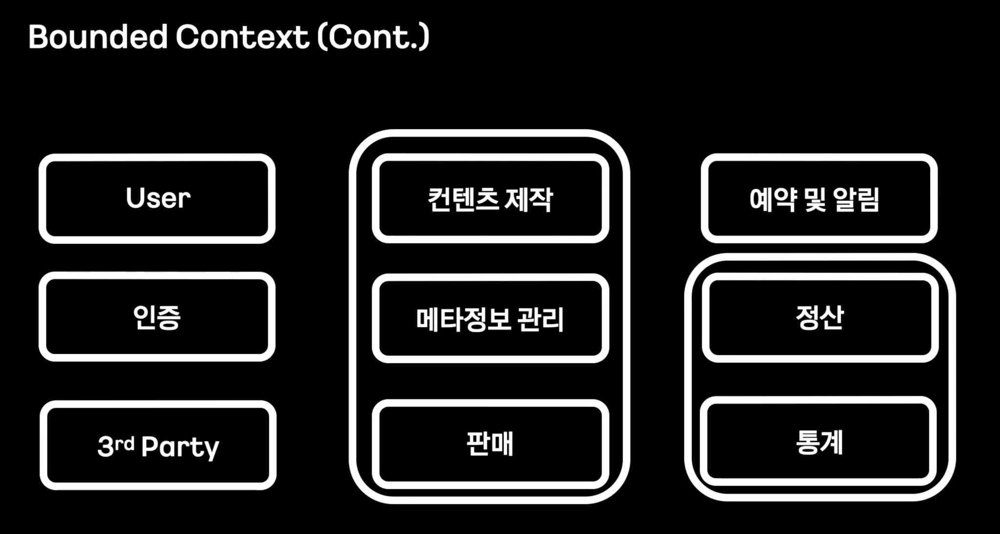

경계를 구성해 놓고 서로 데이터의 조회 등을 위해서는 api를 사용하여 통신하게 하면서 각 도메인을 철저하게 분리

 
 

### Context Map

바운디드 컨텍스트간의 관계를 보여주는 맵

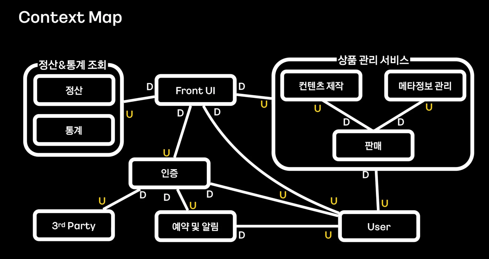

컨텍스트 맵을 구성하여 업스트림과 다운스트림을 한눈에 볼 수 있게하여 전체적인 흐름 예상 가능

하지만 컨텍스트 맵을 가지고 서비스를 각각 구현을 할때 해당 서비스들이 가지고 있는 많은 객체들을 그대로 사용하는 것은 의미가 없음
→ 각 도메인 영역을 대표하는 도메인 객체들의 집합을 설계 = 어그리게이트

 
 

### 어그리게이트 - Aggregate

연관된 엔티티와 값 객체를 하나의 군으로 묶은 단위
데이터 변경 단위 일종의 라이프 사이클이 같은 도메인들을 모아 놓은 집합

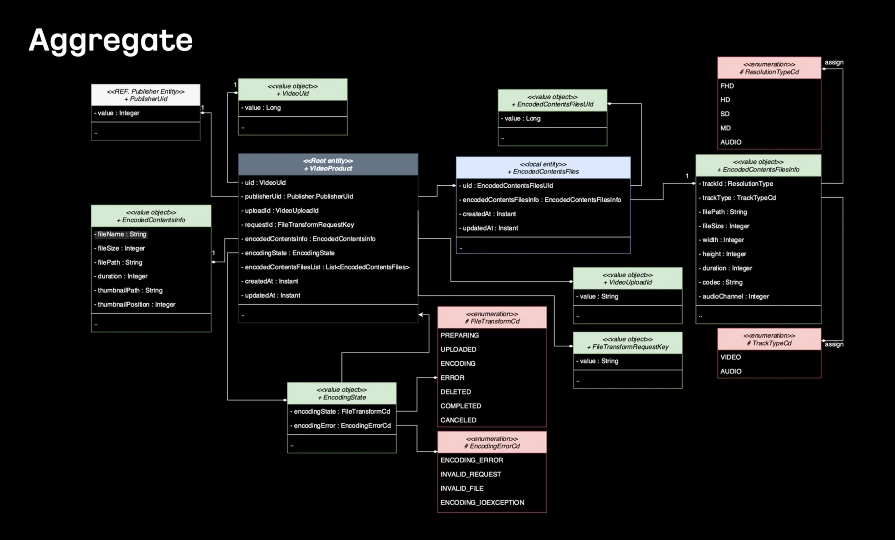

서비스들이 가지고 있는 많은 객체들을 그대로 사용하는 것은 의미가 없기 때문에 각 도메인 영역을 대표하는 도메인 객체들의 집합을 설계를 하였고 이걸을 DDD에서는 어그리게이트라고 함

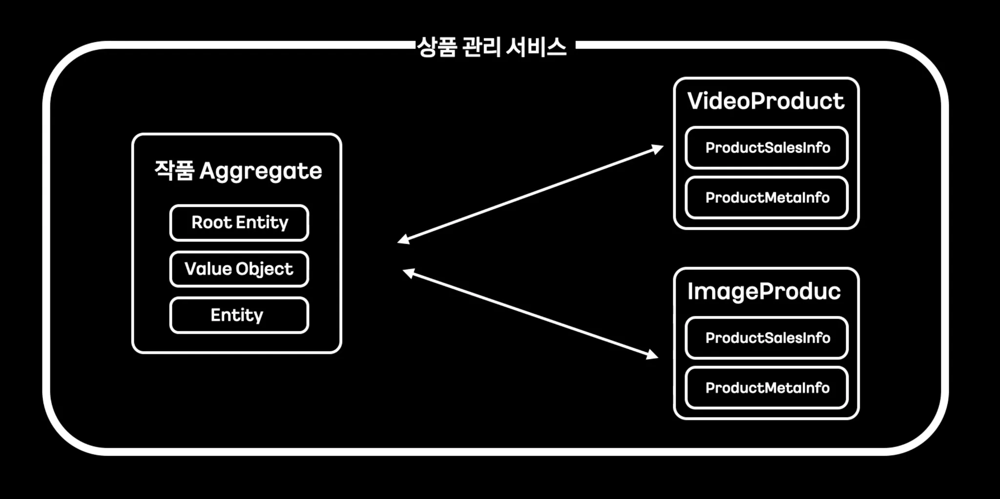

루트(Aggregate Root)를 통해서만 외부 접근이 가능

 
 

### 이벤트스토밍

복잡한 비즈니스 도메인을 빠르게 탐색, 학습할 수 있는 워크숍

개발자 뿐만 아니라 모든 이해관계자들이 참여하여 서비스에서 발생하는 이벤트를 정의, 발생 원인에 대해 함께 이해하려는 접근 방식

해당 과정을 통해 각 이해관계자가 서비스에 대한 지식과 경험을 공유, 서비스에서 발생하는 이벤트와 그 관련 프로세스를 함께 이해하고 모델링하는 경험을 제공

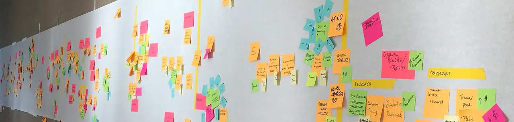

이벤트 스토밍은 보통 벽이나 대형 보드에 스티커를 붙이며 시작

스티커들은 서비스에서 발생하는 이벤트를 나타내며, 각각의 색상은 서로 다른 의미를 가짐

이를 통해 시스템에서 어떤 행위가 발생하는지, 그 결과로 어떤 이벤트가 일어나는지를 명확하게 표현 가능

 

> 이벤트 스토밍을 왜 하는가?
> 
- 요구사항 명확화
    - 기능 명세를 글로 작성시 빠진 것도 많고, 소통의 오류가 발생
    - 이벤트 스토밍은  실제 발생하는 이벤트 중심으로 얘기, 우리가 뭘 만들어야 하는지가 명확해짐
- 개발자 + 기획자 + 디자이너 소통
    - 각자 용어가 달라서 생기는 의사소통 오류 방지
    - 모두가 같은 보드를 보며 회의 = 공통된 이해 형성
- 복잡한 도메인을 빠르게 파악
    - 복잡한 도메인에서 흐름 중심으로 정리 가능
- 기능 설계 전 확인 작업
    - 코드 설계 전 미리 흐름을 시뮬레이션 가능

 

> 이벤트 스토밍을 통한 질문
> 
- 서비스에서 어떤 “주체”가 어떤 “행동”을 취하는가?
- 그 “행동”의 결과로 어떤 “이벤트”가 발생하는가?
- “이벤트”가 발생하면 시스템에서는 어떤 “변화”가 일어나는가?
- 이 “이벤트”가 다른 “이벤트”에 어떤 영향을 미치는가?

이런 질문들을 통해, 서비스의 핵심 프로세스와 비즈니스 로직을 명확히 이해하고 모델링 할 수 있음

 

> 진행 방법
> 

벽에 커다란 종이를 붙여 놓고 그 위에 포스트잇을 붙여 나감

비즈니스 프로세스를 이해하는 데에 초점을 맞춤

 
 

### 포스트잇

떼어 내고 붙이기가 쉽기 때문에 이동이 가능하며, 틀린 경우에는 뗄 수 있어 부담을 줄일 수 있기에 포스트잇을 사용하여 이벤트 스토밍을 진행

이벤트 스토밍의 포스트은 각각의 색상마다 역할이 구분되어 있음

각 스티커가 어떤 이름으로 불리고, 어떤 역할을 수행하는지는 이벤트 스토밍에서 중요한 부분

 
 

### 도메인 이벤트(주황색) - Domain Event

도메인에서 실제로 발생하는 “결과”, 도메인 전문가가 관심이 있는 어떤 사건

서비스에서 발생한 사실, 결과, 특정행위의 Output을 표현

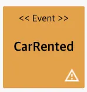

이벤트 이름은 과거에 일어났던 일을 표현하기 때문에 과거 시제를 사용

이벤트가 발생한다는 것은 상태가 변경되었다는 것을 의미

> 예시
> 
- 상품이 등록되었다.
- 장바구니가 공유되었다.
- 수량이 변경되었다.
- 결제가 요청되었다

 
 

### 커맨드  - Command

도메인에서 특정 주체가 요청하는 “행위”

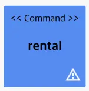

커맨드는 입력(Input), API, UI 버튼 등을 표현하는데 사용되며, 파란색 스티커를 사용하여 표현하고 현재형을 이용해 이름을 정의

> 예시
> 
- 공동 장바구니를 생성한다
- 참여자를 추가한다

 
 

### 액터 - Actor

커맨드를 발생시키는 “주체”

온라인 강의 사이트에서 “지식 제공자”는 강의를 촬영, “수강생”은 강의를 수강하듯이 각각의 행위를 수행하는 주체를 액터라고 부르며, 노란 색상의 스티커를 사용하여 표현

> 예시
> 
- 공동구매 참여자
- 공동 장바구니 생성자

 
 

### 정책 - Policy

이벤트 조건에 따라 발생하는 “새로운 커맨드”

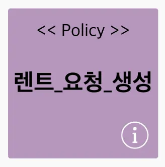

모든 비즈니스로직은 1개의 행위로 1개의 결과가 발생하지 않음

이벤트로 인해 발생하는 요청 사항을 “정책”이라고 부르며, 라일락 색의 스티커를 사용하여 표현

> 예시
> 
- 유효 기간 초과 시 종료
- 결제 시도 시 재고 임시 확보

 
 

### 외부 시스템 - External Ststem

도메인 이벤트가 호출하거나 관계가 있는 “외부 시스템”을 표현할 때 사용

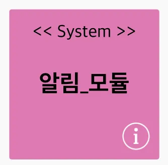

여러 서비스에서는 해당 서비스 코드 내부에서 처리가 안되어 외부 시스템이 필요한 경우가 존재

결제 요청을 처리하기 위해서는 “결제 모듈”이라는 외부 시스템이 필요하며, 고객에게 알림을 전달하기 위해서는 “알림 모듈”이라는 외부 시스템이 필요

이처럼 서비스에 필요한 기능이지만 직접 개발하기 어렵거나, 외부 의존성을 가지는 시스템을 “외부 시스템”이라고 부르며, 핑크색스티커를 사용하여 표현

> 예시
> 
- OAuth

 
 

### 어그리게이트 - Aggregate

도메인 이벤트와 커맨드가 처리하게되는 “데이터”

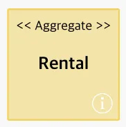

고객이 자동차를 대여하는 요청을 하면, 자동차 대여점에서는 해당 요청을 처리하기 위해 필요한 자동차의 상세한 정보(차종, 연식, 주행거리 등)가 필요
이러한 데이터를 “어그리게이트”라고 부르며 연 노란 색상의 스티커를 사용하여 표현

> 예시
> 
- 구매
- 장바구니
- 결제
- 참여자 목록

 
 

### 바운디드 컨텍스트  - Bounded Context

“도메인” 그 자체를 나타냄

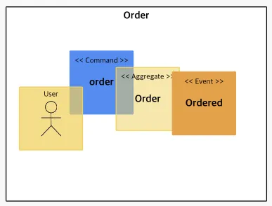

배달 서비스를 구현하기 위해서는 “주문”, “매장”, “배달” 과 같은 여러가지의 도메인이 존재

각 도메인은 여러 개의 액터, 커맨드, 이벤트, 어그리게이트 등으로 구성되는데 이 모든 구성요소를 포함하여 하나의 도메인을 구성한 것을 “바운디드 컨텍스트”라고 부름

> 이벤트 스토밍 구성요소 정리
> 

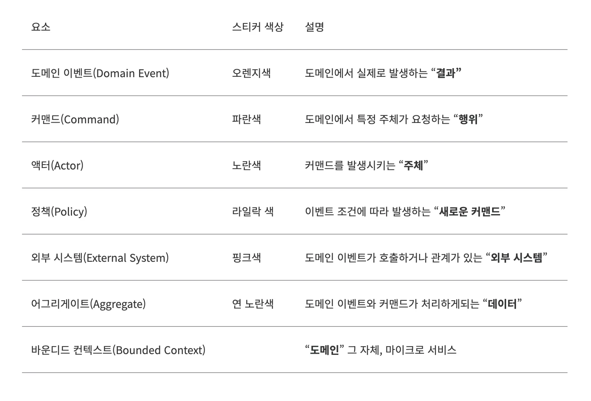

 
 

### 이벤트 스토밍의 Step

자동차 렌트 서비스를 통해 이벤트 스토밍 Step 흐름을 알아보자 !!

> 자동차 렌트 서비스에 대한 요구사항
> 
- 고객은 자동차를 렌트할 수 있어야 함
- 대여점은 자동차 렌트 요청이 도달했을 때, 수락 또는 거절할 수 있어야 함
- 고객은 렌트한 자동차를 반환할 수 있어야 함
- 자동차 렌트는 최소 8시간에서 최대 30일까지만 가능
- 자동차 렌트 상태가 변경될 때마다 고객과 대여점에 알림이 전송

 
 

### 도메인 이벤트 도출

서비스에서 발생할 수 있는 비즈니스 이벤트를 분석하는 단계

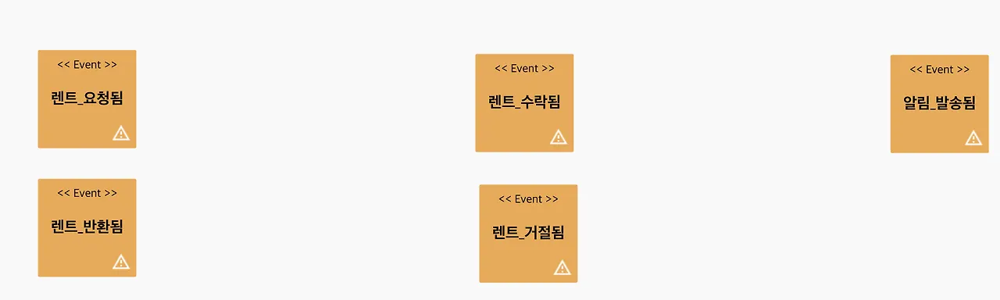

요구사항을 기반으로 5개의 이벤트를 도출

 
 

### 이벤트에 따른 정책 도출

도메인 이벤트 발생 후 그에 따라 추가적으로 반응하는 행위인 정책을 도출하는 단계

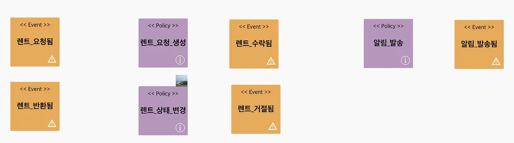

 
 

### 커맨드와 액터 식별

도메인 이벤트를 발생시키는 행위인 커맨드와 행위를 수행하는 주체인 액터를 도출하는 단계

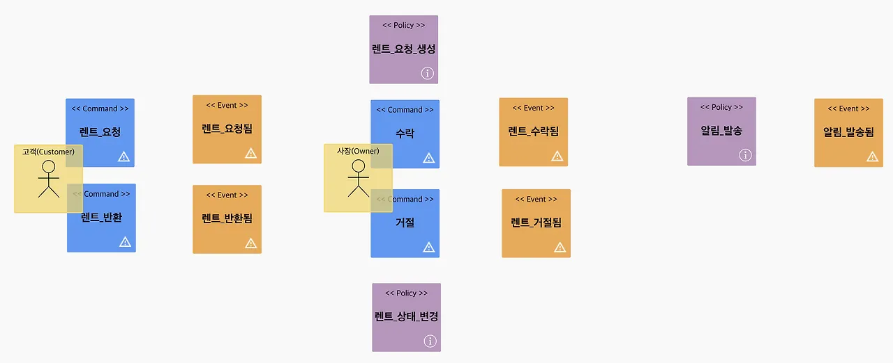

 
 

### 어그리게이트 매핑

커맨드와 이벤트가 사용하는 데이터를 정의하는 단계

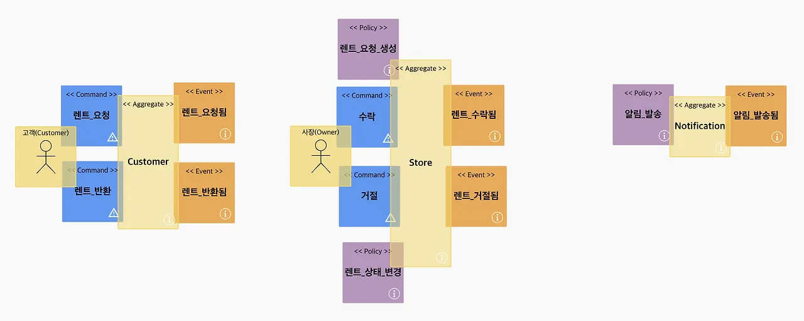

 
 

### 바운디드 컨텍스트

지금까지의 결과물들을 바운디드 컨텍스트를 이용해 묶어주는 단계

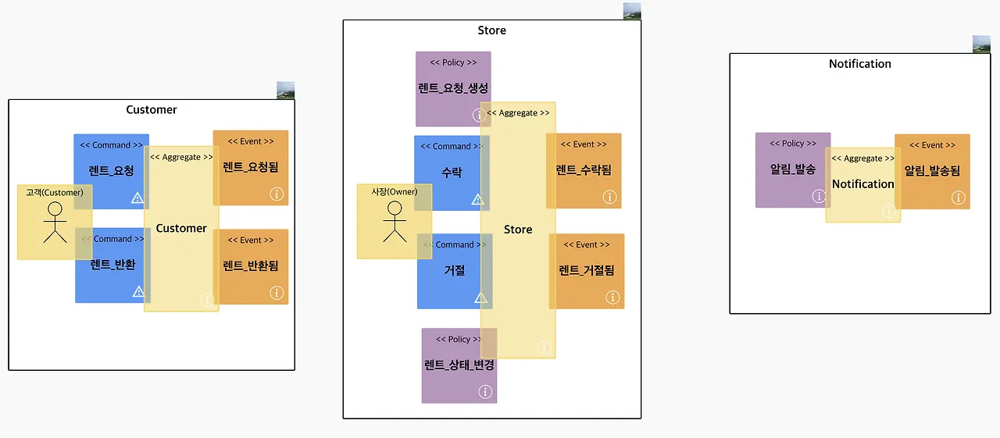

이벤트 스토밍이 완료되었을 때, 이 단계에서 생성된 바운디드 컨텍스트들은 각각의 마이크로 서비스가 될 가능성이 존재

 
 

### 컨텍스트 매핑

최종적으로 구성요소간의 관계를 설정하는 단계

고려하지 못했던 외부 시스템이나, 추가적으로 도출된 도메인 이벤트나 커맨드 등을 포함하여 전체 시스템을 검토

 