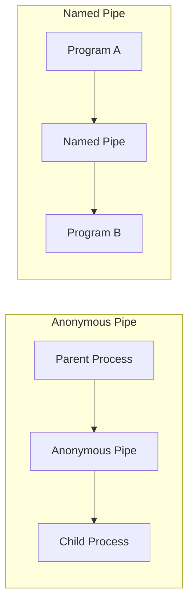
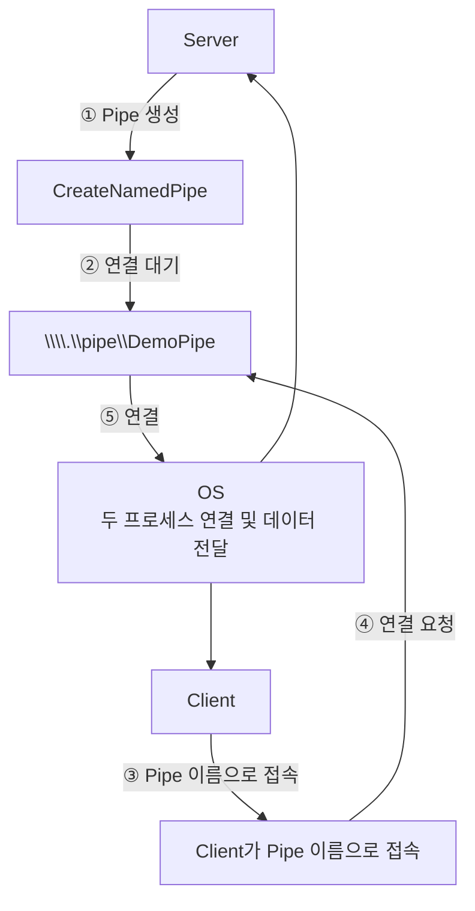
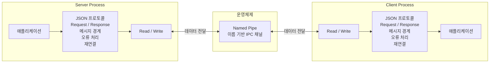

### Named Pipe란?

Pipe는 기본적으로 한 프로세스가 데이터를 쓰고 다른 프로세스가 데이터를 읽는 통신 통로임

Named Pipe는 운영체제가 제공하는 프로세스 간 통신, IPC 메커니즘임

여기서 중요한 부분은 Pipe 앞에 `Named` 가 붙었다는 것임

<br/>

Named Pipe는 이름을 가지고 있기 때문에 다른 프로세스가 그 이름을 알고 해당 Pipe에 접속할 수 있음

```bash
\\.\pipe\MyApplicationPipe
```

<br/>

일반적으로 부모와 자식처럼 관계가 있는 프로세스 사이의 통신에는 Anonymous Pipe가 사용됨

하지만 Named Pipe를 사용하면 두 프로그램이 서로 직접적인 부모-자식 관계가 없어도 가능함



Winodws에서는 Named Pipe를 동일 컴퓨터뿐 아니라 네트워크상의 다른 컴퓨터 간 통신에도 사용할 수 있음

<br/>
<br/>

### Pipe Server와 Pipe Client

Named Pipe를 제대로 이해하려면 Server/Client를 이해해야함

- **Pipe Server**
    - Pipe를 생성하고 연결을 기다리는 프로세스
- **Pipe Client**
    - 이미 존재하는 Pipe에 연결하는 프로세스

<br/>

Windows API로 보면 Server 측에서는 `CreateNamedPipe` , `ConnectNamedPipe` 같은 API를 사용, Client는 `CreateFile` 또는 `CallNamedPipe` 를 이용해 연결함

여기서 중요한 점은 Server와 Client가 반드시 특정 프로그램 종류를 의미하지 않고 하나의 프로세스가 상황에 따라 Server와 Client 역할을 모두 수행할 수 있음

<br/>

Named Pipe는 다음과 같은 순서로 연결됨



실제 데이터 전달 경로는 OS가 관리함

그렇기에 OS에게 Pipe 연결을 요청하고, OS가 제공하는 접근용 handle을 받은 다음 handle을 `read` / `write` 작업에 사용하면 됨

<br/>
<br/>

### Named Pipe는 한 방향인가, 양방향인가?

Windows Named Pipe는 `Inbound` , `Outbound` , `Duplex` 형태로 구성할 수 있음

Duplex Pipe에서는 Server와 Client 모두 읽고 쓸 수 있음

```tsx
ClientToEnginePipe_EXAMPLE
EngineToClientPipe_EXAMPLE
```

하나의 Duplex Pipe를 통해 양쪽 모두를 읽고 쓸 수 있지만 방향을 명확하게 분리하고 싶다면 두 개를 사용할 수도 있음

<br/>
<br/>

### Node.js에서는 Named Pipe를 어떻게 사용하는가?

Node.js의 `net` 모듈은 TCP뿐 아니라 IPC endpoint도 다룰 수 있음

Windows에서는 IPC path를 지정하여 Named Pipe에 연결할 수 있음

`net.createConnection()` 은 해당 endpoint에 연결한 뒤 `net.Socket` 객체를 반환함

```tsx
net.createConnection({
	path: '\\\\.\\pipe\\MyPipe'
})
```

즉, `MyPipe` 라는 Windows Named Pipe에 Client로 연결하라는 뜻임

<br/>

연결이 완료되면 양쪽 프로그램은 데이터를 읽고 쓸 수 있음

Node.js에서는 다음과 같이 데이터를 전송하고 받을 수 있음

```tsx
// 전송하기
client.write(data)

// 받기
client.on('data', ...)
```

<br/>

하지만 여기서 Named Pipe는 Request와 Response를 알아서 처리하지 않음

→ 애플리케이션 프로토콜의 책임

그래서 일반적인 Request/Response 시스템에서는 다음과 같이 Request/Response ID를 응답에 포함시킴

```tsx
// Request
{
	"requestId": "123",
	"type": "GET_USER"
}

// Response
{
	"requestId": "123",
	"type": "GET_USER_RESULT"
}
```

<br/>
<br/>

### 정리하자면..

Named Pipe는 운영체제가 제공하는 이름 기반 IPC 통신 채널임

프로세스는 그 채널에 데이터를 읽고 쓰며, 실제 애플리케이션에서는 JSON 등의 프로토콜을 그 위에 올려 Request/Response, 메시지 경계, 오류 처리, 재연결 같은 규칙을 직접 구현하여 사용함



<br/>