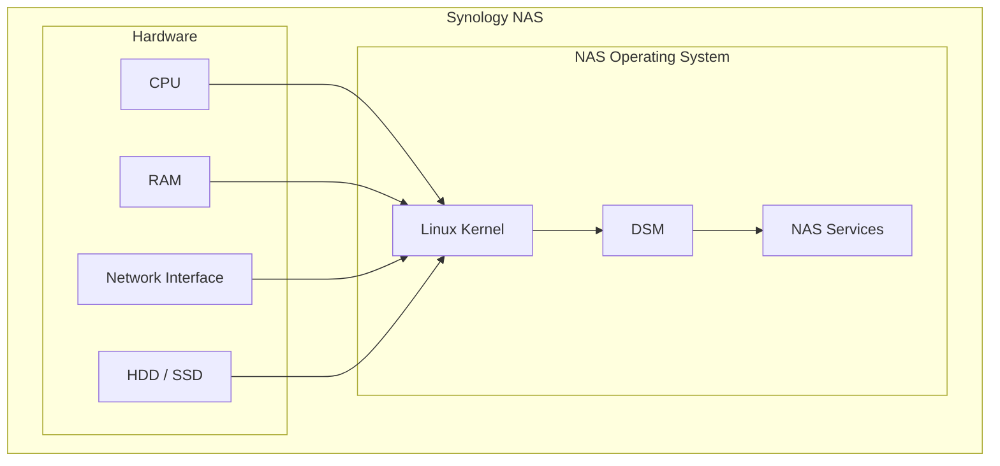
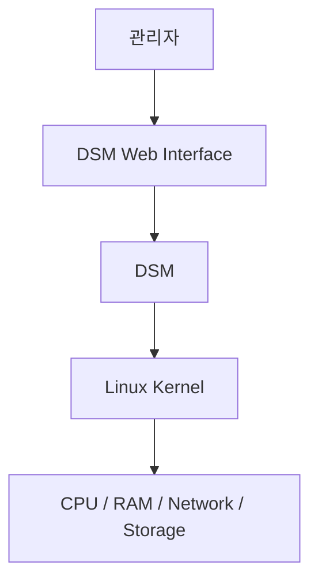
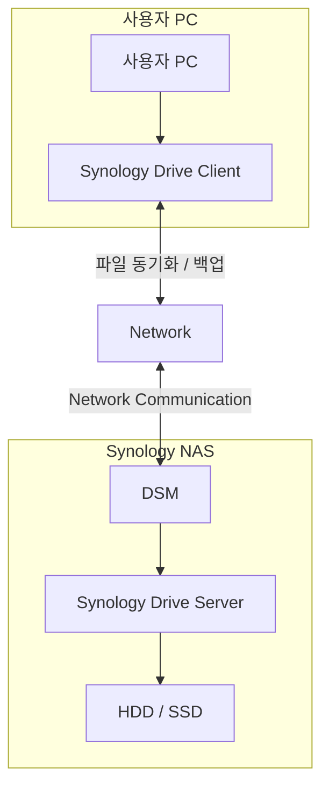
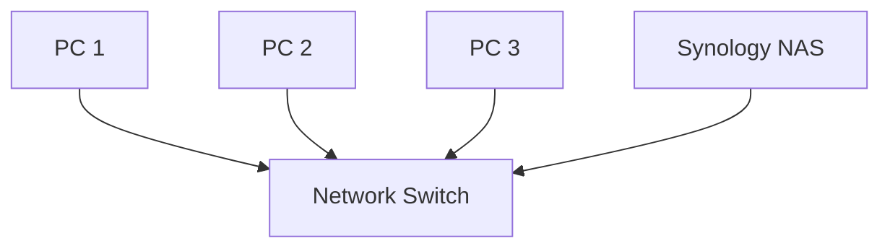
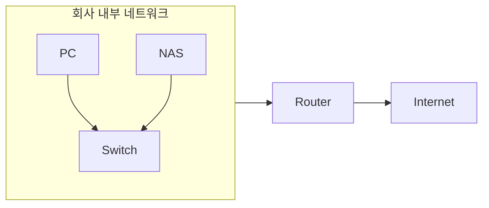
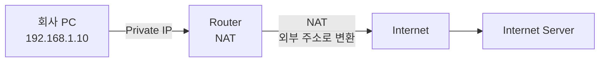
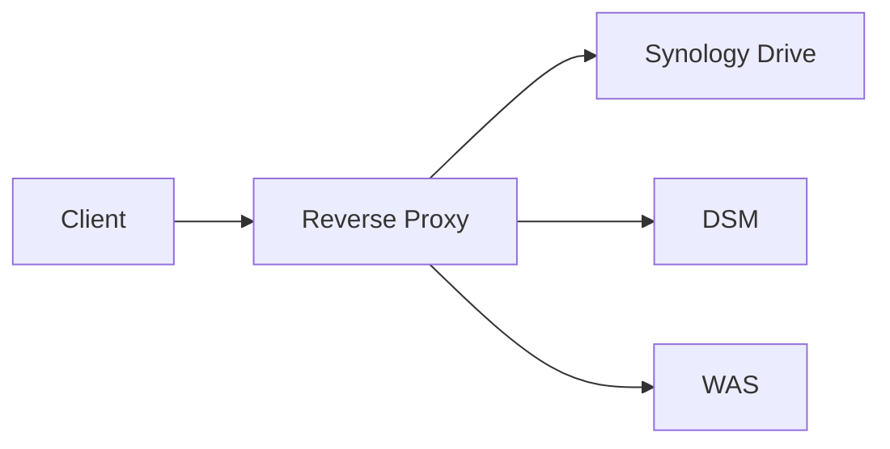
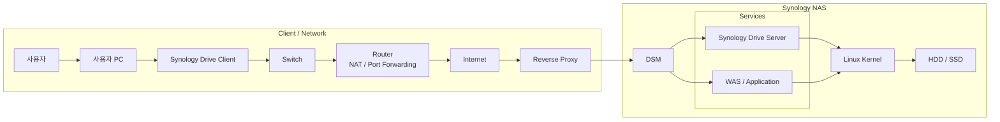

### NAS란?

NAS는 Network Attached Storage의 약자로 네트워크에 연결되어 여러 사용자가 파일과 저장 공간을 사용할 수 있도록 만들어진 장치임

NAS 내부에는 CPU, RAM, HDD/SDD, 네트워크 인터페이스 같은 HW가 존재하고 그 위에서 운영체제가 실행됨

전체적인 구조는 다음과 같음

즉 NAS 자체가 하나의 작은 PC이고 일반적인 PC와의 차이점은 NAS 운영체제가 파일 공유, 저장소 관리, 백업, 사용자 관리 같은 NAS에 필요한 기능을 중심으로 제공함

 
 

### DiskStation Manager

Synology NAS를 사용한다면 DSM이라는 이름을 자주 보게 됨

DSM은 Synology NAS에서 사용하는 NAS 운영체제임

Kernel은 운영체제에서 가장 핵심적인 부분으로 CPU, 메모리, 네트워크, 저장장치 등의 HW 자원을 관리하는데 DSM은 이런 Kernel 위에서 NAS를 관리하기 위한 여러 기능을 제공함

사용자는 웹 UI를 통해 설정하지만 실제로는 DSM이 운영체제 수준의 기능과 서비스에 해당 작업을 전달하고, 최종적으로 Kernel과 HW가 실제 작업을 수행하게 됨

 
 

### Synology Drive Server와 Synology Drive Client

Synology Drive는 NAS에 저장된 파일을 PC에서 편리하게 사용하고 동기화할 수 있도록 해주는 시스템임

- **Synology Drive Server**
    - NAS에서 실행되는 서버 측 프로그램임
    - DSM 위에서 동작하면서 파일 관리와 동기화 등의 기능을 제공함
- **Synology Drive Client**
    - 사용자 PC에 설치되는 프로그램임
    - PC의 특정 폴더와 NAS의 파일을 동기화하거나 NAS의 파일을 접근하고 PC 백업 등의 기능을 수행함

 

그림으로 보면 다음과 같은 구조임

PC의 Synology Drive 폴더에 새로운 파일을 생성한다면 Drive Client가 해당 변경을 감지하고 NAS의 Drive Server와 통신함

Drive Server는 파일을 처리하고 NAS의 저장 공간에 반영함

반대로 NAS 측에서 변경된 내용이 있다면 해당 변경사항이 다시 Client 쪽으로 동기화될 수 있음

즉 Drive Client는 PC와 NAS 사이의 동기화를 담당하는 클라이언트 프로그램임

 
 

### Switch

Drive Client와 Drive Server는 서로 다른 컴퓨터에 존재하므로 둘 사이에는 Nerwork Communication이 필요함

이를 연결해주는 장비가 바로 Switch임

Switch는 같은 네트워크 안에 있는 여러 장치를 연결하는 네트워크 장비임

Switch는 들어온 네트워크 프레임을 확인하고 목적지 장치가 연결된 포트로 전달함

즉 Switch는 기본적으로 같은 네트워크 내부의 장치들을 연결하는 역할을 함

 
 

### Router와 NAT

Router는 서로 다른 네트워크를 연결하고 네트워크 간에 패킷을 전달하는 장비임

회사 네트워크를 예로 들면 내부 네트워크와 인터넷이라는 서로 다른 네트워크 사이에 Router가 존재할 수 있음

 

회사 내부에서는 Private IP를 사용하는 경우가 많음

여기서 인터넷에 있는 서버가 직접 192.168.x.x 이라는 주소를 보고 회사 NAS에 직접 접근하는 구조는 아님

→ Private Network에서 사용하는 주소이기에

이때 Router가 외부 네트워크와 내부 네트워크 사이를 연결하고, NAT를 통해 주소를 변환할 수 있음

NAT의 역할은 내부에서 사용하는 주소와 외부 네트워크에서 사용하는 주소 사이를 변환하는 것임

정리하자면 Router는 서로 다른 네트워크를 연결하고 패킷을 전달하는 장비이고 NAT는 네트워크 통신 과정에서 IP 주소 및 포트 정보를 변환하는 기술임

 
 

### Reverse Proxy란?

Reverse Proxy는 클라이언트와 실제 서버 사이에 위치하여 클라이언트의 요청을 대신 받아 적절한 내부 서버로 전달하는 서버임

NAS 내부에는 다음과 같은 여러 서비스들이 존재할 수 있음

이때 Reverse Proxy는 외부 사용자가 NAS에 접근했을 때 요청을 확인하고 적절한 서비스로 전달해줌

따라서 외부 사용자는 내부 서비스가 실제로 어떤 Port에서 실행되고 있는지 직접 알 필요가 없음

 

NAT와 Reverse Proxy의 역할을 헷갈릴 수 있음

NAT는 네트워크 계층에서 외부 요청을 회사 내부 네트워크 또는 장비로 전달하는 네트워크 계층에서 동작함

하지만 Reverse Proxy는 서버에 도작한 HTTP/HTTPS 요청을 적절한 내부 서비스로 전달함

 

지금까지 다룬 내용을 정리하자면 다음과 같은 그림임

 